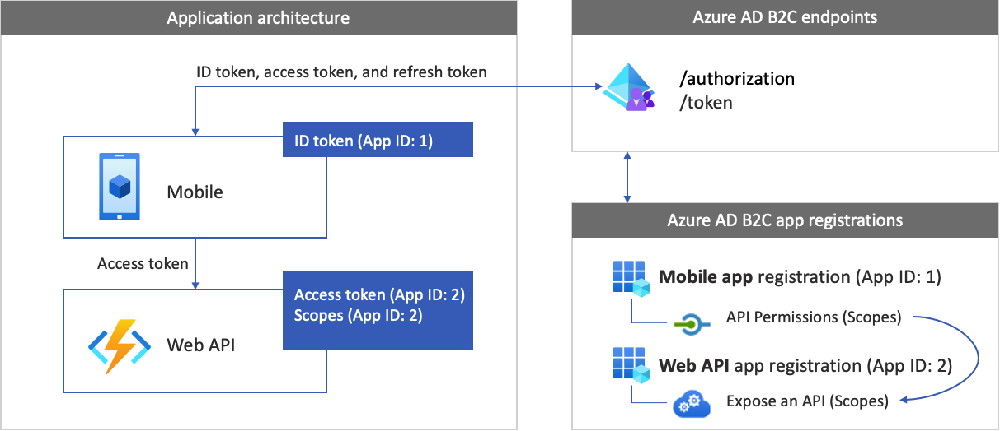
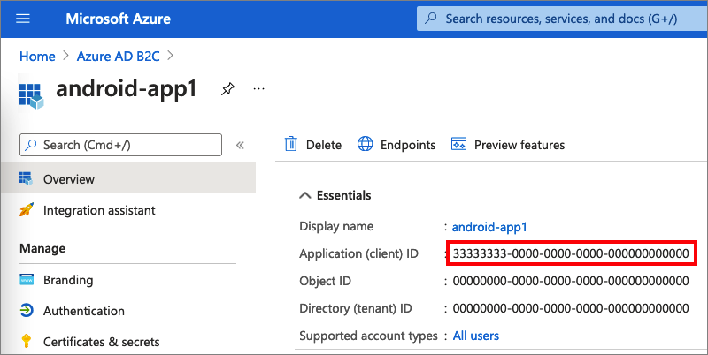
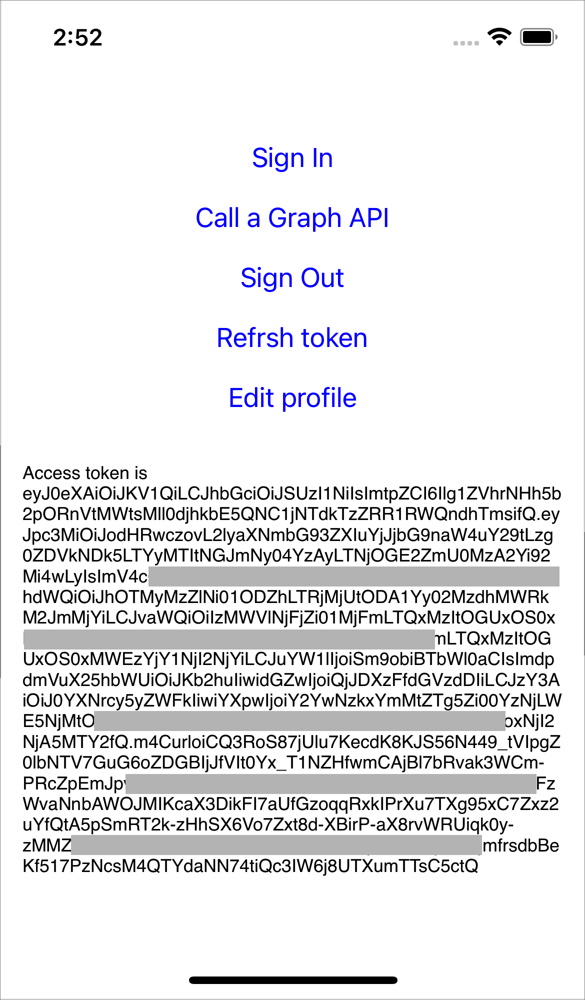

# Configure authentication in a sample iOS Swift app by using Azure AD B2C

This article uses a sample [iOS Swift](https://developer.apple.com/swift/) application to illustrate how to add Azure Active Directory B2C (Azure AD B2C) authentication to your mobile apps.

## Overview

OpenID Connect (OIDC) is an authentication protocol that's built on OAuth 2.0. You can use OIDC to securely sign users in to an application. This mobile app sample uses the [Microsoft Authentication Library (MSAL)](../active-directory/develop/msal-overview.md) with OIDC authorization code Proof Key for Code Exchange (PKCE) flow. The MSAL is a Microsoft-provided library that simplifies adding authentication and authorization support to mobile apps. 

The sign-in flow involves the following steps:

1. Users open the app and select **sign-in**.
1. The app opens the mobile device's system browser and starts an authentication request to Azure AD B2C.
1. Users [sign up or sign in](add-sign-up-and-sign-in-policy.md), [reset the password](add-password-reset-policy.md), or sign in with a [social account](add-identity-provider.md).
1. After users sign in successfully, Azure AD B2C returns an authorization code to the app.
1. The app takes the following actions:
    1. It exchanges the authorization code to an ID token, access token, and refresh token.
    1. It reads the ID token claims.
    1. It stores the tokens in an in-memory cache for later use.

### App registration overview

To enable your app to sign in with Azure AD B2C and call a web API, register two applications in the Azure AD B2C directory:  

- The **mobile application** registration enables your app to sign in with Azure AD B2C. During app registration, specify the *redirect URI*. The redirect URI is the endpoint to which users are redirected by Azure AD B2C after they've authenticated with Azure AD B2C. The app registration process generates an *application ID*, also known as the *client ID*, which uniquely identifies your mobile app (for example, *App ID: 1*).

- The **web API** registration enables your app to call a protected web API. The registration exposes the web API permissions (scopes). The app registration process generates an *application ID*, which uniquely identifies your web API (for example, *App ID: 2*). Grant your mobile app (App ID: 1) permissions to the web API scopes (App ID: 2). 


The application registration and architecture are illustrated in the following diagrams:

 

### Call to a web API

[!INCLUDE [active-directory-b2c-app-integration-call-api](../../includes/active-directory-b2c-app-integration-call-api.md)]

### The sign-out flow

[!INCLUDE [active-directory-b2c-app-integration-sign-out-flow](../../includes/active-directory-b2c-app-integration-sign-out-flow.md)]

## Prerequisites

A computer that's running: 

- [Xcode 13 or later](https://developer.apple.com/xcode/).
- [CocoaPods](https://cocoapods.org/) dependency manager for Swift and Objective-C Cocoa projects.


## Step 1: Configure your user flow

[!INCLUDE [active-directory-b2c-app-integration-add-user-flow](../../includes/active-directory-b2c-app-integration-add-user-flow.md)]

## Step 2: Register mobile applications

Create the mobile app and the web API application registration, and specify the scopes of your web API.

### Step 2.1: Register the web API app

[!INCLUDE [active-directory-b2c-app-integration-register-api](../../includes/active-directory-b2c-app-integration-register-api.md)]

### Step 2.2: Configure web API app scopes

[!INCLUDE [active-directory-b2c-app-integration-api-scopes](../../includes/active-directory-b2c-app-integration-api-scopes.md)]


### Step 2.3: Register the mobile app

To create the mobile app registration, do the following:

1. Sign in to the [Azure portal](https://portal.azure.com).
1. Select **App registrations**, and then select **New registration**.
1. Under **Name**, enter a name for the application (for example, *iOs-app1*).
1. Under **Supported account types**, select **Accounts in any identity provider or organizational directory (for authenticating users with user flows)**. 
1. Under **Redirect URI**, select **Public client/native (mobile & desktop)** and then, in the URL box, enter `msauth.com.microsoft.identitysample.MSALiOS://auth`.
1. Select **Register**.
1. After the app registration is completed, select **Overview**.
1. Record the **Application (client) ID** for later use, when you configure the mobile application.
      


### Step 2.4: Grant the mobile app permissions for the web API

[!INCLUDE [active-directory-b2c-app-integration-grant-permissions](../../includes/active-directory-b2c-app-integration-grant-permissions.md)]

## Step 3: Configure the sample web API

This sample acquires an access token with the relevant scopes that the mobile app can use for a web API. To call a web API from code, do the following:

1. Use an existing web API, or create a new one. For more information, see [Enable authentication in your own web API by using Azure AD B2C](enable-authentication-web-api.md).
1. Change the sample code to [call a web API](enable-authentication-iOs-app.md#step-63-call-a-web-api).
1. After you configure the web API, copy the URI of the web API endpoint. You will use the web API endpoint in the next steps.

> [!TIP]
> If you don't have a web API, you can still run this sample. In this case, the app returns the access token but won't be able to call the web API. 

## Step 4: Get the iOS mobile app sample

1. [Download the .zip file](https://github.com/Azure-Samples/active-directory-b2c-ios-swift-native-msal/archive/refs/heads/vNext.zip), or clone the sample web app from the [GitHub repo](https://github.com/Azure-Samples/active-directory-b2c-ios-swift-native-msal). 

    ```bash
    git clone https://github.com/Azure-Samples/active-directory-b2c-ios-swift-native-msal/tree/vNext.git
    ``` 

1. Use [CocoaPods](https://cocoapods.org/) to install the MSAL library. In a terminal window, go to the project root folder. This folder contains the *podfile* file. Run the following command:

    ```bash
    pod install
    ```

1. Open the `MSALiOS.xcworkspace` workspace with Xcode.


## Step 5: Configure the sample mobile app

Open the *ViewController.swift* file. The `ViewController` class members contain information about your Azure AD B2C identity provider. The mobile app uses this information to establish a trust relationship with Azure AD B2C, sign users in and out, acquire tokens, and validate them. 

Update the following class members:

|Key  |Value  |
|---------|---------|
|kTenantName| Your Azure AD B2C tenant full [tenant name](tenant-management.md#get-your-tenant-name) (for example, `contoso.onmicrosoft.com`).|
|kAuthorityHostName|The first part of your Azure AD B2C [tenant name](tenant-management.md#get-your-tenant-name) (for example, `contoso.b2clogin.com`).|
|kClientID|The mobile application ID from [step 2.3](#step-23-register-the-mobile-app).|
|kRedirectUri|The mobile application redirect URI from [step 2.3](#step-23-register-the-mobile-app), `msauth.com.microsoft.identitysample.MSALiOS://auth`.|
|kSignupOrSigninPolicy| The sign-up or sign-in user flow or custom policy you created in [step 1](#step-1-configure-your-user-flow).|
|kEditProfilePolicy|The edit profile user flow or custom policy you created in [step 1](#step-1-configure-your-user-flow).|
|kGraphURI| (Optional) The web API endpoint that you created in [step 3](#step-3-configure-the-sample-web-api) (for example, `https://contoso.azurewebsites.net/hello`).|
| kScopes | The web API scopes that you created in [step 2.4](#step-24-grant-the-mobile-app-permissions-for-the-web-api).|
| | | 


## Step 6: Run and test the mobile app

1. Build and run the project with a [simulator of a connected iOS device](https://developer.apple.com/documentation/xcode/running-your-app-in-the-simulator-or-on-a-device).

1. Select **Sign In**, and then sign up or sign in with your Azure AD B2C local or social account.

    

1. After successful authentication, you'll see your display name in the navigation bar.

     

## Next steps

Learn how to:
* [Enable authentication in your own iOS app by using Azure AD B2C](enable-authentication-ios-app.md)
* [Configure authentication options in an iOS app by using Azure AD B2C](enable-authentication-ios-app-options.md)
* [Enable authentication in your own web API by using Azure AD B2C](enable-authentication-web-api.md)
