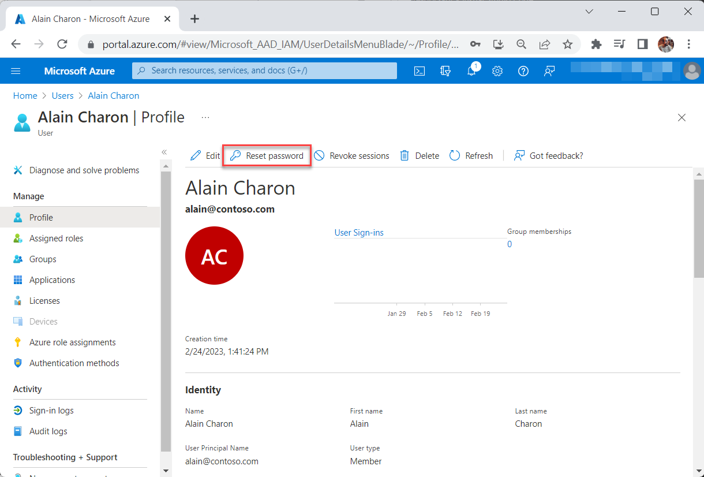

# Use the Azure portal to create and delete consumer users in Azure AD B2C

There might be scenarios in which you want to manually create consumer accounts in your Azure Active Directory B2C (Azure AD B2C) directory. Although consumer accounts in an Azure AD B2C directory are most commonly created when users sign up to use one of your applications, you can create them programmatically and by using the Azure portal. This article focuses on the Azure portal method of user creation and deletion.

To add or delete users, your account must be assigned the *User administrator* or *Global administrator* role.

## Types of user accounts

As described in [Overview of user accounts in Azure AD B2C](user-overview.md), there are three types of user accounts that can be created in an Azure AD B2C directory:

* Work
* Guest
* Consumer

This article focuses on working with **consumer accounts** in the Azure portal. For information about creating and deleting Work and Guest accounts, see [Add or delete users using Azure Active Directory](../active-directory/fundamentals/add-users-azure-active-directory.md).

## Create a consumer user

1. Sign in to the [Azure portal](https://portal.azure.com).
1. Make sure you're using the directory that contains your Azure AD B2C tenant. Select the **Directories + subscriptions** icon in the portal toolbar.
1. On the **Portal settings | Directories + subscriptions** page, find your Azure AD B2C directory in the **Directory name** list, and then select **Switch**.
1. In the left menu, select **Azure AD B2C**. Or, select **All services** and search for and select **Azure AD B2C**.
1. Under **Manage**, select **Users**.
1. Select **New user**.
1. Select **Create Azure AD B2C user**.
1. Choose a **Sign in method** and enter either an **Email** address or a **Username** for the new user. The sign in method you select here must match the setting you've specified for your Azure AD B2C tenant's *Local account* identity provider (see **Manage** > **Identity providers** in your Azure AD B2C tenant).
1. Enter a **Name** for the user. This is typically the full name (given and surname) of the user.
1. (Optional) You can **Block sign in** if you wish to delay the ability for the user to sign in. You can enable sign in later by editing the user's **Profile** in the Azure portal.
1. Choose **Autogenerate password** or **Let me create password**.
1. Specify the user's **First name** and **Last name**.
1. Select **Create**.

Unless you've selected **Block sign in**, the user can now sign in using the sign in method (email or username) that you specified.

## Reset a user's password

As an administrator, you can reset a user's password, if the user forgets their password. When you reset the user's password, a temporary password is autogenerated for the user. The temporary password never expires. The next time the user signs in, the password will still work, regardless how much time has passed since the temporary password was generated. Then user must reset password to a permanent one. 

> [!IMPORTANT]
> Before you reset a user's password, [set up a force password reset flow in Azure Active Directory B2C](force-password-reset.md), otherwise the user won't be able to sign-in.

To reset a user's password:

1. In your Azure AD B2C directory, select **Users**, and then select the user you want to reset the password.
1. Search for and select the user that needs the reset, and then select **Reset Password**.

    The **Alain Charon - Profile** page appears with the **Reset password** option.

    

1. In the **Reset password** page, select **Reset password**.
1. Copy the password and give it to the user. The user will be required to change the password during the next sign-in process.

## Delete a consumer user

1. In your Azure AD B2C directory, select **Users**, and then select the user you want to delete.
1. Select **Delete**, and then **Yes** to confirm the deletion.

For details about restoring a user within the first 30 days after deletion, or for permanently deleting a user, see [Restore or remove a recently deleted user using Azure Active Directory](../active-directory/fundamentals/active-directory-users-restore.md).

## Next steps

For automated user management scenarios, for example migrating users from another identity provider to your Azure AD B2C directory, see [Azure AD B2C: User migration](user-migration.md).
