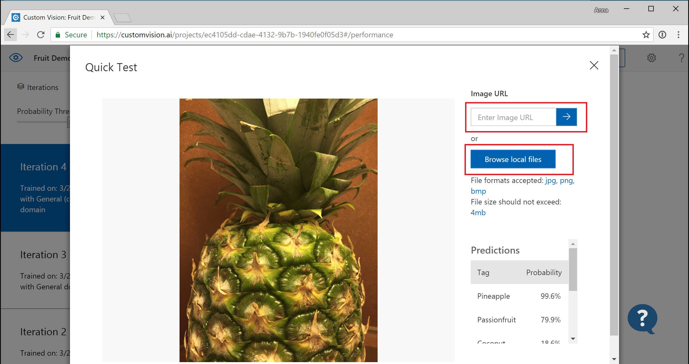
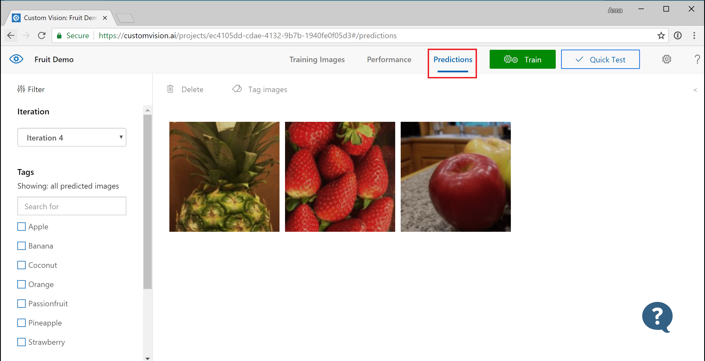
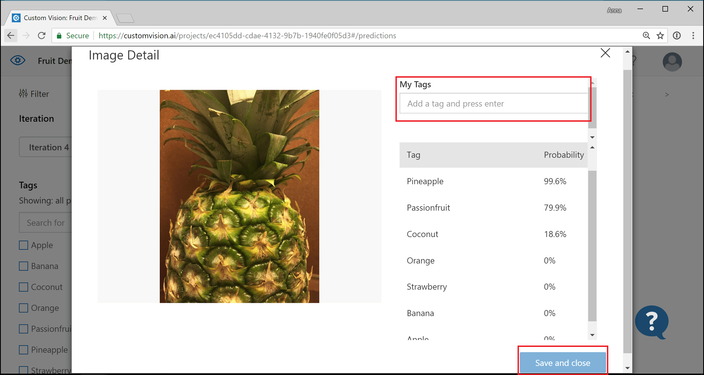

# Test and retrain a Custom Vision model

After you train your Custom Vision model, you can quickly test it using a locally stored image or a URL pointing to a remote image. Test the most recently trained iteration of your model, and then decide whether further training is needed.

## Test your model

1. From the [Custom Vision web portal](https://customvision.ai), select your project. Select **Quick Test** on the right of the top menu bar. This action opens a window labeled **Quick Test**.

    

1. In the **Quick Test** window, select in the **Submit Image** field and enter the URL of the image you want to use for your test. If you want to use a locally stored image instead, select the **Browse local files** button and select a local image file.

    

The image you select appears in the middle of the page. Then the prediction results appear below the image in the form of a table with two columns, labeled **Tags** and **Confidence**. After you view the results, you may close the **Quick Test** window.

## Use the predicted image for training

You can now take the image submitted previously for testing and use it to retrain your model.

1. To view images submitted to the classifier, open the [Custom Vision web page](https://customvision.ai) and select the **Predictions** tab.

    

    > [!TIP]
    > The default view shows images from the current iteration. You can use the **Iteration** drop down field to view images submitted during previous iterations.

1. Hover over an image to see the tags that were predicted by the classifier.

    > [!TIP]
    > Images are ranked, so that the images that can bring the most gains to the classifier are at the top. To select a different sorting, use the **Sort** section.

    To add an image to your training data, select the image, manually select the tag(s), and then select **Save and close**. The image is removed from **Predictions** and added to the training images. You can view it by selecting the **Training Images** tab.

    

1. Use the **Train** button to retrain the classifier.

## Next steps

[Improve your model](getting-started-improving-your-classifier.md)
