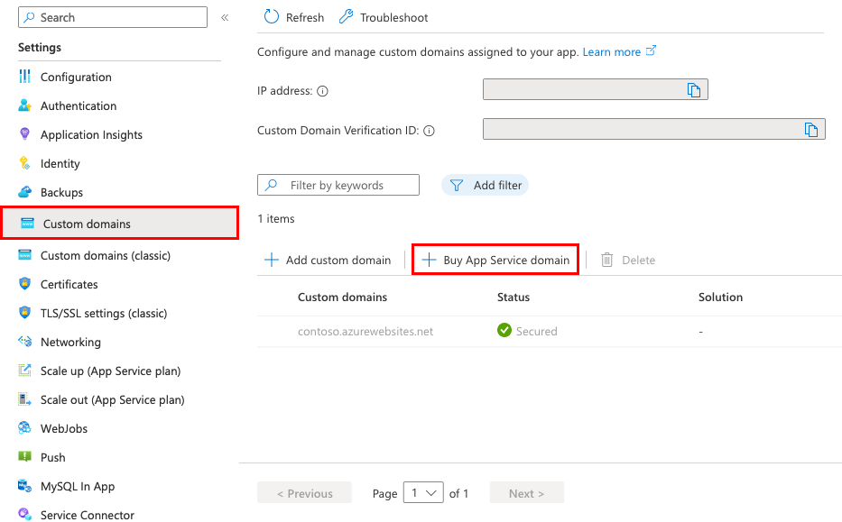
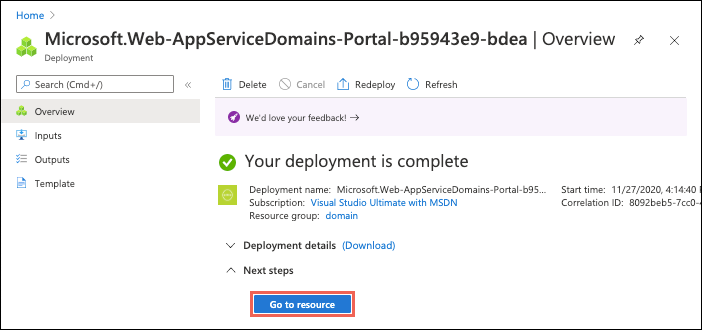
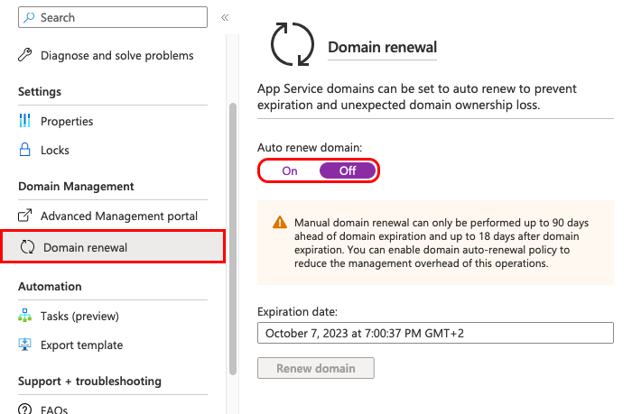

# Buy a custom domain name for Azure App Service

App Service domains are custom domains that are managed directly in Azure. They make it easy to manage custom domains for [Azure App Service](overview.md). This tutorial shows you how to buy an App Service domain and assign DNS names to Azure App Service.

For Azure VM or Azure Storage, see [Assign App Service domain to Azure VM or Azure Storage](https://azure.github.io/AppService/2017/07/31/Assign-App-Service-domain-to-Azure-VM-or-Azure-Storage). For Cloud Services, see 
[Configuring a custom domain name for an Azure cloud service](../cloud-services/cloud-services-custom-domain-name-portal.md).

## Prerequisites

To complete this tutorial:

* [Create an App Service app](./index.yml), or use an app that you created for another tutorial. The app should be in an Azure Public region. At this time, Azure National Clouds are not supported.
* [Remove the spending limit on your subscription](../cost-management-billing/manage/spending-limit.md#remove). You cannot buy App Service domains with free subscription credits.

## Buy an App Service domain

For pricing information on App Service domains, visit the [App Service Pricing page](https://azure.microsoft.com/pricing/details/app-service/windows/) and scroll down to App Service Domain.

1. Open the [Azure portal](https://portal.azure.com) and sign in with your Azure account.

1. In the search bar, search for and select **App Service Domains**.

    

1. In the **App Service Domains** view, click **Add**.

    

1. Select **Click to try the newer version of the App Service Domains create experience**.

    

### Basics tab

1. In the **Basics** tab, configure the settings using the following table:  

   | Setting  | Description |
   | -------- | ----------- |
   | **Subscription** | The subscription to use to buy the domain. |
   | **Resource Group** | The resource group to put the domain in. For example, the resource group your app is in. |
   | **Domain** | Type the domain you want. For example, **contoso.com**. If the domain you want is not available, you can select from a list of suggestions of available domains, or try a different domain. |

    > [!NOTE]
    > The following [top-level domains](https://wikipedia.org/wiki/Top-level_domain) are supported by App Service domains: _com_, _net_, _co.uk_, _org_, _nl_, _in_, _biz_, _org.uk_, and _co.in_.
    >
    >
    
2. When finished, click **Next: Contact information**.

### Contact information tab

1. Supply your information as required by [ICANN](https://go.microsoft.com/fwlink/?linkid=2116641) for the domain registration. 

    It is important that you fill out all required fields with as much accuracy as possible. Incorrect data for contact information can result in failure to buy the domain.

1. When finished, click **Next: Advanced**.

### Advanced tab

1. In the **Advanced** tab, configure the optional settings:  

   | Setting  | Description |
   | -------- | ----------- |
   | **Auto renewal** | Enabled by default. Your App Service domain is registered to you at one-year increments. Auto renewal makes sure that your domain registration doesn't expire and that you retain ownership of the domain. Your Azure subscription is automatically charged the yearly domain registration fee at the time of renewal. To opt out, select **Disable**. If auto-renewal is disabled, you can [renew it manually](#renew-the-domain). |
   | **Privacy protection** | Enabled by default. Privacy protection hides your domain registration contact information from the WHOIS database. Privacy protection is already included in the yearly domain registration fee. To opt out, select **Disable**. |

2. When finished, click **Next: Tags**.

### Finish

1. In the **Tags** tab, set the tags you want for your App Service domain. Tagging is not required for using App Service domains, but is a [feature in Azure that helps you manage your resources](../azure-resource-manager/management/tag-resources.md).

1. Click **Next: Review + create**.

1. In the **Review + create** tab, review your domain order. When finished, click **Create**.

    > [!NOTE]
    > App Service Domains use GoDaddy for domain registration and Azure DNS to host the domains. In addition to the yearly domain registration fee, usage charges for Azure DNS apply. For information, see [Azure DNS Pricing](https://azure.microsoft.com/pricing/details/dns/).
    >
    >

1. When the domain registration is complete, you see a **Go to resource** button. Select it to see it's management page.

    

You're now ready to assign an App Service app to this custom domain.

> [!NOTE]
> Depending on the subscription type, a sufficient payment history may be required prior to creating an App Service Domain. 
> 
> If you have made payments and are still running into this error, you can contact support and provide proof of payments.

## Prepare the app

To map a custom DNS name to a web app, the web app's [App Service plan](https://azure.microsoft.com/pricing/details/app-service/) must be a paid tier (Shared, Basic, Standard, Premium, or Consumption for Azure Functions). In this step, you make sure that the App Service app is in the supported pricing tier.

[!INCLUDE [app-service-dev-test-note](../../includes/app-service-dev-test-note.md)]

### Navigate to the app in the Azure portal

1. From the top search bar, search for and select **App Services**.

    

1. Select the name of the app.

    

    You see the management page of the App Service app.  

### Check the pricing tier

1. In the left navigation of the app page, scroll to the **Settings** section and select **Scale up (App Service plan)**.

    

1. The app's current tier is highlighted by a blue border. Check to make sure that the app is not in the **F1** tier. Custom DNS is not supported in the **F1** tier. 

    :::image type="content" source="./media/app-service-web-tutorial-custom-domain/check-pricing-tier.png" alt-text="Screenshot of the left navigation menu of the app page with Scale up (App Service plan) selected.":::

1. If the App Service plan is not in the **F1** tier, close the **Scale up** page and skip to [Buy the domain](#buy-an-app-service-domain).

### Scale up the App Service plan

1. Select any of the non-free tiers (**D1**, **B1**, **B2**, **B3**, or any tier in the **Production** category). For additional options, click **See additional options**.

1. Click **Apply**.

    :::image type="content" source="./media/app-service-web-tutorial-custom-domain/choose-pricing-tier.png" alt-text="Screenshot of the custom domain pricing tiers in the Production category with the Production tab, B1 plan, and the Apply button highlighted.":::

    When you see the following notification, the scale operation is complete.

    

## Map App Service domain to your app

It's easy to map a hostname in your App Service domain to an App Service app, as long as it's in the same subscription. You map the App Service domain or any of its subdomain directly in your app, and Azure creates the necessary DNS records for you.

> [!NOTE]
> If the domain and the app are in different subscriptions, you map the App Service domain to the app just like [mapping an externally purchased domain](app-service-web-tutorial-custom-domain.md). In this case, Azure DNS is the external domain provider, and you need to [add the required DNS records manually](#manage-custom-dns-records).
>

### Map the domain

1. In the left navigation of the app page, scroll to the **Settings** section and select **Custom domains**.

    

1. Select **Add custom domain**.

    

1. Type the App Service domain (such as **contoso.com**) or a subdomain (such as **www.contoso.com**) and click **Validate**.

    > [!NOTE]
    > If you made a typo in the App Service domain name, a verification error appears at the bottom of the page to tell you that you're missing some DNS records. You don't need to add these records manually for an App Service domain. Just make sure that you type the domain name correctly and click **Validate** again.
    >
    > 

1. Accept the **Hostname record type** and click **Add custom domain**.

    

1. It might take some time for the new custom domain to be reflected in the app's **Custom Domains** page. Refresh the browser to update the data.

    

    > [!NOTE]
    > A **Not Secure** label for your custom domain means that it's not yet bound to a TLS/SSL certificate. Any HTTPS request from a browser to your custom domain will receive an error or warning, depending on the browser. To add a TLS binding, see [Secure a custom DNS name with a TLS/SSL binding in Azure App Service](configure-ssl-bindings.md).
    
### Test the custom domain

To test the custom domain, navigate to it in the browser.

## Renew the domain

The App Service domain you bought is valid for one year from the time of purchase. You can configure to renew your domain automatically which will charge your payment method when your domain renews the following year. You can also manually renew your domain name.

If you want to configure automatic renewal, or if you want to manually renew your domain, follow the steps here.

1. In the search bar, search for and select **App Service Domains**.

    

1. In the **App Service Domains** section, select the domain you want to configure.

1. From the left navigation of the domain, select **Domain renewal**. To start renewing your domain automatically, select **On**, otherwise select **Off**. The setting takes effect immediately. If automatic renewal is enabled, on the day after your domain expiration date, Azure attempts to bill you for the domain name renewal.

    

    > [!NOTE]
    > When navigating away from the page, disregard the "Your unsaved edits will be discarded" error by clicking **OK**.
    >

To manually renew your domain, select **Renew domain**. However, this button is not active until 90 days before the domain's expiration date.

If your domain renewal is successful, you receive an email notification within 24 hours. 

## Manage custom DNS records

In Azure, DNS records for an App Service Domain are managed using [Azure DNS](https://azure.microsoft.com/services/dns/). You can add, remove, and update DNS records, just like for an externally purchased domain. To manage custom DNS records:

1. In the search bar, search for and select **App Service Domains**.

    

1. In the **App Service Domains** section, select the domain you want to configure.

1. From the **Overview** page, select **Manage DNS records**.

    

For information on how to edit DNS records, see [How to manage DNS Zones in the Azure portal](../dns/dns-operations-dnszones-portal.md).

## Cancel purchase (delete domain)

After you purchase the App Service Domain, you have five days to cancel your purchase for a full refund. After five days, you can delete the App Service Domain, but cannot receive a refund.

1. In the search bar, search for and select **App Service Domains**.

    

1. In the **App Service Domains** section, select the domain you want to configure.

1. In the domain's left navigation, select **Locks**. 

    A delete lock has been created for your domain. As long as a delete lock exists, you can't delete the App Service domain.

1. Click **Delete** to remove the lock.

1. In the domain's left navigation, select **Overview**. 

1. If the cancellation period on the purchased domain has not elapsed, select **Cancel purchase**. Otherwise, you see a **Delete** button instead. To delete the domain without a refund, select **Delete**.

    

1. Confirm the operation by selecting **Yes**.

    After the operation is complete, the domain is released from your subscription and available for anyone to purchase again. 

## Direct default URL to a custom directory

By default, App Service directs web requests to the root directory of your app code. To direct them to a subdirectory, such as `public`, see [Redirect to a custom directory](configure-common.md#redirect-to-a-custom-directory).

## Next steps

Learn how to bind a custom TLS/SSL certificate to App Service.

> [!div class="nextstepaction"]
> [Secure a custom DNS name with a TLS binding in Azure App Service](configure-ssl-bindings.md)
