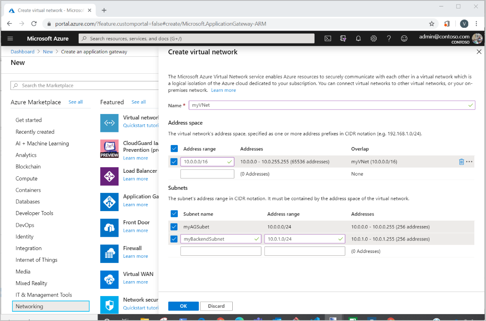
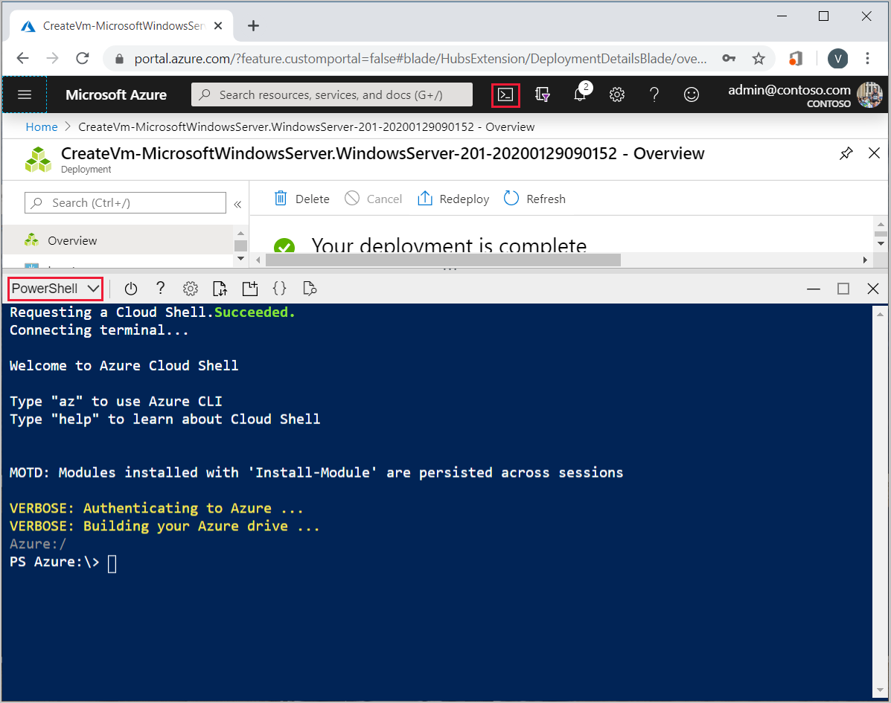
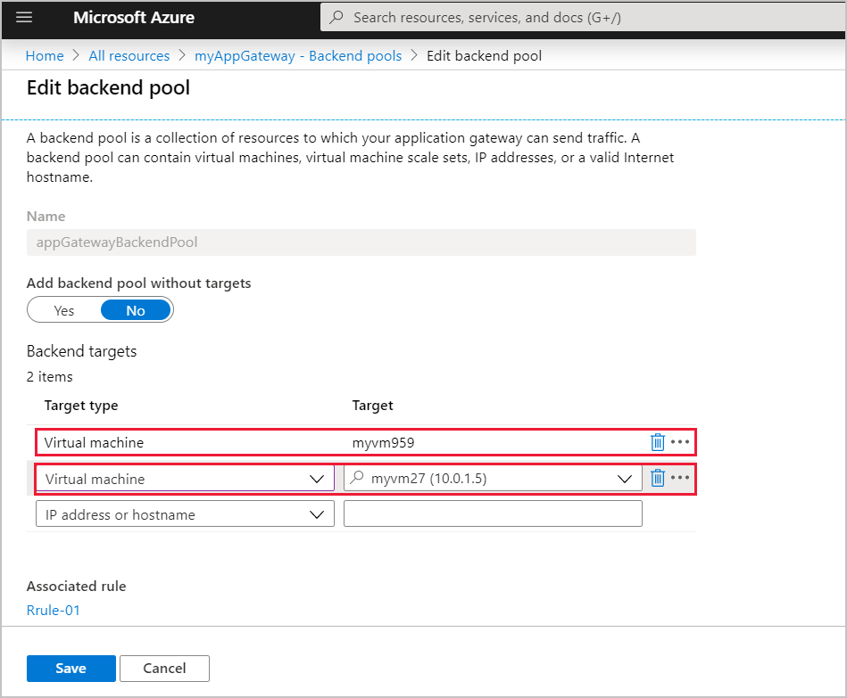

# Configure an application gateway with an internal load balancer (ILB) endpoint

Azure Application Gateway Standard v1 can be configured with an Internet-facing VIP or with an internal endpoint that isn't exposed to the Internet. An internal endpoint uses a private IP address for the frontend, which is also known as an *internal load balancer (ILB) endpoint*.

Configuring the gateway using a frontend private IP address is useful for internal line-of-business applications that aren't exposed to the Internet. It's also useful for services and tiers within a multi-tier application that are in a security boundary that isn't exposed to the Internet but:

- still require round-robin load distribution
- session stickiness
- or Transport Layer Security (TLS) termination (previously known as Secure Sockets Layer (SSL)).

This article guides you through the steps to configure a Standard v1 Application Gateway with an ILB using the Azure portal.

[!INCLUDE [updated-for-az](../../includes/updated-for-az.md)]

## Sign in to Azure

Sign in to the [Azure portal](https://portal.azure.com).

## Create an application gateway

For Azure to communicate between the resources that you create, it needs a virtual network. Either create a new virtual network or use an existing one. 

In this example, you create a new virtual network. You can create a virtual network at the same time that you create the application gateway. Application Gateway instances are created in separate subnets. There are two subnets in this example: one for the application gateway, and another for the backend servers.

1. Expand the portal menu and select **Create a resource**.
2. Select **Networking** and then select **Application Gateway** in the Featured list.
3. Enter *myAppGateway* for the name of the application gateway and *myResourceGroupAG* for the new resource group.
4. For **Region**, select **Central US**.
5. For **Tier**, select **Standard**.
6. Under **Configure virtual network** select **Create new**, and then enter these values for the virtual network:
   - *myVNet* - for the name of the virtual network.
   - *10.0.0.0/16* - for the virtual network address space.
   - *myAGSubnet* - for the subnet name.
   - *10.0.0.0/24* - for the subnet address space.
   - *myBackendSubnet* - for the backend subnet name.
   - *10.0.1.0/24* - for the backend subnet address space.

    

6. Select **OK** to create the virtual network and subnets.
7. Select **Next : Frontends**.
8. For **Frontend IP address type**, select **Private**.

   By default, it's a dynamic IP address assignment. The first available address of the configured subnet is assigned as the frontend IP address.
   > [!NOTE]
   > Once allocated, the IP address type (static or dynamic) cannot be changed later.
9. Select **Next:Backends**.
10. Select **Add a backend pool**.
11. For **Name**, type *appGatewayBackendPool*.
12. For **Add backend pool without targets**, select **Yes**. You'll add the targets later.
13. Select **Add**.
14. Select **Next:Configuration**.
15. Under **Routing rules**, select **Add a routing rule**.
16. For **Rule name**, type *Rrule-01*.
17. For **Listener name**, type *Listener-01*.
18. For **Frontend IP**, select **Private**.
19. Accept the remaining defaults and select the **Backend targets** tab.
20. For **Target type**, select **Backend pool**, and then select **appGatewayBackendPool**.
21. For **HTTP setting**, select **Add new**.
22. For **HTTP setting name**, type *http-setting-01*.
23. For **Backend protocol**, select **HTTP**.
24. For **Backend port**, type *80*.
25. Accept the remaining defaults, and select **Add**.
26. On the **Add a routing rule** page, select **Add**.
27. Select **Next: Tags**.
28. Select **Next: Review + create**.
29. Review the settings on the summary page, and then select **Create** to create the network resources and the application gateway. It may take several minutes to create the application gateway. Wait until the deployment finishes successfully before moving on to the next section.

## Add backend pool

The backend pool is used to route requests to the backend servers that serve the request. The backend can be composed of NICs, virtual machine scale sets, public IP addresses, internal IP addresses, fully qualified domain names (FQDN), and multi-tenant back-ends like Azure App Service. In this example, you use virtual machines as the target backend. You can either use existing virtual machines or create new ones. In this example, you create two virtual machines that Azure uses as backend servers for the application gateway.

To do this, you:

1. Create two new virtual machines, *myVM* and *myVM2*, used as backend servers.
2. Install IIS on the virtual machines to verify that the application gateway was created successfully.
3. Add the backend servers to the backend pool.

### Create a virtual machine


1. Select **Create a resource**.
2. Select **Compute** and then select **Virtual machine**.
4. Enter these values for the virtual machine:
   - Select your subscription.
   - Select *myResourceGroupAG* for **Resource group**.
   - Type *myVM* for **Virtual machine name**.
   - Select **Windows Server 2019 Datacenter** for **Image**.
   - Type a valid **Username**.
   - Type a valid **Password**.
1. Accept the remaining defaults and select **Next: Disks**.
1. Accept the defaults and select **Next : Networking**.
1. Ensure that **myVNet** is selected for the virtual network and the subnet is **myBackendSubnet**.
1. Accept the remaining defaults, and select **Next : Management**.
1. Select **Disable** to disable boot diagnostics.
1. Select **Review + create**.
1. Review the settings on the summary page, and then select **Create**. It may take several minutes to create the VM. Wait until the deployment finishes successfully before moving on to the next section.

### Install IIS

1. Open the Cloud Shell and ensure that it's set to **PowerShell**.
    
2. Run the following command to install IIS on the virtual machine:

   ```azurepowershell
   Set-AzVMExtension `
        -ResourceGroupName myResourceGroupAG `
        -ExtensionName IIS `
        -VMName myVM `
        -Publisher Microsoft.Compute `
        -ExtensionType CustomScriptExtension `
        -TypeHandlerVersion 1.4 `
        -SettingString '{"commandToExecute":"powershell Add-WindowsFeature Web-Server; powershell Add-Content -Path \"C:\\inetpub\\wwwroot\\Default.htm\" -Value $($env:computername)"}' `
         -Location CentralUS 

   ```

3. Create a second virtual machine and install IIS using the steps that you just finished. Use myVM2 for the virtual machine name and for `VMName` in `Set-AzVMExtension`.

### Add backend servers to backend pool

1. Select **All resources**, and then select **myAppGateway**.
2. Select **Backend pools**, and then select **appGatewayBackendPool**.
3. Under **Target type** select **Virtual machine**  and under **Target**, select the vNIC associated with myVM.
4. Repeat to add MyVM2.
   
5. Select **Save.**

## Create a client virtual machine

The client virtual machine is used to connect to the application gateway backend pool.

- Create a third virtual machine using the previous steps. Use myVM3 for the virtual machine name.

## Test the application gateway

1. On the myAppGateway page, select **Frontend IP Configurations** to note the frontend private IP address.
    
2. Copy the private IP address, and then paste it into the browser address bar on myVM3 to access the application gateway backend pool.

## Next steps

If you want to monitor the health of your backend pool, see [Back-end health and diagnostic logs for Application Gateway](application-gateway-diagnostics.md).
