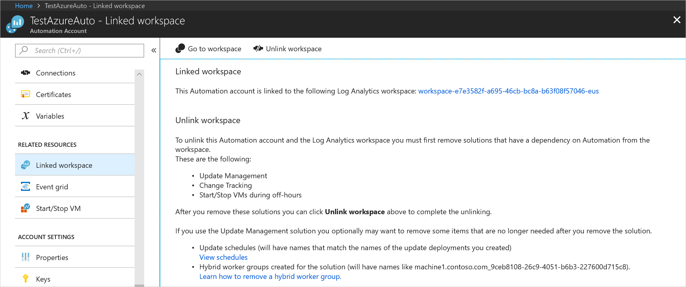

# Remove Change Tracking and Inventory from Automation account

After you enable management of your virtual machines using Azure Automation Change Tracking and Inventory, you may decide to stop using it and remove the configuration from the account and linked Log Analytics workspace. This article tells you how to completely remove Change Tracking and Inventory from the managed VMs, your Automation account, and Log Analytics workspace.

## Sign into the Azure portal

Sign in to the [Azure portal](https://portal.azure.com).

## Remove management of VMs

Before removing Change Tracking and Inventory, you need to first stop managing your VMs. See [Remove VMs from Change Tracking](remove-vms-from-change-tracking.md) to unenroll them from the feature.

## Remove ChangeTracking solution

Before you can unlink the Automation account from the workspace, you need to follow these steps to completely remove Change Tracking and Inventory. You'll remove the **ChangeTracking** solution from the workspace.

1. In the Azure portal, select **All services**. In the list of resources, type **Log Analytics**. As you begin typing, the list filters suggestions based on your input. Select **Log Analytics**.

2. In your list of Log Analytics workspaces, select the workspace you chose when you enabled Change Tracking and Inventory.

3. On the left, select **Solutions**.  

4. In the list of solutions, select **ChangeTracking(workspace name)**. On the **Overview** page for the solution, select **Delete**. When prompted to confirm, select **Yes**.

## Unlink workspace from Automation account

1. In the Azure portal, select **Automation Accounts**.

2. Open your Automation account and select **Linked workspace** under **Related Resources** on the left.

3. On the **Unlink workspace** page, select **Unlink workspace** and respond to prompts.

   

While it attempts to unlink the Log Analytics workspace, you can track the progress under **Notifications** from the menu.

Alternatively, you can unlink your Log Analytics workspace from your Automation account from within the workspace:

1. In the Azure portal, select **Log Analytics**.

2. From the workspace, select **Automation Account** under **Related Resources**.

3. On the Automation Account page, select **Unlink account**.

While it attempts to unlink the Automation account, you can track the progress under **Notifications** from the menu.

## Next steps

To re-enable this feature, see [Enable Change Tracking and Inventory from an Automation account](enable-from-automation-account.md), [Enable Change Tracking and Inventory by browsing the Azure portal](enable-from-portal.md), [Enable Change Tracking and Inventory from a runbook](enable-from-runbook.md), or [Enable Change Tracking and Inventory from an Azure VM](enable-from-vm.md).
