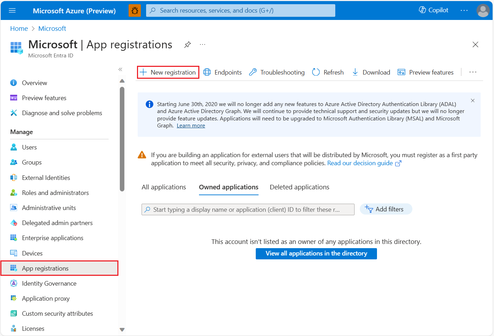
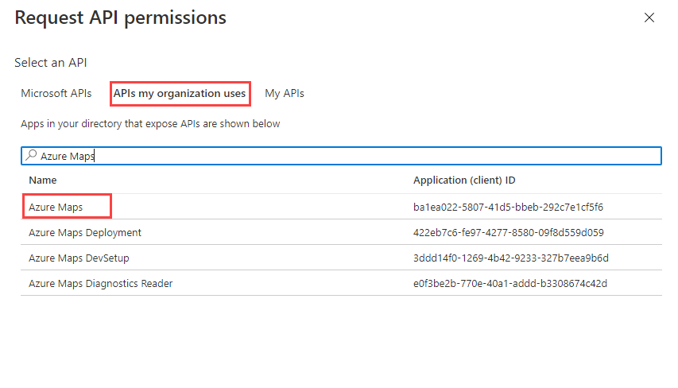
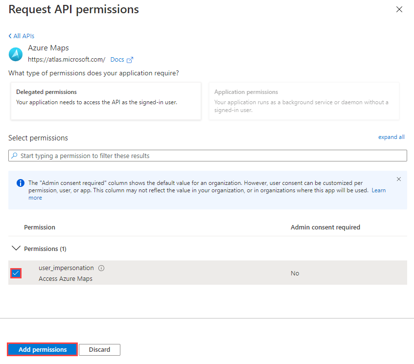

# Secure a web application with user sign-in

The following guide pertains to an application which is hosted on web servers, maintains multiple business scenarios, and deploys to web servers. The application has the requirement to provide protected resources secured only to Azure AD users. The objective of the scenario is to enable the web application to authenticate to Azure AD and call Azure Maps REST APIs on behalf of the user.

[!INCLUDE [authentication details](./includes/view-authentication-details.md)]

## Create an application registration in Azure AD

You must create the web application in Azure AD for users to sign in. This web application will then delegate user access to Azure Maps REST APIs.

1. In the Azure portal, in the list of Azure services, select **Azure Active Directory** > **App registrations** > **New registration**.  

    > [!div class="mx-imgBorder"]
    > 

2. Enter a **Name**, choose a **Support account type**, provide a redirect URI which will represent the url which Azure AD will issue the token and is the url where the map control is hosted. For more details please see Azure AD [Scenario: Web app that signs in users](https://docs.microsoft.com/azure/active-directory/develop/scenario-web-app-sign-user-overview). Complete the provided steps from the Azure AD scenario.  

3. Once the application registration is complete, Confirm that application sign-in works for users. Once sign-in works, then the application can be granted delegated access to Azure Maps REST APIs.
    
4.  To assign delegated API permissions to Azure Maps, go to the application. Then select **API permissions** > **Add a permission**. Under **APIs my organization uses**, search for and select **Azure Maps**.

    > [!div class="mx-imgBorder"]
    > 

5. Select the check box next to **Access Azure Maps**, and then select **Add permissions**.

    > [!div class="mx-imgBorder"]
    > 

6. Enable the web application to call Azure Maps REST APIs by configuring the app registration with an application secret, For detailed steps, see [A web app that calls web APIs: App registration](https://docs.microsoft.com/azure/active-directory/develop/scenario-web-app-call-api-app-registration). A secret is required to authenticate to Azure AD on-behalf of the user. The app registration certificate or secret should be stored in a secure store for the web application to retrieve to authenticate to Azure AD. 
   
   * If the application already has configured an Azure AD app registration and a secret this step may be skipped.

> [!Tip]
> If the application is hosted in an Azure environment, we recommend using [Managed identities for Azure resources](https://docs.microsoft.com/azure/active-directory/managed-identities-azure-resources/overview) and an Azure Key Vault instance to access secrets by [acquiring an access token](https://docs.microsoft.com/azure/active-directory/managed-identities-azure-resources/how-to-use-vm-token) for accessing Azure Key Vault secrets or certificates. To connect to Azure Key Vault to retrieve secrets, see [tutorial to connect through managed identity](https://docs.microsoft.com/azure/key-vault/general/tutorial-net-create-vault-azure-web-app).
   
7. Implement a secure token endpoint for the Azure Maps Web SDK to access a token. 
   
   * For a sample token controller, see [Azure Maps Azure AD Samples](https://github.com/Azure-Samples/Azure-Maps-AzureAD-Samples/blob/master/src/OpenIdConnect/AzureMapsOpenIdConnectv1/AzureMapsOpenIdConnect/Controllers/TokenController.cs). 
   * For a non-AspNetCore implementation or other, see [Acquire token for the app](https://docs.microsoft.com/azure/active-directory/develop/scenario-web-app-call-api-acquire-token) from Azure AD documentation.
   * The secured token endpoint is responsible to return an access token for the authenticated and authorized user to call Azure Maps REST APIs.

8. Configure Azure role based access control for users or groups. See [grant role based access for users](#grant-role-based-access-for-users-to-azure-maps).

9. Configure the web application page with the Azure Maps Web SDK to access the secure token endpoint. 

```javascript
var map = new atlas.Map("map", {
        center: [-122.33, 47.64],
        zoom: 12,
        language: "en-US",
        authOptions: {
            authType: "anonymous",
            clientId: "<insert>",  // azure map account client id
            getToken: function (resolve, reject, map) {
                var xhttp = new XMLHttpRequest();
                xhttp.open("GET", "/api/token", true); // the url path maps to the token endpoint.
                xhttp.onreadystatechange = function () {
                    if (this.readyState === 4 && this.status === 200) {
                        resolve(this.responseText);
                    } else if (this.status !== 200) {
                        reject(this.responseText);
                    }
                };

                xhttp.send();
            }
        }
    });
    map.events.add("tokenacquired", function () {
        console.log("token acquired");
    });
    map.events.add("error", function (err) {
        console.log(JSON.stringify(err.error));
    });
```

[!INCLUDE [grant role access to users](./includes/grant-rbac-users.md)]

## Next steps

Further understanding of web application scenario:
> [!div class="nextstepaction"]
> [Scenario: Web app that signs in users](https://docs.microsoft.com/azure/active-directory/develop/scenario-web-app-sign-user-overview)

Find the API usage metrics for your Azure Maps account:
> [!div class="nextstepaction"]
> [View usage metrics](how-to-view-api-usage.md)

Explore samples that show how to integrate Azure AD with Azure Maps:
> [!div class="nextstepaction"]
> [Azure Maps Azure AD Web App Samples](https://github.com/Azure-Samples/Azure-Maps-AzureAD-Samples/tree/master/src/OpenIdConnect)
