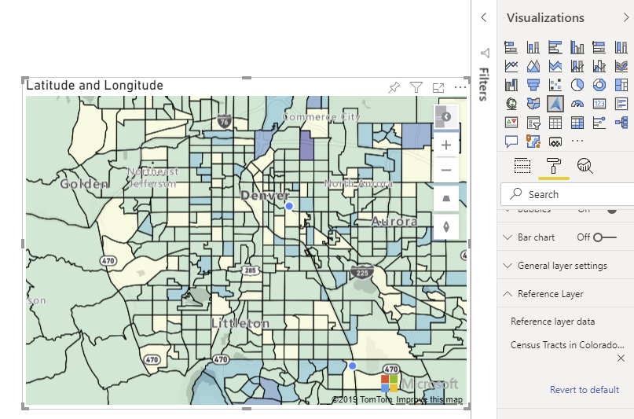

# Add a reference layer

The reference layer feature lets a secondary spatial dataset be uploaded to the visual and overlaid on the map to provide addition context. This dataset is hosted by Power BI and must be a [GeoJSON file](https://wikipedia.org/wiki/GeoJSON) with a `.json` or `.geojson` file extension.

To add a **GeoJSON** file as a reference layer, go to the **Format** pane, expand the **Reference layer** section, and press the **+ Add local file** button.

After a GeoJSON file is added to the reference layer, the name of the file will appear in place of the **+ Add local file** button with an **X** beside it. Press the **X** button to remove the data from the visual and delete the GeoJSON file from Power BI.

The following map is displays [2016 census tracts for Colorado](https://github.com/Azure-Samples/AzureMapsCodeSamples/tree/master/AzureMapsCodeSamples/Common/data/geojson), colored by population.

> [!div class="mx-imgBorder"]
> 

The following are all settings in the **Format** pane that are available in the **Reference layer** section.

| Setting              | Description   |
|----------------------|---------------|
| Reference layer data | The data GeoJSON file to upload to the visual as an additional layer within the map. The **+ Add local file** button opens a file dialog the user can use to select a GeoJSON file that has a `.json` or `.geojson` file extension. |

> [!NOTE]
> In this preview of the Azure Maps visual, the reference layer will only load the first 5,000 shape features to the map. This limit will be increased in a future update.

## Styling data in a reference layer

Properties can be added to each feature within the GeoJSON file to customize how it is styled on the map. This feature uses the simple data layer feature in the Azure Maps Web SDK. For more information, see this document on [supported style properties](spatial-io-add-simple-data-layer.md#default-supported-style-properties). Custom icon images are not supported within the Azure Maps visual as a security precaution.

The following is an example of a GeoJSON point feature that sets its displayed color to red.

```json
{
    "type": "Feature",
    "geometry": {
        "type": "Point",
        "coordinates": [-122.13284, 47.63699]
    },
    "properties": {
        "color": "red"
    }
}
```
## Next steps

Add more context to the map:

> [!div class="nextstepaction"]
> [Add a tile layer](power-bi-visual-add-tile-layer.md)

> [!div class="nextstepaction"]
> [Show real-time traffic](power-bi-visual-show-real-time-traffic.md)
