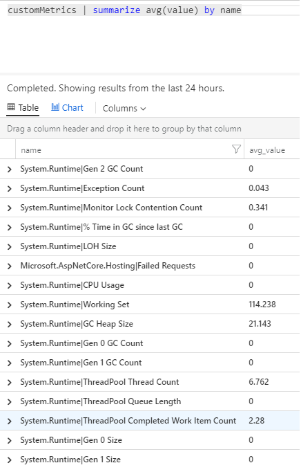
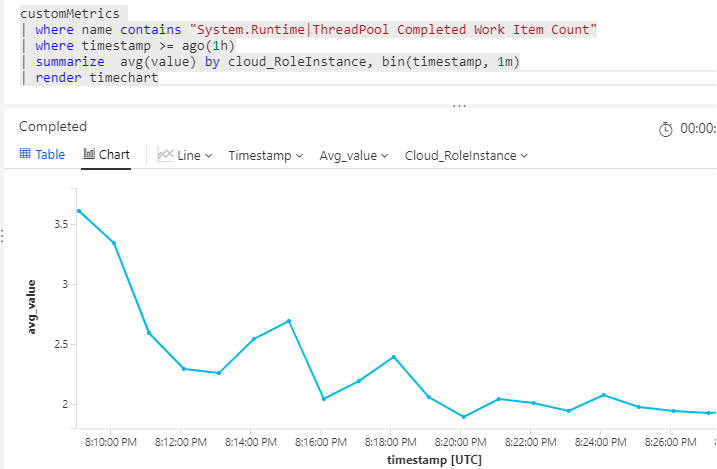

# EventCounters introduction

`EventCounter` is .NET/.NET Core mechanism to publish and consume counters or statistics. [This](https://github.com/dotnet/runtime/blob/master/src/libraries/System.Diagnostics.Tracing/documentation/EventCounterTutorial.md) document gives an overview of `EventCounters` and examples on how to publish and consume them. EventCounters are supported in all OS platforms - Windows, Linux, and macOS. It can be thought of as a cross-platform equivalent for the [PerformanceCounters](/dotnet/api/system.diagnostics.performancecounter) that is only supported in Windows systems.

While users can publish any custom `EventCounters` to meet their needs, .NET Core 3.0 and higher runtime publishes a set of these counters by default. This document will walk through the steps required to collect and view `EventCounters` (system defined or user defined) in Azure Application Insights.

## Using Application Insights to collect EventCounters

Application Insights supports collecting `EventCounters` with its `EventCounterCollectionModule`, which is part of the newly released NuGet package [Microsoft.ApplicationInsights.EventCounterCollector](https://www.nuget.org/packages/Microsoft.ApplicationInsights.EventCounterCollector). `EventCounterCollectionModule` is automatically enabled when using either [AspNetCore](asp-net-core.md) or [WorkerService](worker-service.md). `EventCounterCollectionModule` collects counters with a non-configurable collection frequency of 60 seconds. There are no special permissions required to collect EventCounters.

## Default counters collected

For apps running in .NET Core 3.0 or higher, the following counters are collected automatically by the SDK. The name of the counters will be of the form "Category|Counter".

|Category | Counter|
|---------------|-------|
|`System.Runtime` | `cpu-usage` |
|`System.Runtime` | `working-set` |
|`System.Runtime` | `gc-heap-size` |
|`System.Runtime` | `gen-0-gc-count` |
|`System.Runtime` | `gen-1-gc-count` |
|`System.Runtime` | `gen-2-gc-count` |
|`System.Runtime` | `time-in-gc` |
|`System.Runtime` | `gen-0-size` |
|`System.Runtime` | `gen-1-size` |
|`System.Runtime` | `gen-2-size` |
|`System.Runtime` | `loh-size` |
|`System.Runtime` | `alloc-rate` |
|`System.Runtime` | `assembly-count` |
|`System.Runtime` | `exception-count` |
|`System.Runtime` | `threadpool-thread-count` |
|`System.Runtime` | `monitor-lock-contention-count` |
|`System.Runtime` | `threadpool-queue-length` |
|`System.Runtime` | `threadpool-completed-items-count` |
|`System.Runtime` | `active-timer-count` |

## Customizing counters to be collected

The following example shows how to add/remove counters. This customization would be done in the `ConfigureServices` method of your application after Application Insights telemetry collection is enabled using either `AddApplicationInsightsTelemetry()` or `AddApplicationInsightsWorkerService()`. Following is an example code from an ASP.NET Core application. For other type of applications, refer to [this](worker-service.md#configuring-or-removing-default-telemetrymodules) document.

```csharp
    using Microsoft.ApplicationInsights.Extensibility.EventCounterCollector;
    using Microsoft.Extensions.DependencyInjection;

    public void ConfigureServices(IServiceCollection services)
    {
        //... other code...

        // The following code shows how to configure the module to collect
        // additional counters.
        services.ConfigureTelemetryModule<EventCounterCollectionModule>(
            (module, o) =>
            {
                // This removes all default counters.
                module.Counters.Clear();

                // This adds a user defined counter "MyCounter" from EventSource named "MyEventSource"
                module.Counters.Add(new EventCounterCollectionRequest("MyEventSource", "MyCounter"));

                // This adds the system counter "gen-0-size" from "System.Runtime"
                module.Counters.Add(new EventCounterCollectionRequest("System.Runtime", "gen-0-size"));
            }
        );
    }
```

## Disabling EventCounter collection module

`EventCounterCollectionModule` can be disabled by using `ApplicationInsightsServiceOptions`. An
example when using ASP.NET Core SDK is shown below.

```csharp
    using Microsoft.ApplicationInsights.AspNetCore.Extensions;
    using Microsoft.Extensions.DependencyInjection;

    public void ConfigureServices(IServiceCollection services)
    {
        //... other code...

        var applicationInsightsServiceOptions = new ApplicationInsightsServiceOptions();
        applicationInsightsServiceOptions.EnableEventCounterCollectionModule = false;
        services.AddApplicationInsightsTelemetry(applicationInsightsServiceOptions);
    }
```

A similar approach can be used for the WorkerService SDK as well, but the namespace must be
changed as shown in the example below.

```csharp
    using Microsoft.ApplicationInsights.WorkerService;
    using Microsoft.Extensions.DependencyInjection;

    var applicationInsightsServiceOptions = new ApplicationInsightsServiceOptions();
    applicationInsightsServiceOptions.EnableEventCounterCollectionModule = false;
    services.AddApplicationInsightsTelemetryWorkerService(applicationInsightsServiceOptions);
```

## Event counters in Metric Explorer

To view EventCounter metrics in [Metric Explorer](../platform/metrics-charts.md), select Application Insights resource, and chose Log-based metrics as metric namespace. Then EventCounter metrics get displayed under Custom category.

> [!div class="mx-imgBorder"]
> 

## Event counters in Analytics

You can also search and display event counter reports in [Analytics](../log-query/log-query-overview.md), in the **customMetrics** table.

For example, run the following query to see what counters are collected and available to query:

```Kusto
customMetrics | summarize avg(value) by name
```

> [!div class="mx-imgBorder"]
> 

To get a chart of a specific counter (for example: `ThreadPool Completed Work Item Count`) over the recent period, run the following query.

```Kusto
customMetrics 
| where name contains "System.Runtime|ThreadPool Completed Work Item Count"
| where timestamp >= ago(1h)
| summarize  avg(value) by cloud_RoleInstance, bin(timestamp, 1m)
| render timechart
```
> [!div class="mx-imgBorder"]
> 

Like other telemetry, **customMetrics** also has a column `cloud_RoleInstance` that indicates the identity of the host server instance on which your app is running. The above query shows the counter value per instance, and can be used to compare performance of different server instances.

## Alerts
Like other metrics, you can [set an alert](../platform/alerts-log.md) to warn you if an event counter goes outside a limit you specify. Open the Alerts pane and click Add Alert.

## Frequently asked questions

### Can I see EventCounters in Live Metrics?

Live Metrics do not show EventCounters as of today. Use Metric Explorer or Analytics to see the telemetry.

### I have enabled Application Insights from Azure Web App Portal. But I can't see EventCounters.?

 [Application Insights extension](./azure-web-apps.md) for ASP.NET Core doesn't yet support this feature. This document will be updated when this feature is supported.

## <a name="next"></a>Next steps

* [Dependency tracking](./asp-net-dependencies.md)

