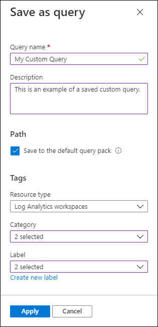

# Save a query in Azure Monitor Log Analytics (preview)
[Log queries](log-query-overview.md) are requests in Azure Monitor that allow you to process and retrieve data in a Log Analytics workspace. Saving a log queries allows you to:

- use the query in all Log Analytics context, including workspace and resource centric.
- allow other users to run same query.
- create a library of common queries for your organization.

## Save options
When you save a query, it's stored in a query pack which has the following benefits over the previous method of storing the query in a workspace. Saving to a query pack is the preferred method providing the following benefits:

- Easier discoverability with the ability to filter and group queries by different properties.
- Queries available when using a resource scope in Log Analytics.
- Make queries available across subscriptions.
- More data available to describe and categorize the query.

## Save a query
To save a query to a query pack, select **Save as Log Analytics Query** from the **Save** dropdown in Log Analytics.

When you save a query to a query pack, the following dialog box is displayed where you can provide values for the query properties. The query properties are used for filtering and grouping of similar queries to help you find the query you're looking for. See [Query properties](queries.md#query-properties) for a detailed description of each property.

Most users should leave the option to **Save to the default query pack** which will save the query in the [default query pack](query-packs.md#default-query-pack). Uncheck this box if there are other query packs in your subscription. See [Query packs in Azure Monitor Logs](query-packs.md) for details on creating a new query pack.

## Edit a query
You may want to edit a query that you already saved. This may be to change the query itself or modify any of its properties. After you open an existing query in Log Analytics, you can edit it by selecting **Edit query details** from the **Save** dropdown. This will allow you to save the edited query with the same properties or modify any properties before saving.

If you want to save the query with a different name, then select **Save as Log Analytics Query** the same as if you were creating a new query. 

## Save as a legacy query
Saving as a legacy query is not recommended because of the advantages of query packs listed above. You can save a query to the workspace though to combine it with other queries that were save to the workspace before the release of query packs. 

To save a legacy query,  select **Save as Log Analytics Query** from the **Save** dropdown in Log Analytics. Choose the  **Save as Legacy query** option. The only option available will be the legacy category.

## Next steps

[Get started with KQL Queries](get-started-queries.md)
