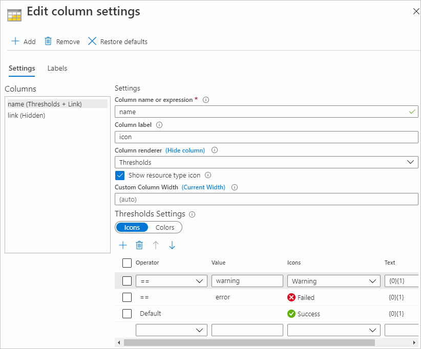
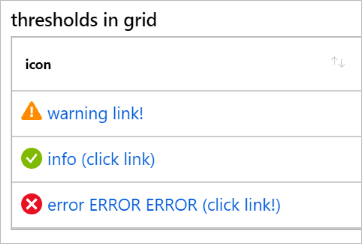

# Rendering options

This article describes the Azure Workbooks rendering options you can use with grids, tiles, and graphs to produce visualizations in optimal format.

## Column renderers

| Column renderer | Description | More options |
|:------------- |:-------------|:-------------|
| Automatic | The default. Uses the most appropriate renderer based on the column type.  |  |
| Text| Renders the column values as text. | |
| Right aligned| Renders the column values as right-aligned text. | |
| Date/Time| Renders a readable date/time string. | |
| Heatmap| Colors the grid cells based on the value of the cell. | Color palette and min/max value used for scaling. |
| Bar| Renders a bar next to the cell based on the value of the cell. | Color palette and min/max value used for scaling. |
| Bar underneath | Renders a bar near the bottom of the cell based on the value of the cell. | Color palette and min/max value used for scaling. |
| Composite bar| Renders a composite bar by using the specified columns in that row. For more information, see [Composite bar](workbooks-composite-bar.md). | Columns with corresponding colors to render the bar and a label to display at the top of the bar. |
|Spark bars| Renders a spark bar in the cell based on the values of a dynamic array in the cell. An example is the Trend column from the screenshot at the top. | Color palette and min/max value used for scaling. |
|Spark lines| Renders a spark line in the cell based on the values of a dynamic array in the cell. | Color palette and min/max value used for scaling. |
|Icon| Renders icons based on the text values in the cell. Supported values include:<br><ul><li>canceled</li><li>critical</li><li>disabled</li><li>error</li><li>failed</li> <li>info</li><li>none</li><li>pending</li><li>stopped</li><li>question</li><li>success</li><li>unknown</li><li>warning</li><li>uninitialized</li><li>resource</li><li>up</li> <li>down</li><li>left</li><li>right</li><li>trendup</li><li>trenddown</li><li>4</li><li>3</li><li>2</li><li>1</li><li>Sev0</li><li>Sev1</li><li>Sev2</li><li>Sev3</li><li>Sev4</li><li>Fired</li><li>Resolved</li><li>Available</li><li>Unavailable</li><li>Degraded</li><li>Unknown</li><li>Blank</li></ul>|  |
| Link | Renders a link when selected or performs a configurable action. Use this setting if you *only* want the item to be a link. Any of the other types of renderers can also be a link by using the **Make this item a link** setting. For more information, see [Link actions](#link-actions). |  |
| Location | Renders a friendly Azure region name based on a region ID. |  |
| Resource type | Renders a friendly resource type string based on a resource type ID.  |  |
| Resource| Renders a friendly resource name and link based on a resource ID.  | Option to show the resource type icon.  |
| Resource group | Renders a friendly resource group name and link based on a resource group ID. If the value of the cell isn't a resource group, it will be converted to one.  | Option to show the resource group icon.  |
|Subscription| Renders a friendly subscription name and link based on a subscription ID. If the value of the cell isn't a subscription, it will be converted to one.  | Option to show the subscription icon.  |
|Hidden| Hides the column in the grid. Useful when the default query returns more columns than needed but a project-away isn't desired. |  |

## Link actions

If the **Link** renderer is selected or the **Make this item a link** checkbox is selected, you can configure a link action. The action can occur when the user selects the cell to take the user to another view with context coming from the cell or to open a URL. For more information, see link renderer actions.

## Use thresholds with links

The following instructions show you how to use thresholds with links to assign icons and open different workbooks. Each link in the grid opens a different workbook template for that Application Insights resource.

1. Switch the workbook to edit mode by selecting **Edit**.
1. Select **Add** > **Add query**.
1. Change **Data source** to **JSON** and change **Visualization** to **Grid**.
1. Enter this query:

      ```json
        [ 
            { "name": "warning", "link": "Community-Workbooks/Performance/Performance Counter Analysis" },
            { "name": "info", "link": "Community-Workbooks/Performance/Performance Insights" },
            { "name": "error", "link": "Community-Workbooks/Performance/Apdex" }
        ]
      ```

1. Run the query.
1. Select **Column Settings** to open the settings.
1. Under **Columns**, select **name**.
1. Under **Column renderer**, select **Thresholds**.
1. Enter and choose the following **Threshold Settings**:

   1. Keep the **Default** row as is.
   1. Enter whatever text you like.
   1. The **Text** column takes a string format as an input and populates it with the column value and unit if specified. For example, if **warning** is the column value, the text can be `{0} {1} link!`. It will be displayed as `warning link!`.
   
    | Operator | Value   | Icons   |
    |----------|---------|---------|
    | ==       | warning | Warning |
    | ==       | error   | Failed  |

    
   
1. Select the **Make this item a link** checkbox.
     - Under **View to open**, select **Workbook (Template)**.
     - Under **Link value comes from**, select **link**.
     - Select the **Open link in Context Blade** checkbox.
     -  Choose the following settings in **Workbook Link Settings**:
        - Under **Template Id comes from**, select **Column**.
        - Under **Column**, select **link**.

     

1. Under **Columns**, select **link**. Under **Settings**, next to **Column renderer**, select **(Hide column)**.
1. To change the display name of the **name** column, select the **Labels** tab. On the row with **name** as its **Column ID**, under **Column Label**, enter the name you want displayed.
1. Select **Apply**.

     
