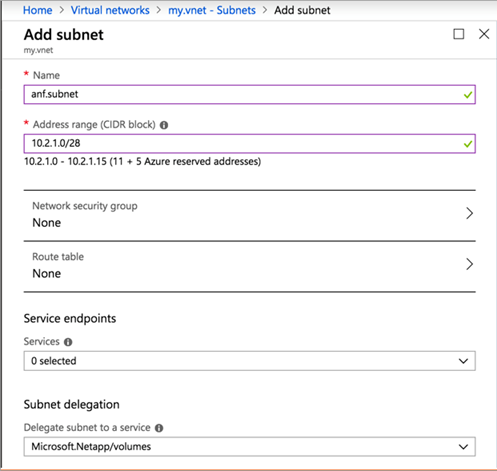

# Delegate a subnet to Azure NetApp Files 

You must delegate a subnet to Azure NetApp Files. When you create a volume, you need to specify the delegated subnet.

## Considerations

* When creating the delegated subnet for Azure NetApp Files, the size of the subnet matters. A subnet with a /28 network mask provides (only) 11 usable IP addresses, which might be insufficient for certain use cases. In that case, you should plan for a larger delegated subnet. For instance, a subnet with a /26 network mask provides 59 and a /24 network mask provides 251 available IP addresses respectively. You should consider even larger subnets (for example, /23 network mask) in scenarios where application volume group for SAP HANA is used and where many volumes and storage endpoints are anticipated. The network mask of the delegated network can't be changed after the initial creation. Make sure to plan your VNet and delegated subnet sizes consciously. 
* In each VNet, only one subnet can be delegated to Azure NetApp Files.   
   Azure enables you to create multiple delegated subnets in a VNet.  However, any attempts to create a new volume would fail if you use more than one delegated subnet.  
   You can have only a single delegated subnet in a VNet. A NetApp account can deploy volumes into multiple VNets, each having its own delegated subnet.  
* You can't designate a network security group or service endpoint in the delegated subnet. Doing so causes the subnet delegation to fail.
* Access to a volume from a globally peered virtual network isn't currently supported using Basic networks features. Global VNet peering is supported with Standard network features. For more information, see [Supported network topologies](azure-netapp-files-network-topologies.md#supported-network-topologies).
* For Azure NetApp Files support of [User-defined routes](../virtual-network/virtual-networks-udr-overview.md#custom-routes) (UDRs) and Network security groups (NSGs), see [Constraints in Guidelines for Azure NetApp Files network planning](azure-netapp-files-network-topologies.md#constraints).   
   To establish routing or access control ***to*** the Azure NetApp Files delegated subnet, you can apply UDRs and NSGs to other subnets, even within the same VNet as the subnet delegated to Azure NetApp Files.  

## Steps

1.	Go to the **Virtual networks** blade in the Azure portal and select the virtual network that you want to use for Azure NetApp Files.    

1. Select **Subnets** from the Virtual network blade and click the **+Subnet** button. 

1. Create a new subnet to use for Azure NetApp Files by completing the following required fields in the Add Subnet page:
    * **Name**: Specify the subnet name.
    * **Address range**: Specify the IP address range.
    * **Subnet delegation**: Select **Microsoft.NetApp/volumes**. 

      
    
You can also create and delegate a subnet when you [create a volume for Azure NetApp Files](azure-netapp-files-create-volumes.md). 

## Next steps

* [Create a volume for Azure NetApp Files](azure-netapp-files-create-volumes.md)
* [Learn about virtual network integration for Azure services](../virtual-network/virtual-network-for-azure-services.md)
* [Application resilience FAQs for Azure NetApp Files](faq-application-resilience.md)
