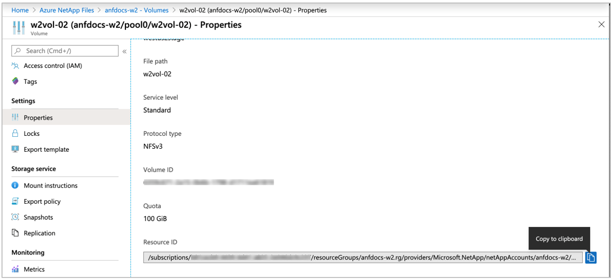
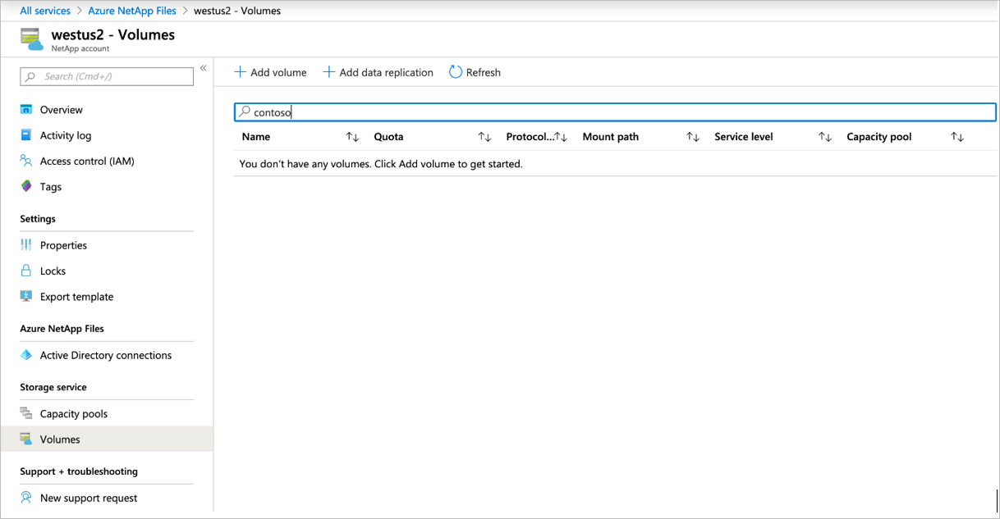
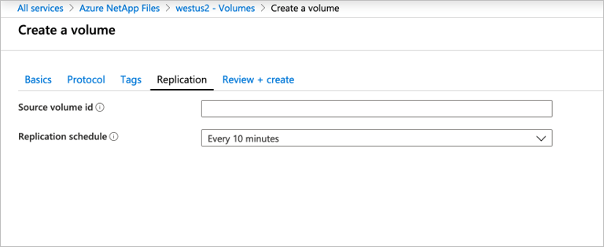
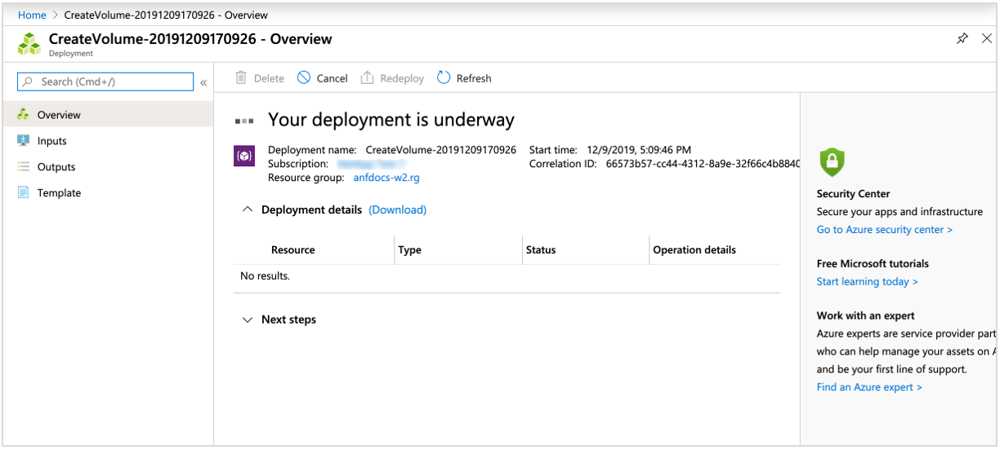
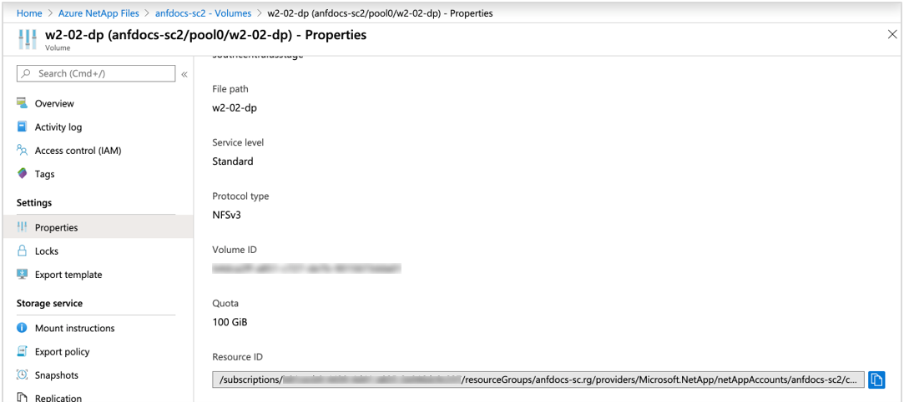

# Create volume replication for Azure NetApp Files

> [!IMPORTANT]
> The cross-region replication feature is currently in preview. You need to submit a waitlist request for accessing the feature through the [Azure NetApp Files cross-region replication waitlist submission page](https://aka.ms/anfcrrpreviewsignup). Wait for an official confirmation email from the Azure NetApp Files team before using the cross-region replication feature.

This article shows you how to set up cross-region replication by creating replication peering. 

Setting up replication peering enables you to asynchronously replicate data from an Azure NetApp Files volume (source) to another Azure NetApp Files volume (destination). The source volume and the destination volume must be deployed in separate regions. The service level for the destination capacity pool can match that of the source capacity pool, or you can select a different service level.   

Azure NetApp Files replication does not currently support multiple subscriptions; all replications must be performed under a single subscription.

Before you begin, ensure that you have reviewed the [requirements and considerations for using cross-region replication](cross-region-replication-requirements-considerations.md).  

## Locate the source volume resource ID  

You need to obtain the resource ID of the source volume that you want to replicate. 

1. Go to the source volume, and select **Properties** under Settings to display the source volume resource ID.   
    
 
2. Copy the resource ID to the clipboard.  You will need it later.

## Create the data replication volume (the destination volume)

You need to create a destination volume where you want the data from the source volume to be replicated to.  Before you can create a destination volume, you need to have a NetApp account and a capacity pool in the destination region. 

1. The destination account must be in a different region from the source volume region. If necessary, create a NetApp account in the Azure region to be used for replication by following the steps in [Create a NetApp account](azure-netapp-files-create-netapp-account.md).   
You can also select an existing NetApp account in a different region.  

2. If necessary, create a capacity pool in the newly created NetApp account by following the steps in [Set up a capacity pool](azure-netapp-files-set-up-capacity-pool.md).   

    You can also select an existing capacity pool to host the replication destination volume.  

    The service level for the destination capacity pool can match that of the source capacity pool, or you can select a different service level.

3. Delegate a subnet in the region to be used for replication by following the steps in [Delegate a subnet to Azure NetApp Files](azure-netapp-files-delegate-subnet.md).

4. Create the data replication volume by selecting **Volumes** under Storage Service in the destination NetApp account. Then click the **+ Add data replication** button.  

    
 
5. In the Create a Volume page that appears, complete the following fields under the **Basics** tab:
    * Volume name
    * Capacity pool
    * Volume quota
        > [!NOTE] 
        > The volume quota (size) for the destination volume should mirror that of the source volume. If you specify a size that is smaller than the source volume, the destination volume is automatically resized to the source volume size. 
    * Virtual network 
    * Subnet

    For details about the fields, see [Create an NFS volume](azure-netapp-files-create-volumes.md#create-an-nfs-volume). 

6. Under the **Protocol** tab, select the same protocol as the source volume.  
For the NFS protocol, ensure that the export policy rules satisfy the requirements of any hosts in the remote network that will access the export.  

7. Under the **Tags** tab, create key/value pairs as necessary.  

8. Under the **Replication** tab, paste in the source volume resource ID that you obtained in [Locate the source volume resource ID](#locate-the-source-volume-resource-id), and then select the desired replication schedule. Options for replication schedule include: every 10 minutes, hourly, daily, weekly and monthly.  

    

9. Click **Review + Create**, then click **Create** to create the data replication volume.   

    

## Authorize replication from the source volume  

To authorize the replication, you need to obtain the resource ID of the replication destination volume and paste it to the Authorize field of the replication source volume. 

1. In the Azure portal, navigate to Azure NetApp Files.

2. Go to the destination NetApp account and destination capacity pool where the replication destination volume is located.

3. Select the replication destination volume, go to **Properties** under Settings, and locate the **Resource ID** of the destination volume. Copy the destination volume resource ID to the clipboard.

     
 
4. In Azure NetApp Files, go to the replication source account and source capacity pool. 

5. Locate the replication source volume and select it. Go to **Replication** under Storage Service and click **Authorize**.

     

6. In the Authorize field, paste the destination replication volume resource ID that you obtained in Step 3, then click **OK**.

    > [!NOTE]
    > Due to various factors, like the state of the destination storage at a given time, there’s likely a difference between the used space of the source volume and the used space of the destination volume. <!-- ANF-14038 --> 

## Next steps  

* [Cross-region replication](cross-region-replication-introduction.md)
* [Requirements and considerations for using cross-region replication](cross-region-replication-requirements-considerations.md)
* [Display health status of replication relationship](cross-region-replication-display-health-status.md)
* [Volume replication metrics](azure-netapp-files-metrics.md#replication)
* [Manage disaster recovery](cross-region-replication-manage-disaster-recovery.md)
* [Delete volume replications or volumes](cross-region-replication-delete.md)
* [Troubleshoot cross-region-replication](troubleshoot-cross-region-replication.md)

