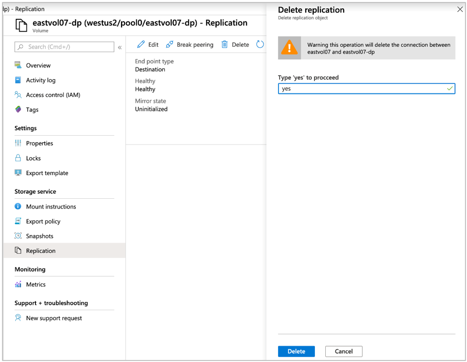

# Delete replications

You can terminate the replication connection between the source and the destination volumes by deleting volume replication. You can perform the delete operation from either the source or the destination volume. The delete operation removes only authorization for replication; it does not remove the source or the destination volume. 

## Steps

1. Ensure that the replication peering has been broken before you delete volume replication.    
    See [Display health status of replication relationship](cross-region-replication-display-health-status.md) and [Break replication peering](cross-region-replication-manage-disaster-recovery.md#break-replication-peering-to-activate-the-destination-volume).  

1. To delete volume replication, select **Replication** from the source or the destination volume.  

2. Click **Delete**.    

3. Confirm deletion by typing **Yes** and clicking **Delete**.   

    

## Next steps  

* [Cross-region replication](cross-region-replication-introduction.md)
* [Requirements and considerations for using cross-region replication](cross-region-replication-requirements-considerations.md)
* [Display health status of replication relationship](cross-region-replication-display-health-status.md)
* [Troubleshoot cross-region-replication](troubleshoot-cross-region-replication.md)

