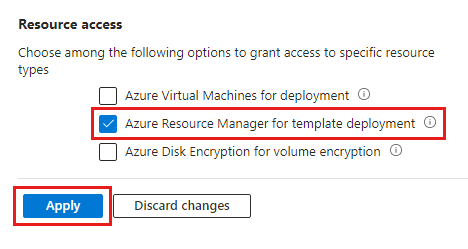

# Access Key Vault secret when deploying Azure Managed Applications

When you need to pass a secure value (like a password) as a parameter during deployment, you can retrieve the value from an [Azure Key Vault](../../key-vault/general/overview.md). To access the Key Vault when deploying Managed Applications, you must grant access to the **Appliance Resource Provider** service principal. The Managed Applications service uses this identity to run operations. To successfully retrieve a value from a Key Vault during deployment, the service principal must be able to access the Key Vault.

This article describes how to configure the Key Vault to work with Managed Applications.

## Enable template deployment

1. In the portal, select your Key Vault.

1. Select **Access policies**.   

   

1. Select **Click to show advanced access policies**.

   

1. Select **Enable access to Azure Resource Manager for template deployment**. Then, select **Save**.

   

## Add service as contributor

Assign the **Contributor** role to the **Appliance Resource Provider** user at the key vault scope.

For detailed steps, see [Assign Azure roles using the Azure portal](../../role-based-access-control/role-assignments-portal.md).

## Reference Key Vault secret

To pass a secret from a Key Vault to a template in your Managed Application, you must use a [linked or nested template](../templates/linked-templates.md) and reference the Key Vault in the parameters for the linked or nested template. Provide the resource ID of the Key Vault and the name of the secret.

```json
{
  "$schema": "https://schema.management.azure.com/schemas/2015-01-01/deploymentTemplate.json#",
  "contentVersion": "1.0.0.0",
  "parameters": {
    "location": {
      "type": "string",
      "defaultValue": "[resourceGroup().location]",
      "metadata": {
        "description": "The location where the resources will be deployed."
      }
    },
    "vaultName": {
      "type": "string",
      "metadata": {
        "description": "The name of the keyvault that contains the secret."
      }
    },
    "secretName": {
      "type": "string",
      "metadata": {
        "description": "The name of the secret."
      }
    },
    "vaultResourceGroupName": {
      "type": "string",
      "metadata": {
        "description": "The name of the resource group that contains the keyvault."
      }
    },
    "vaultSubscription": {
      "type": "string",
      "defaultValue": "[subscription().subscriptionId]",
      "metadata": {
        "description": "The name of the subscription that contains the keyvault."
      }
    }
  },
  "resources": [
    {
      "type": "Microsoft.Resources/deployments",
      "apiVersion": "2018-05-01",
      "name": "dynamicSecret",
      "properties": {
        "mode": "Incremental",
        "expressionEvaluationOptions": {
          "scope": "inner"
        },
        "template": {
          "$schema": "https://schema.management.azure.com/schemas/2015-01-01/deploymentTemplate.json#",
          "contentVersion": "1.0.0.0",
          "parameters": {
            "adminLogin": {
              "type": "string"
            },
            "adminPassword": {
              "type": "securestring"
            },
            "location": {
              "type": "string"
            }
          },
          "variables": {
            "sqlServerName": "[concat('sql-', uniqueString(resourceGroup().id, 'sql'))]"
          },
          "resources": [
            {
              "type": "Microsoft.Sql/servers",
              "apiVersion": "2018-06-01-preview",
              "name": "[variables('sqlServerName')]",
              "location": "[parameters('location')]",
              "properties": {
                "administratorLogin": "[parameters('adminLogin')]",
                "administratorLoginPassword": "[parameters('adminPassword')]"
              }
            }
          ],
          "outputs": {
            "sqlFQDN": {
              "type": "string",
              "value": "[reference(variables('sqlServerName')).fullyQualifiedDomainName]"
            }
          }
        },
        "parameters": {
          "location": {
            "value": "[parameters('location')]"
          },
          "adminLogin": {
            "value": "ghuser"
          },
          "adminPassword": {
            "reference": {
              "keyVault": {
                "id": "[resourceId(parameters('vaultSubscription'), parameters('vaultResourceGroupName'), 'Microsoft.KeyVault/vaults', parameters('vaultName'))]"
              },
              "secretName": "[parameters('secretName')]"
            }
          }
        }
      }
    }
  ],
  "outputs": {
  }
}
```

## Next steps

You've configured your Key Vault to be accessible during deployment of a Managed Application.

* For information about passing a value from a Key Vault as a template parameter, see [Use Azure Key Vault to pass secure parameter value during deployment](../templates/key-vault-parameter.md).
* For managed application examples, see [Sample projects for Azure managed applications](sample-projects.md).
* To learn how to create a UI definition file for a managed application, see [Get started with CreateUiDefinition](create-uidefinition-overview.md).
