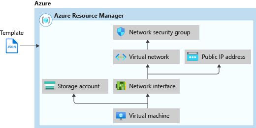
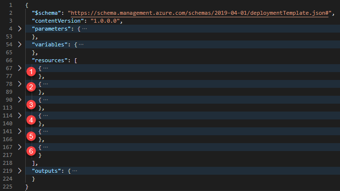
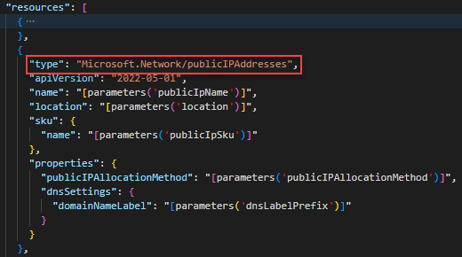
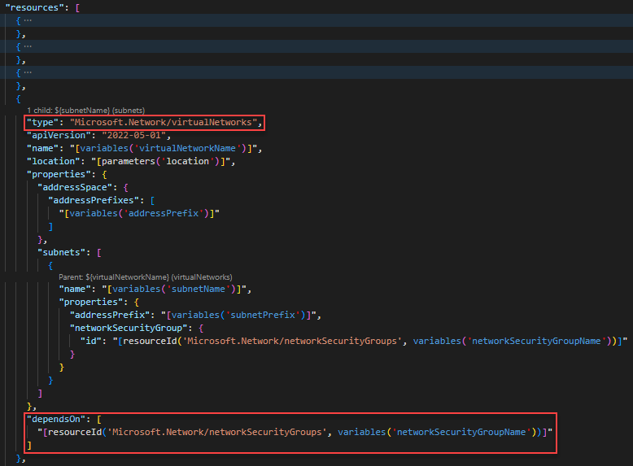
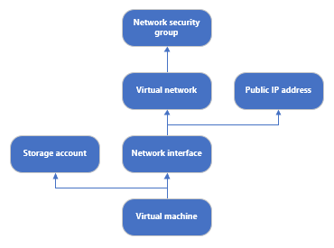

# Tutorial: Create ARM templates with dependent resources

Learn how to create an Azure Resource Manager template (ARM template) to deploy multiple resources and configure the deployment order. After you create the template, you deploy the template using the Cloud Shell from the Azure portal.

In this tutorial, you create a storage account, a virtual machine, a virtual network, and some other dependent resources. Some of the resources cannot be deployed until another resource exists. For example, you can't create the virtual machine until its storage account and network interface exist. You define this relationship by making one resource as dependent on the other resources. Resource Manager evaluates the dependencies between resources, and deploys them in their dependent order. When resources aren't dependent on each other, Resource Manager deploys them in parallel. For more information, see [Define the order for deploying resources in ARM templates](./define-resource-dependency.md).



This tutorial covers the following tasks:

> [!div class="checklist"]
> * Open a Quickstart template
> * Explore the template
> * Deploy the template

If you don't have an Azure subscription, [create a free account](https://azure.microsoft.com/free/) before you begin.

For a Microsoft Learn module that covers resource dependencies, see [Manage complex cloud deployments by using advanced ARM template features](/learn/modules/manage-deployments-advanced-arm-template-features/).

## Prerequisites

To complete this article, you need:

* Visual Studio Code with Resource Manager Tools extension. See [Quickstart: Create ARM templates with Visual Studio Code](quickstart-create-templates-use-visual-studio-code.md).
* To increase security, use a generated password for the virtual machine administrator account. Here is a sample for generating a password:

    ```console
    openssl rand -base64 32
    ```

    Azure Key Vault is designed to safeguard cryptographic keys and other secrets. For more information, see [Tutorial: Integrate Azure Key Vault in ARM template deployment](./template-tutorial-use-key-vault.md). We also recommend you to update your password every three months.

## Open a Quickstart template

Azure Quickstart Templates is a repository for ARM templates. Instead of creating a template from scratch, you can find a sample template and customize it. The template used in this tutorial is called [Deploy a simple Windows VM](https://azure.microsoft.com/resources/templates/101-vm-simple-windows/).

1. From Visual Studio Code, select **File** > **Open File**.
2. In **File name**, paste the following URL:

    ```url
    https://raw.githubusercontent.com/Azure/azure-quickstart-templates/master/quickstarts/microsoft.compute/vm-simple-windows/azuredeploy.json
    ```

3. Select **Open** to open the file.
4. Select **File** > **Save As** to save a copy of the file to your local computer with the name _azuredeploy.json_.

## Explore the template

When you explore the template in this section, try to answer these questions:

* How many Azure resources defined in this template?
* One of the resources is an Azure storage account. Does the definition look like the one used in the last tutorial?
* Can you find the template references for the resources defined in this template?
* Can you find the dependencies of the resources?

1. From Visual Studio Code, collapse the elements until you only see the first-level elements and the second-level elements inside `resources`:

    

    There are six resources defined by the template:

   * [**Microsoft.Storage/storageAccounts**](/azure/templates/Microsoft.Storage/storageAccounts).
   * [**Microsoft.Network/publicIPAddresses**](/azure/templates/microsoft.network/publicipaddresses).
   * [**Microsoft.Network/networkSecurityGroups**](/azure/templates/microsoft.network/networksecuritygroups).
   * [**Microsoft.Network/virtualNetworks**](/azure/templates/microsoft.network/virtualnetworks).
   * [**Microsoft.Network/networkInterfaces**](/azure/templates/microsoft.network/networkinterfaces).
   * [**Microsoft.Compute/virtualMachines**](/azure/templates/microsoft.compute/virtualmachines).

     It's helpful to review the template reference before customizing a template.

1. Expand the first resource. It's a storage account. Compare the resource definition to the [template reference](/azure/templates/Microsoft.Storage/storageAccounts).

    

1. Expand the second resource. The resource type is `Microsoft.Network/publicIPAddresses`. Compare the resource definition to the [template reference](/azure/templates/microsoft.network/publicipaddresses).

    

1. Expand the third resource. The resource type is `Microsoft.Network/networkSecurityGroups`. Compare the resource definition to the [template reference](/azure/templates/microsoft.network/networksecuritygroups).

    

1. Expand the fourth resource. The resource type is `Microsoft.Network/virtualNetworks`:

    

    The `dependsOn` element enables you to define one resource as a dependent on one or more resources. This resource depends on one other resource:

    * `Microsoft.Network/networkSecurityGroups`

1. Expand the fifth resource. The resource type is `Microsoft.Network/networkInterfaces`. The resource depends on two other resources:

    * `Microsoft.Network/publicIPAddresses`
    * `Microsoft.Network/virtualNetworks`

1. Expand the sixth resource. This resource is a virtual machine. It depends on two other resources:

    * `Microsoft.Storage/storageAccounts`
    * `Microsoft.Network/networkInterfaces`

The following diagram illustrates the resources and the dependency information for this template:



By specifying the dependencies, Resource Manager efficiently deploys the solution. It deploys the storage account, public IP address, and virtual network in parallel because they have no dependencies. After the public IP address and virtual network are deployed, the network interface is created. When all other resources are deployed, Resource Manager deploys the virtual machine.

## Deploy the template

1. Sign in to the [Azure Cloud Shell](https://shell.azure.com)

1. Choose your preferred environment by selecting either **PowerShell** or **Bash** (for CLI) on the upper left corner.  Restarting the shell is required when you switch.

    

1. Select **Upload/download files**, and then select **Upload**. See the previous screenshot. Select the file you saved earlier. After uploading the file, you can use the `ls` command and the `cat` command to verify the file was uploaded successfully.

1. Run the following PowerShell script to deploy the template.

    # [CLI](#tab/CLI)

    ```azurecli
    echo "Enter a project name that is used to generate resource group name:" &&
    read projectName &&
    echo "Enter the location (i.e. centralus):" &&
    read location &&
    echo "Enter the virtual machine admin username:" &&
    read adminUsername &&
    echo "Enter the DNS label prefix:" &&
    read dnsLabelPrefix &&
    resourceGroupName="${projectName}rg" &&
    az group create --name $resourceGroupName --location $location &&
    az deployment group create --resource-group $resourceGroupName --template-file "$HOME/azuredeploy.json" --parameters adminUsername=$adminUsername dnsLabelPrefix=$dnsLabelPrefix
    ```

    # [PowerShell](#tab/PowerShell)

    ```azurepowershell
    $projectName = Read-Host -Prompt "Enter a project name that is used to generate resource group name"
    $location = Read-Host -Prompt "Enter the location (i.e. centralus)"
    $adminUsername = Read-Host -Prompt "Enter the virtual machine admin username"
    $adminPassword = Read-Host -Prompt "Enter the admin password" -AsSecureString
    $dnsLabelPrefix = Read-Host -Prompt "Enter the DNS label prefix"
    $resourceGroupName = "${projectName}rg"

    New-AzResourceGroup -Name $resourceGroupName -Location "$location"
    New-AzResourceGroupDeployment `
        -ResourceGroupName $resourceGroupName `
        -adminUsername $adminUsername `
        -adminPassword $adminPassword `
        -dnsLabelPrefix $dnsLabelPrefix `
        -TemplateFile "$HOME/azuredeploy.json"

    Write-Host "Press [ENTER] to continue ..."
    ```

    ---

1. RDP to the virtual machine to verify the virtual machine has been created successfully.

## Clean up resources

When the Azure resources are no longer needed, clean up the resources you deployed by deleting the resource group.

1. From the Azure portal, select **Resource group** from the left menu.
2. Enter the resource group name in the **Filter by name** field.
3. Select the resource group name. You'll see a total of six resources in the resource group.
4. Select **Delete resource group** from the top menu.

## Next steps

In this tutorial, you developed and deployed a template to create a virtual machine, a virtual network, and the dependent resources. To learn how to use deployment scripts to perform pre/post deployment operations, see:

> [!div class="nextstepaction"]
> [Use deployment script](./template-tutorial-deployment-script.md)
