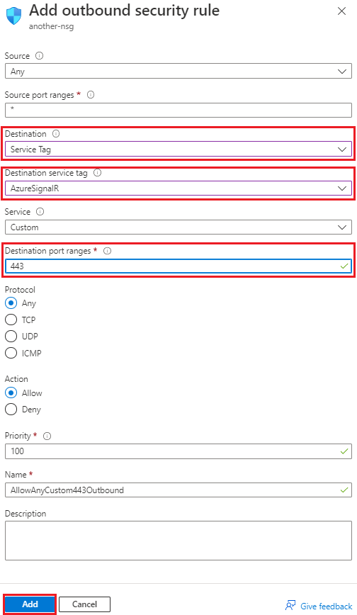

# Use service tags for Azure SignalR Service

You can use [Service Tags](../virtual-network/network-security-groups-overview.md#service-tags) for Azure SignalR Service when configuring [Network Security Group](../virtual-network/network-security-groups-overview.md#network-security-groups). It allows you to define inbound/outbound network security rule for Azure SignalR Service endpoints without need to hardcode IP addresses.

Azure SignalR Service manages these service tags. You can't create your own service tag or modify an existing one. Microsoft manages these address prefixes that match to the service tag and automatically updates the service tag as addresses change.

> [!Note]
> Starting from 15 August 2021, Azure SignalR Service supports bidirectional Service Tag for both inbound and outbound traffic.

## Use service tag on portal

### Configure outbound traffic

You can allow outbound traffic to Azure SignalR Service by adding a new outbound network security rule:

1. Go to the network security group.

1. Click on the settings menu called **Outbound security rules**.

1. Click the button **+ Add** on the top.

1. Choose **Service Tag** under **Destination**.

1. Choose **AzureSignalR** under **Destination service tag**.

1. Fill in **443** in **Destination port ranges**.

    

1. Adjust other fields according to your needs.

1. Click **Add**.

### Configure inbound traffic

If you have upstreams, you can also allow inbound traffic from Azure SignalR Service by adding a new inbound network security rule:

1. Go to the network security group.

1. Click on the settings menu called **Inbound security rules**.

1. Click the button **+ Add** on the top.

1. Choose **Service Tag** under **Source**.

1. Choose **AzureSignalR** under **Source service tag**.

1. Fill in **\*** in **Source port ranges**.

   :::image type="content" alt-text="Create an inbound security rule" source="media/howto-service-tags/portal-add-inbound-security-rule.png" :::

1. Adjust other fields according to your needs.

1. Click **Add**.

## Next steps

- [Network security groups: service tags](../virtual-network/network-security-groups-overview.md#security-rules)