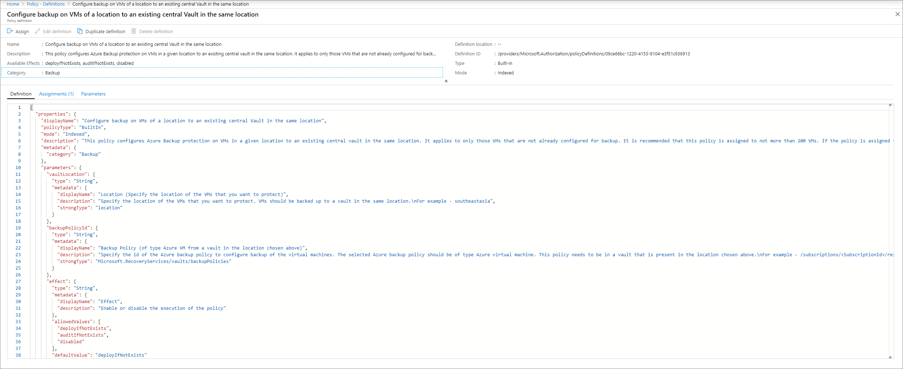

# Auto-Enable Backup on VM Creation using Azure Policy

One of the key responsibilities of a Backup or Compliance Admin in an organization is to ensure that all business-critical machines are backed up with the appropriate retention.

Today, Azure Backup provides a built-in policy (using Azure Policy) that can be assigned to **all Azure VMs in a specified location within a subscription or resource group**. When this policy is assigned to a given scope, all new VMs created in that scope are automatically configured for backup to an **existing vault in the same location and subscription**. The user can specify the vault and the retention policy to which the backed-up VMs should be associated.

## Supported Scenarios

* The built-in policy is currently supported only for Azure VMs. Users must take care to ensure that the retention policy specified during assignment is a VM retention policy. Refer to [this](./backup-azure-policy-supported-skus.md) document to see all the VM SKUs supported by this policy.

* The policy can be assigned to a single location and subscription at a time. To enable backup for VMs across locations and subscriptions, multiple instances of the policy assignment need to be created, one for each combination of location and subscription.

* The specified vault and the VMs configured for backup can be under different resource groups.

* Management Group scope is currently unsupported.

* The built-in policy is currently not available in national clouds.

## Using the built-in policy

To assign the policy to the required scope, follow the steps below:

1. Sign in to the Azure portal and navigate to the **Policy** Dashboard.
1. Select **Definitions** in the left menu to get a list of all built-in policies across Azure Resources.
1. Filter the list for **Category=Backup**. You'll see the list filtered down to a single policy named 'Configure backup on VMs of a location to an existing central Vault in the same location'.

1. Select the name of the policy. You'll be redirected to the detailed definition for this policy.

1. Select the **Assign** button at the top of the pane. This redirects you to the **Assign Policy** pane.
1. Under **Basics**, select the three dots next to the **Scope** field. This opens up a right context pane where you can select the subscription for the policy to be applied on. You can also optionally select a resource group, so that the policy is applied only for VMs in a particular resource group.

1. In the **Parameters** tab, choose a location from the drop-down, and select the vault and backup policy to which the VMs in the scope must be associated.

1. Ensure that **Effect** is set to deployIfNotExists.
1. Navigate to **Review+create** and select **Create**.

> [!NOTE]
>
> Azure Policy can also be used on existing VMs, using [remediation](../governance/policy/how-to/remediate-resources.md).

> [!NOTE]
>
> It is recommended that this policy is not assigned to more than 200 VMs at a time. If the policy is assigned to more than 200 VMs, it can result in the backup getting triggered a few hours later than that specified by the schedule.

## Next Steps

[Learn more about Azure Policy](../governance/policy/overview.md)
