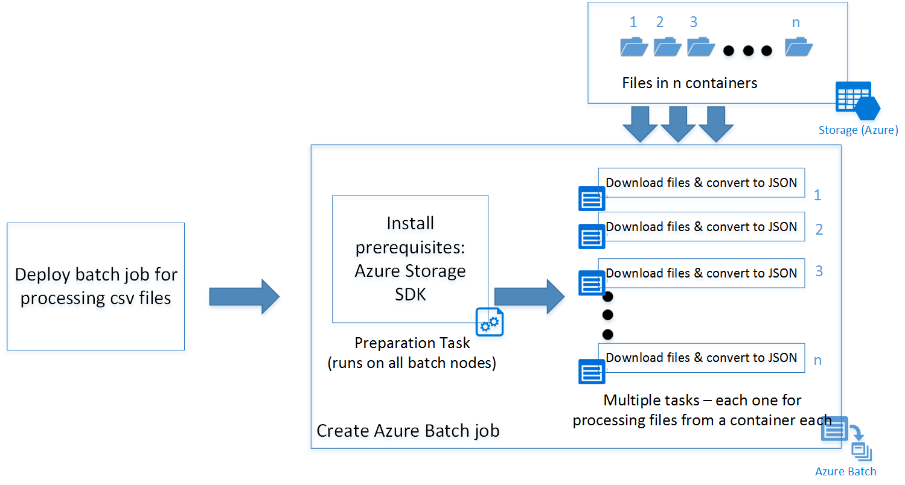
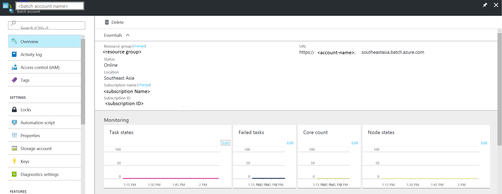

# Get started with Batch SDK for JavaScript

Learn the basics of building a Batch client in JavaScript using [Azure Batch JavaScript SDK](https://github.com/Azure/azure-sdk-for-js/). We take a step by step approach of understanding a scenario for a batch application and then setting it up using JavaScript.

## Prerequisites

This article assumes that you have a working knowledge of JavaScript and familiarity with Linux. It also assumes that you have an Azure account setup with access rights to create Batch and Storage services.

We recommend reading [Azure Batch Technical Overview](batch-technical-overview.md) before you go through the steps outlined this article.

## Understand the scenario

Here, we have a simple script written in Python that downloads all csv files from an Azure Blob storage container and converts them to JSON. To process multiple storage account containers in parallel, we can deploy the script as an Azure Batch job.

## Azure Batch architecture

The following diagram depicts how we can scale the Python script using Azure Batch and a client.



The JavaScript sample deploys a batch job with a preparation task (explained in detail later) and a set of tasks depending on the number of containers in the storage account. You can download the scripts from the GitHub repository.

- [Sample Code](https://github.com/Azure-Samples/azure-batch-samples/blob/master/JavaScript/Node.js/sample.js)
- [Preparation task shell scripts](https://github.com/Azure-Samples/azure-batch-samples/blob/master/JavaScript/Node.js/startup_prereq.sh)
- [Python csv to JSON processor](https://github.com/Azure-Samples/azure-batch-samples/blob/master/JavaScript/Node.js/processcsv.py)

> [!TIP]
> The JavaScript sample in the link specified does not contain specific code to be deployed as an Azure function app. You can refer to the following links for instructions to create one.
> - [Create function app](../azure-functions/functions-get-started.md)
> - [Create timer trigger function](../azure-functions/functions-bindings-timer.md)

## Build the application

Now, let us follow the process step by step into building the JavaScript client:

### Step 1: Install Azure Batch SDK

You can install Azure Batch SDK for JavaScript using the npm install command.

`npm install @azure/batch`

This command installs the latest version of azure-batch JavaScript SDK.

>[!Tip]
> In an Azure Function app, you can go to "Kudu Console" in the Azure function's Settings tab to run the npm install commands. In this case to install Azure Batch SDK for JavaScript.

### Step 2: Create an Azure Batch account

You can create it from the [Azure portal](batch-account-create-portal.md) or from command line ([PowerShell](batch-powershell-cmdlets-get-started.md) /[Azure CLI](/cli/azure)).

Following are the commands to create one through Azure CLI.

Create a Resource Group, skip this step if you already have one where you want to create the Batch Account:

`az group create -n "<resource-group-name>" -l "<location>"`

Next, create an Azure Batch account.

`az batch account create -l "<location>"  -g "<resource-group-name>" -n "<batch-account-name>"`

Each Batch account has its corresponding access keys. These keys are needed to create further resources in Azure batch account. A good practice for production environment is to use Azure Key Vault to store these keys. You can then create a Service principal for the application. Using this service principal the application can create an OAuth token to access keys from the key vault.

`az batch account keys list -g "<resource-group-name>" -n "<batch-account-name>"`

Copy and store the key to be used in the subsequent steps.

### Step 3: Create an Azure Batch service client

Following code snippet first imports the azure-batch JavaScript module and then creates a Batch Service client. You need to first create a SharedKeyCredentials object with the Batch account key copied from the previous step.

```javascript
// Initializing Azure Batch variables

import { BatchServiceClient, BatchSharedKeyCredentials } from "@azure/batch";

// Replace values below with Batch Account details 
const batchAccountName = '<batch-account-name>';
const batchAccountKey = '<batch-account-key>';
const batchEndpoint = '<batch-account-url>';

const credentials = new BatchSharedKeyCredentials(batchAccountName, batchAccountKey);
const batchClient = new BatchServiceClient(credentials, batchEndpoint);

```

The Azure Batch URI can be found in the Overview tab of the Azure portal. It is of the format:

`https://accountname.location.batch.azure.com`

Refer to the screenshot:



### Step 4: Create an Azure Batch pool

An Azure Batch pool consists of multiple VMs (also known as Batch Nodes). Azure Batch service deploys the tasks on these nodes and manages them. You can define the following configuration parameters for your pool.

- Type of Virtual Machine image
- Size of Virtual Machine nodes
- Number of Virtual Machine nodes

> [!TIP]
> The size and number of Virtual Machine nodes largely depend on the number of tasks you want to run in parallel and also the task itself. We recommend testing to determine the ideal number and size.

The following code snippet creates the configuration parameter objects.

```javascript
// Creating Image reference configuration for Ubuntu Linux VM
const imgRef = {
    publisher: "Canonical",
    offer: "UbuntuServer",
    sku: "18.04-LTS",
    version: "latest"
}
// Creating the VM configuration object with the SKUID
const vmConfig = {
    imageReference: imgRef,
    nodeAgentSKUId: "batch.node.ubuntu 18.04"
};
// Number of VMs to create in a pool
const numVms = 4;

// Setting the VM size
const vmSize = "STANDARD_D1_V2";
```

> [!TIP]
> For the list of Linux VM images available for Azure Batch and their SKU IDs, see [List of virtual machine images](batch-linux-nodes.md#list-of-virtual-machine-images).

Once the pool configuration is defined, you can create the Azure Batch pool. The Batch pool command creates Azure Virtual Machine nodes and prepares them to be ready to receive tasks to execute. Each pool should have a unique ID for reference in subsequent steps.

The following code snippet creates an Azure Batch pool.

```javascript
// Create a unique Azure Batch pool ID
const now = new Date();
const poolId = `processcsv_${now.getFullYear()}${now.getMonth()}${now.getDay()}${now.getHours()}${now.getSeconds()}`;

const poolConfig = {
    id: poolId,
    displayName: "Processing csv files",
    vmSize: vmSize,
    virtualMachineConfiguration: vmConfig,
    targetDedicatedNodes: numVms,
    enableAutoScale: false
};

// Creating the Pool
var pool = batchClient.pool.add(poolConfig, function (error, result){
    if(error!=null){console.log(error.response)};
});
```

You can check the status of the pool created and ensure that the state is in "active" before going ahead with submission of a Job to that pool.

```javascript
var cloudPool = batchClient.pool.get(poolId,function(error,result,request,response){
        if(error == null)
        {

            if(result.state == "active")
            {
                console.log("Pool is active");
            }
        }
        else
        {
            if(error.statusCode==404)
            {
                console.log("Pool not found yet returned 404...");

            }
            else
            {
                console.log("Error occurred while retrieving pool data");
            }
        }
        });
```

Following is a sample result object returned by the pool.get function.

```
{
  id: 'processcsv_2022002321',
  displayName: 'Processing csv files',
  url: 'https://<batch-account-name>.westus.batch.azure.com/pools/processcsv_2022002321',
  eTag: '0x8D9D4088BC56FA1',
  lastModified: 2022-01-10T07:12:21.943Z,
  creationTime: 2022-01-10T07:12:21.943Z,
  state: 'active',
  stateTransitionTime: 2022-01-10T07:12:21.943Z,
  allocationState: 'steady',
  allocationStateTransitionTime: 2022-01-10T07:13:35.103Z,
  vmSize: 'standard_d1_v2',
  virtualMachineConfiguration: {
    imageReference: {
      publisher: 'Canonical',
      offer: 'UbuntuServer',
      sku: '18.04-LTS',
      version: 'latest'
    },
    nodeAgentSKUId: 'batch.node.ubuntu 18.04'
  },
  resizeTimeout: 'PT15M',
  currentDedicatedNodes: 4,
  currentLowPriorityNodes: 0,
  targetDedicatedNodes: 4,
  targetLowPriorityNodes: 0,
  enableAutoScale: false,
  enableInterNodeCommunication: false,
  taskSlotsPerNode: 1,
  taskSchedulingPolicy: { nodeFillType: 'Spread' }}
```

### Step 4: Submit an Azure Batch job

An Azure Batch job is a logical group of similar tasks. In our scenario, it is "Process csv to JSON." Each task here could be processing csv files present in each Azure Storage container.

These tasks would run in parallel and deployed across multiple nodes, orchestrated by the Azure Batch service.

> [!TIP]
> You can use the [taskSlotsPerNode](https://github.com/Azure/azure-sdk-for-js/blob/main/sdk/batch/arm-batch/src/models/index.ts#L1190-L1191) property to specify maximum number of tasks that can run concurrently on a single node.

#### Preparation task

The VM nodes created are blank Ubuntu nodes. Often, you need to install a set of programs as prerequisites.
Typically, for Linux nodes you can have a shell script that installs the prerequisites before the actual tasks run. However it could be any programmable executable.

The [shell script](https://github.com/Azure-Samples/azure-batch-samples/blob/master/JavaScript/Node.js/startup_prereq.sh) in this example installs Python-pip and the Azure Storage Blob SDK for Python.

You can upload the script on an Azure Storage Account and generate a SAS URI to access the script. This process can also be automated using the Azure Storage JavaScript SDK.

> [!TIP]
> A preparation task for a job runs only on the VM nodes where the specific task needs to run. If you want prerequisites to be installed on all nodes irrespective of the tasks that run on it, you can use the [startTask](https://github.com/Azure/azure-sdk-for-js/blob/main/sdk/batch/batch/src/models/index.ts#L1432) property while adding a pool. You can use the following preparation task definition for reference.

A preparation task is specified during the submission of Azure Batch job. Following are some configurable preparation task parameters:

- **ID**: A unique identifier for the preparation task
- **commandLine**: Command line to execute the task executable
- **resourceFiles**: Array of objects that provide details of files needed to be downloaded for this task to run.  Following are its options
  - httpUrl: The URL of the file to download
  - filePath: Local path to download and save the file
  - fileMode: Only applicable for Linux nodes, fileMode is in octal format with a default value of 0770
- **waitForSuccess**: If set to true, the task does not run on preparation task failures
- **runElevated**: Set it to true if elevated privileges are needed to run the task.

Following code snippet shows the preparation task script configuration sample:

```javascript
var jobPrepTaskConfig = {id:"installprereq",commandLine:"sudo sh startup_prereq.sh > startup.log",resourceFiles: [{ 'httpUrl': 'Blob sh url', 'filePath': 'startup_prereq.sh' }],waitForSuccess:true,runElevated:true, userIdentity: {autoUser: {elevationLevel: "admin", scope: "pool"}}}
```

If there are no prerequisites to be installed for your tasks to run, you can skip the preparation tasks. Following code creates a job with display name "process csv files."

 ```javascript
 // Setting Batch Pool ID
const poolInfo = { poolId: poolId };
// Batch job configuration object
const jobId = "processcsvjob";
const jobConfig = {
    id: jobId,
    displayName: "process csv files",
    jobPreparationTask: jobPrepTaskConfig,
    poolInfo: poolInfo
};
 // Adding Azure batch job to the pool
 const job = batchClient.job.add(jobConfig, function (error, result) {
        if (error !== null) {
            console.log("An error occurred while creating the job...");
            console.log(error.response);
        }
    });
```

### Step 5: Submit Azure Batch tasks for a job

Now that our process csv job is created, let us create tasks for that job. Assuming we have four containers, we have to create four tasks, one for each container.

If we look at the [Python script](https://github.com/Azure-Samples/azure-batch-samples/blob/master/JavaScript/Node.js/processcsv.py), it accepts two parameters:

- container name: The Storage container to download files from
- pattern: An optional parameter of file name pattern

Assuming we have four containers "con1", "con2", "con3","con4" following code shows submitting four tasks to the Azure batch job "process csv" we created earlier.

```javascript
// storing container names in an array
const containerList = ["con1", "con2", "con3", "con4"];      //Replace with list of blob containers within storage account
containerList.forEach(function (val, index) {
    console.log("Submitting task for container : " + val);
    const containerName = val;
    const taskID = containerName + "_process";
    // Task configuration object
    const taskConfig = {
        id: taskID,
        displayName: 'process csv in ' + containerName,
        commandLine: 'python processcsv.py --container ' + containerName,
        resourceFiles: [{ 'httpUrl': 'Blob script url', 'filePath': 'processcsv.py' }]
    };

    const task = batchClient.task.add(jobId, taskConfig, function (error, result) {
        if (error !== null) {
            console.log("Error occurred while creating task for container " + containerName + ". Details : " + error.response);
        }
        else {
            console.log("Task for container : " + containerName + " submitted successfully");
        }
    });
});
```

The code adds multiple tasks to the pool. And each of the tasks is executed on a node in the pool of VMs created. If the number of tasks exceeds the number of VMs in a pool or the taskSlotsPerNode property, the tasks wait until a node is made available. This orchestration is handled by Azure Batch automatically.

The portal has detailed views on the tasks and job statuses. You can also use the list and get functions in the Azure JavaScript SDK. Details are provided in the documentation [link](https://github.com/Azure/azure-sdk-for-js/blob/main/sdk/batch/batch/src/operations/job.ts#L114-L149).

## Next steps

- Learn about the [Batch service workflow and primary resources](batch-service-workflow-features.md) such as pools, nodes, jobs, and tasks.
- See the [Batch JavaScript reference](/javascript/api/overview/azure/batch) to explore the Batch API.
