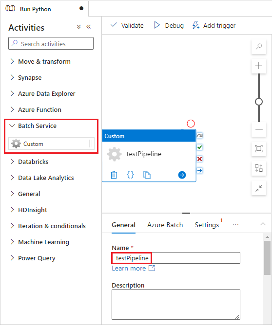
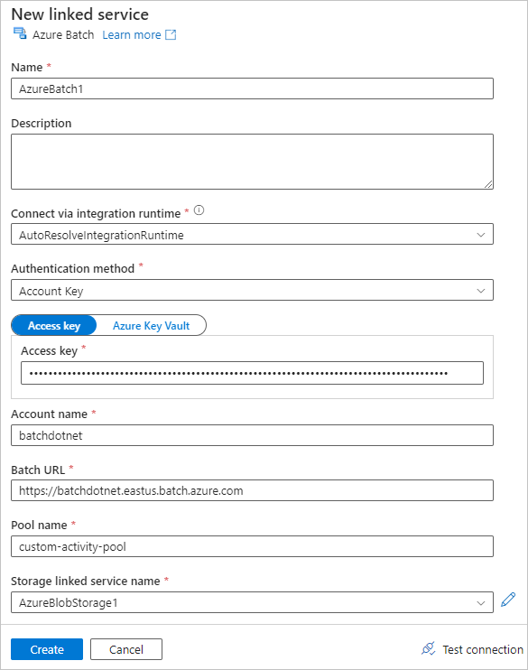

# Tutorial: Run Python scripts through Azure Data Factory using Azure Batch

In this tutorial, you'll learn how to:

> [!div class="checklist"]
> * Authenticate with Batch and Storage accounts
> * Develop and run a script in Python
> * Create a pool of compute nodes to run an application
> * Schedule your Python workloads
> * Monitor your analytics pipeline
> * Access your logfiles

The example below runs a Python script that receives CSV input from a blob storage container, performs a data manipulation process, and writes the output to a separate blob storage container.

If you don’t have an Azure subscription, create a [free account](https://azure.microsoft.com/free/) before you begin.

## Prerequisites

* An installed [Python](https://www.python.org/downloads/) distribution, for local testing.
* The [Azure](https://pypi.org/project/azure/) `pip` package.
* The [iris.csv dataset](https://www.kaggle.com/uciml/iris/version/2#Iris.csv)
* An Azure Batch account and a linked Azure Storage account. See [Create a Batch account](quick-create-portal.md#create-a-batch-account) for more information on how to create and link Batch accounts to storage accounts.
* An Azure Data Factory account. See [Create a data factory](../data-factory/quickstart-create-data-factory-portal.md#create-a-data-factory) for more information on how to create a data factory through the Azure portal.
* [Batch Explorer](https://azure.github.io/BatchExplorer/).
* [Azure Storage Explorer](https://azure.microsoft.com/features/storage-explorer/).

## Sign in to Azure

Sign in to the Azure portal at [https://portal.azure.com](https://portal.azure.com).

[!INCLUDE [batch-common-credentials](../../includes/batch-common-credentials.md)]

## Create a Batch pool using Batch Explorer

In this section, you'll use Batch Explorer to create the Batch pool that your Azure Data factory pipeline will use. 

1. Sign in to Batch Explorer using your Azure credentials.
1. Select your Batch account
1. Create a pool by selecting **Pools** on the left side bar, then the **Add** button above the search form. 
    1. Choose an ID and display name. We'll use `custom-activity-pool` for this example.
    1. Set the scale type to **Fixed size**, and set the dedicated node count to 2.
    1. Under **Data science**, select **Dsvm Windows** as the operating system.
    1. Choose `Standard_f2s_v2` as the virtual machine size.
    1. Enable the start task and add the command `cmd /c "pip install pandas"`. The user identity can remain as the default **Pool user**.
    1. Select **OK**.

## Create blob containers

Here you'll create blob containers that will store your input and output files for the OCR Batch job.

1. Sign in to Storage Explorer using your Azure credentials.
1. Using the storage account linked to your Batch account, create two blob containers (one for input files, one for output files) by following the steps at [Create a blob container](../vs-azure-tools-storage-explorer-blobs.md#create-a-blob-container).
    * In this example, we'll call our input container `input`, and our output container `output`.
1. Upload `main.py` and [`iris.csv`](https://www.kaggle.com/uciml/iris/version/2#Iris.csv) to your input container `input` using Storage Explorer by following the steps at [Managing blobs in a blob container](../vs-azure-tools-storage-explorer-blobs.md#managing-blobs-in-a-blob-container)


## Develop a script in Python

The following Python script loads the `iris.csv` dataset from your `input` container, performs a data manipulation process, and saves the results back to the `output` container.

``` python
# Load libraries
from azure.storage.blob import BlockBlobService
import pandas as pd

# Define parameters
storageAccountName = "<storage-account-name>"
storageKey         = "<storage-account-key>"
containerName      = "output"

# Establish connection with the blob storage account
blobService = BlockBlobService(account_name=storageAccountName,
                               account_key=storageKey
                               )

# Load iris dataset from the task node
df = pd.read_csv("iris.csv")

# Subset records
df = df[df['Species'] == "setosa"]

# Save the subset of the iris dataframe locally in task node
df.to_csv("iris_setosa.csv", index = False)

# Upload iris dataset
blobService.create_blob_from_path(containerName, "iris_setosa.csv", "iris_setosa.csv")
```

Save the script as `main.py` and upload it to the **Azure Storage** container. Be sure to test and validate its functionality locally before uploading it to your blob container:

``` bash
python main.py
```

## Set up an Azure Data Factory pipeline

In this section, you'll create and validate a pipeline using your Python script.

1. Follow the steps to create a data factory under the "Create a data factory" section of [this article](../data-factory/quickstart-create-data-factory-portal.md#create-a-data-factory).
1. In the **Factory Resources** box, select the + (plus) button and then select **Pipeline**
1. In the **General** tab, set the name of the pipeline as "Run Python"

    

1. In the **Activities** box, expand **Batch Service**. Drag the custom activity from the **Activities** toolbox to the pipeline designer surface.
1. In the **General** tab, specify **testPipeline** for Name

    
1. In the **Azure Batch** tab, add the **Batch Account** that was created in the previous steps and **Test connection** to ensure that it is successful

    

1. In the **Settings** tab, enter the command `python main.py`.
1. For the **Resource Linked Service**, add the storage account that was created in the previous steps. Test the connection to ensure it is successful.
1. In the **Folder Path**, select the name of the **Azure Blob Storage** container that contains the Python script and the associated inputs. This will download the selected files from the container to the pool node instances before the execution of the Python script.

    
1. Click **Validate** on the pipeline toolbar above the canvas to validate the pipeline settings. Confirm that the pipeline has been successfully validated. To close the validation output, select the &gt;&gt; (right arrow) button.
1. Click **Debug** to test the pipeline and ensure it works accurately.
1. Click **Publish** to publish the pipeline.
1. Click **Trigger** to run the Python script as part of a batch process.

    

### Monitor the log files

In case warnings or errors are produced by the execution of your script, you can check out `stdout.txt` or `stderr.txt` for more information on output that was logged.

1. Select **Jobs** from the left-hand side of Batch Explorer.
1. Choose the job created by your data factory. Assuming you named your pool `custom-activity-pool`, select `adfv2-custom-activity-pool`.
1. Click on the task that had a failure exit code.
1. View `stdout.txt` and `stderr.txt` to investigate and diagnose your problem.

## Next steps

In this tutorial, you explored an example that taught you how to run Python scripts as part of a pipeline through Azure Data Factory using Azure Batch.

To learn more about Azure Data Factory, see:

> [!div class="nextstepaction"]
> [Azure Data Factory](../data-factory/introduction.md)
> [Pipelines and activities](../data-factory/concepts-pipelines-activities.md)
> [Custom activities](../data-factory/transform-data-using-dotnet-custom-activity.md)
