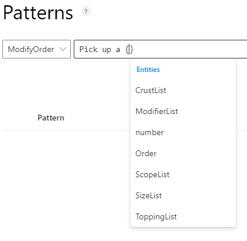
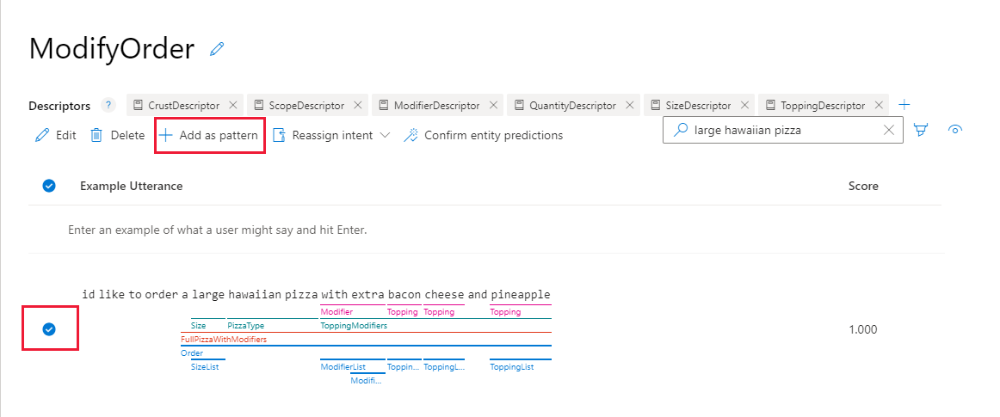

# How to add patterns to improve prediction accuracy
After a LUIS app receives endpoint utterances, use a [pattern](luis-concept-patterns.md) to improve prediction accuracy for utterances that reveal a pattern in word order and word choice. Patterns use specific [syntax](luis-concept-patterns.md#pattern-syntax) to indicate the location of: [entities](luis-concept-entity-types.md), entity [roles](./luis-concept-entity-types.md), and optional text.

>[!Note] 
>* After you add, edit, remove, or reassign a pattern, [train](luis-how-to-train.md) and [publish](luis-how-to-publish-app.md) your app for your changes to affect endpoint queries.
>* Patterns only include machine-learning entity parents, not subentities.

## Add template utterance using correct syntax

1. Sign in to the [LUIS portal](https://www.luis.ai), and select your **Subscription** and **Authoring resource** to see the apps assigned to that authoring resource.
1. Open your app by selecting its name on **My Apps** page.
1. Select **Patterns** in the left panel, under **Improve app performance**.

1. Select the correct intent for the pattern.

1. In the template textbox, type the template utterance and select Enter. When you want to enter the entity name, use the correct pattern entity syntax. Begin the entity syntax with `{`. The list of entities displays. Select the correct entity.

    > [!div class="mx-imgBorder"]
    > 

    If your entity includes a [role](./luis-concept-entity-types.md), indicate the role with a single colon, `:`, after the entity name, such as `{Location:Origin}`. The list of roles for the entities displays in a list. Select the role, and then select Enter.

    > [!div class="mx-imgBorder"]
    > 

    After you select the correct entity, finish entering the pattern, and then select Enter. When you are done entering patterns, [train](luis-how-to-train.md) your app.

    > [!div class="mx-imgBorder"]
    > 

## Create a pattern.any entity

[Pattern.any](luis-concept-entity-types.md) entities are only valid in [patterns](luis-how-to-model-intent-pattern.md), not intents' example utterances. This type of entity helps LUIS find the end of entities of varying length and word choice. Because this entity is used in a pattern, LUIS knows where the end of the entity is in the utterance template.

1. Sign in to the [LUIS portal](https://www.luis.ai), and select your **Subscription** and **Authoring resource** to see the apps assigned to that authoring resource.
1. Open your app by selecting its name on **My Apps** page.
1. From the **Build** section, select **Entities** in the left panel, and then select **+ Create**.

1. In the **Choose an entity type** dialog box, enter the entity name in the **Name** box, and select **Pattern.Any** as the **Type** then select **Create**.

    Once you [create a pattern utterance](luis-how-to-model-intent-pattern.md) using this entity, the entity is extracted with a combined machine-learning and text-matching algorithm.

## Adding example utterances as pattern

If you want to add a pattern for an entity, the _easiest_ way is to create the pattern from the Intent details page. This ensures your syntax matches the example utterance.

1. Sign in to the [LUIS portal](https://www.luis.ai), and select your **Subscription** and **Authoring resource** to see the apps assigned to that authoring resource.
1. Open your app by selecting its name on **My Apps** page.
1. On the **Intents** list page, select the intent name of the example utterance you want to create a template utterance from.
1. On the Intent details page, select the row for the example utterance you want to use as the template utterance, then select **+ Add as pattern** from the context toolbar.

    > [!div class="mx-imgBorder"]
    > 

    The utterance must include an entity in order to create a pattern from the utterance.

1. In the pop-up box, select **Done** on the **Confirm patterns** page. You don't need to define the entities' subentities, or features. You only need to list the machine-learning entity.

    > [!div class="mx-imgBorder"]
    > 

1. If you need to edit the template, such as selecting text as optional, with the `[]` (square) brackets, you need to make this edit from the **Patterns** page.

1. In the navigation bar, select **Train** to train the app with the new pattern.

## Use the OR operator and groups

The following two patterns can be combined into a single pattern using the group "_( )_" and OR "_|_" syntax.

|Intent|Example utterances with optional text and prebuilt entities|
|--|--|
|OrgChart-Manager|"who will be {EmployeeListEntity}['s] manager [[in]{datetimeV2}?]"|
|OrgChart-Manager|"who will be {EmployeeListEntity}['s] manager [[on]{datetimeV2}?]"|

The new template utterance will be:

"who ( was | is | will be ) {EmployeeListEntity}['s] manager [([in]|[on]){datetimeV2}?]" .

This uses a **group** around the required verb tense and the optional 'in' and 'on' with an **or** pipe between them.

## Template utterances

Due to the nature of the Human Resource subject domain, there are a few common ways of asking about employee relationships in organizations. Such as the following example utterances:

* "Who does Jill Jones report to?"
* "Who reports to Jill Jones?"

These utterances are too close to determine the contextual uniqueness of each without providing _many_ utterance examples. By adding a pattern for an intent, LUIS learns common utterance patterns for an intent without needing to supply several more utterance examples.

>[!Tip]
>Each utterance can be deleted from the review list. Once deleted, it will not appear in the list again. This is true even if the user enters the same utterance from the endpoint.

Template utterance examples for this intent would include:

|Template utterances examples|syntax meaning|
|--|--|
|Who does {EmployeeListEntity} report to[?]|interchangeable: {EmployeeListEntity}   ignore: [?]|
|Who reports to {EmployeeListEntity}[?]|interchangeable: {EmployeeListEntity}   ignore: [?]|

The "_{EmployeeListEntity}_" syntax marks the entity location within the template utterance and which entity it is. The optional syntax, "_[?]_", marks words or [punctuation](luis-reference-application-settings.md) that is optional. LUIS matches the utterance, ignoring the optional text inside the brackets.

> [!IMPORTANT]
> While the syntax looks like a regular expression, it is not a regular expression. Only the curly bracket, "_{ }_", and square bracket, "_[ ]_", syntax is supported. They can be nested up to two levels.

For a pattern to be matched to an utterance, _first_ the entities within the utterance must match the entities in the template utterance. This means the entities need to have enough examples in example utterances with a high degree of prediction before patterns with entities are successful. The template doesn't help predict entities, however. The template only predicts intents.

> [!NOTE]
> While patterns allow you to provide fewer example utterances, if the entities are not detected, the pattern will not match.

## Add phrase list as a feature
[Features](concepts/patterns-features.md) help LUIS by providing hints that certain words and phrases are part of an app domain vocabulary.

1. Sign in to the [LUIS portal](https://www.luis.ai/), and select your  **Subscription**  and  **Authoring resource**  to see the apps assigned to that authoring resource.
2. Open your app by selecting its name on  **My Apps**  page.
3. Select  **Build** , then select  **Features**  in your app&#39;s left panel.
4. On the  **Features**  page, select  **+ Create**.
5. In the  **Create new phrase list feature**  dialog box, enter a name such as Pizza Toppings. In the  **Value**  box, enter examples of toppings, such as _Ham_. You can type one value at a time, or a set of values separated by commas, and then press  **Enter**.

:::image type="content" source="media/luis-add-features/add-phrase-list-cities.png" alt-text="A screenshot showing how to add feature (phrase list) Cities" lightbox="media/luis-add-features/add-phrase-list-cities.png":::

6. Keep the  **These values are interchangeable**  selector enabled if the phrases can be used interchangeably. The interchangeable phrase list feature serves as a list of synonyms for training. Non-interchangeable phrase lists serve as separate features for training, meaning that features are similar but the intent changes when you swap phrases.
7. The phrase list can apply to the entire app with the  **Global**  setting, or to a specific model (intent or entity). If you create the phrase list as a _feature_ from an intent or entity, the toggle is not set to global. In this case, the toggle specifies that the feature is local only to that model, therefore, _not global_ to the application.
8. Select  **Done**. The new feature is added to the  **ML Features**  page.

> [!Note]
> * You can delete, or deactivate a phrase list from the contextual toolbar on the **ML Features** page.
> * A phrase list should be applied to the intent or entity it is intended to help but there may be times when a phrase list should be applied to the entire app as a  **Global**  feature. On the **Machine Learning** Features page, select the phrase list, then select  **Make global**  in the top contextual toolbar.

## Add entity as a feature to an intent

To add an entity as a feature to an intent, select the intent from the Intents page, then select  **+ Add feature**  above the contextual toolbar. The list will include all phrase lists and entities that can be applied as features.

To add an entity as a feature to another entity, you can add the feature either on the Intent detail page using the [Entity Palette](/azure/cognitive-services/luis/label-entity-example-utterance#adding-entity-as-a-feature-from-the-entity-palette) or you can add the feature on the Entity detail page.

## Next steps

* [Train and test](luis-how-to-train.md) your app after improvement.
