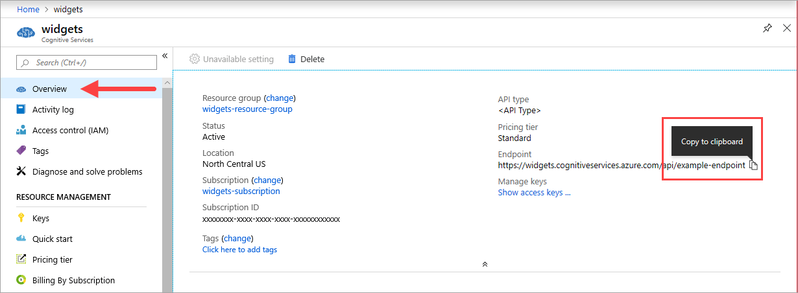
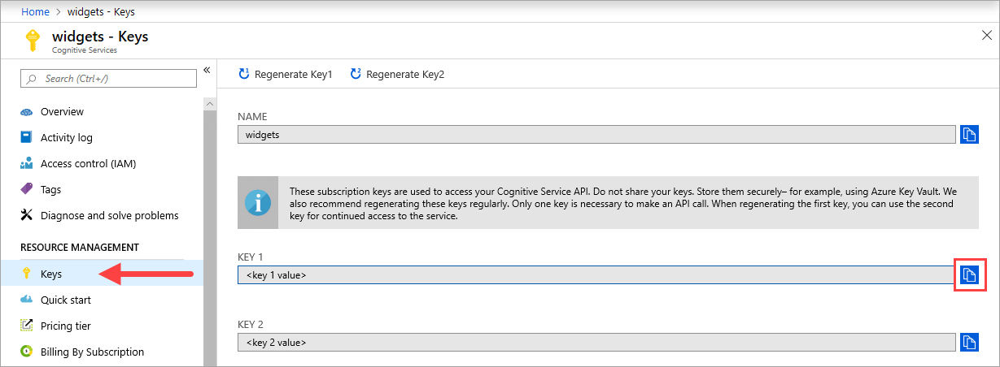

# Install and run Form Recognizer containers (Preview)

[!INCLUDE [Form Recognizer containers limit](includes/container-limit.md)]

Azure Form Recognizer applies machine learning technology to identify and extract key-value pairs and tables from forms. It associates values and table entries with the key-value pairs and then outputs structured data that includes the relationships in the original file. 

To reduce complexity and easily integrate a custom Form Recognizer model into your workflow automation process or other application, you can call the model by using a simple REST API. Only five form documents (or one empty form and two filled-in forms) are needed, so you can get results quickly, accurately, and tailored to your specific content. No heavy manual intervention or extensive data science expertise is necessary. And it doesn't require data labeling or data annotation.

| Function | Features |
|----------|----------|
| Form Recognizer | <li>Processes PDF, PNG, and JPG files<li>Trains custom models with a minimum of five forms of the same layout <li>Extracts key-value pairs and table information <li>Uses the Azure Cognitive Services Computer Vision API Recognize Text feature to detect and extract printed text from images inside forms<li>Doesn't require annotation or labeling |

If you don't have an Azure subscription, create a [free account](https://azure.microsoft.com/free/cognitive-services/) before you begin.

## Prerequisites

Before you use Form Recognizer containers, you must meet the following prerequisites:

| Required | Purpose |
|----------|---------|
| Docker Engine | You need the Docker Engine installed on a [host computer](#the-host-computer). Docker provides packages that configure the Docker environment on [macOS](https://docs.docker.com/docker-for-mac/), [Windows](https://docs.docker.com/docker-for-windows/), and [Linux](https://docs.docker.com/engine/installation/#supported-platforms). For a primer on Docker and container basics, see the [Docker overview](https://docs.docker.com/engine/docker-overview/).<br><br> Docker must be configured to allow the containers to connect with and send billing data to Azure. <br><br> On Windows, Docker must also be configured to support Linux containers.<br><br> |
| Familiarity with Docker | You should have a basic understanding of Docker concepts, such as registries, repositories, containers, and container images, and knowledge of basic `docker` commands. |
| The Azure CLI | Install the [Azure CLI](https://docs.microsoft.com/cli/azure/install-azure-cli) on your host. |
| Computer Vision API resource | To process scanned documents and images, you need a Computer Vision resource. You can access the Recognize Text feature as either an Azure resource (the REST API or SDK) or a *cognitive-services-recognize-text* [container](../Computer-vision/computer-vision-how-to-install-containers.md#get-the-container-image-with-docker-pull). The usual billing fees apply. <br><br>Pass in both the API key and endpoints for your Computer Vision resource (Azure cloud or Cognitive Services container). Use this API key and the endpoint as **{COMPUTER_VISION_API_KEY}** and **{COMPUTER_VISION_ENDPOINT_URI}**.<br><br> If you use the *cognitive-services-recognize-text* container, make sure that:<br><br>Your Computer Vision key for the Form Recognizer container is the key specified in the Computer Vision `docker run` command for the *cognitive-services-recognize-text* container.<br>Your billing endpoint is the container's endpoint (for example, `http://localhost:5000`). If you use both the Computer Vision container and Form Recognizer container together on the same host, they can't both be started with the default port of *5000*. |
| Form Recognizer resource | To use these containers, you must have:<br><br>An Azure **Form Recognizer** resource to get the associated API key and endpoint URI. Both values are available on the Azure portal **Form Recognizer** Overview and Keys pages, and both values are required to start the container.<br><br>**{FORM_RECOGNIZER_API_KEY}**: One of the two available resource keys on the Keys page<br><br>**{FORM_RECOGNIZER_ENDPOINT_URI}**: The endpoint as provided on the Overview page |

> [!NOTE]
> The Computer Vision resource name should be a single word, without a hyphen `-` or any other special characters. This restriction is in place to ensure Form Recognizer and Recognize Text container compatibility.

## Gathering required parameters

There are three primary parameters for all Cognitive Services' containers that are required. The end-user license agreement (EULA) must be present with a value of `accept`. Additionally, both an Endpoint URL and API Key are needed.

### Endpoint URI `{COMPUTER_VISION_ENDPOINT_URI}` and `{FORM_RECOGNIZER_ENDPOINT_URI}`

The **Endpoint** URI value is available on the Azure portal *Overview* page of the corresponding Cognitive Service resource. Navigate to the *Overview* page, hover over the Endpoint, and a `Copy to clipboard` <span class="docon docon-edit-copy x-hidden-focus"></span> icon will appear. Copy and use where needed.



### Keys `{COMPUTER_VISION_API_KEY}` and `{FORM_RECOGNIZER_API_KEY}`

This key is used to start the container, and is available on the Azure portal's Keys page of the corresponding Cognitive Service resource. Navigate to the *Keys* page, and click on the `Copy to clipboard` <span class="docon docon-edit-copy x-hidden-focus"></span> icon.



> [!IMPORTANT]
> These subscription keys are used to access your Cognitive Service API. Do not share your keys. Store them securely, for example, using Azure Key Vault. We also recommend regenerating these keys regularly. Only one key is necessary to make an API call. When regenerating the first key, you can use the second key for continued access to the service.

## The host computer

[!INCLUDE [Host Computer requirements](../../../includes/cognitive-services-containers-host-computer.md)]

### Container requirements and recommendations

The minimum and recommended CPU cores and memory to allocate for each Form Recognizer container are described in the following table:

| Container | Minimum | Recommended |
|-----------|---------|-------------|
| Form Recognizer | 2 core, 4-GB memory | 4 core, 8-GB memory |
| Recognize Text | 1 core, 8-GB memory | 2 cores, 8-GB memory |

* Each core must be at least 2.6 gigahertz (GHz) or faster.
* Core and memory correspond to the `--cpus` and `--memory` settings, which are used as part of the `docker run` command.

> [!Note]
> The minimum and recommended values are based on Docker limits and *not* the host machine resources.

## Get the container images with the docker pull command

Container images for both the **Form Recognizer** and **Recognize Text** offerings are available in the following container registry:

| Container | Fully qualified image name |
|-----------|------------|
| Form Recognizer | `containerpreview.azurecr.io/microsoft/cognitive-services-form-recognizer:latest` |
| Recognize Text | `containerpreview.azurecr.io/microsoft/cognitive-services-recognize-text:latest` |

You will need both containers, please note that the **Recognizer Text** container is [detailed outside of this article.](../Computer-vision/computer-vision-how-to-install-containers.md#get-the-container-image-with-docker-pull)

[!INCLUDE [Tip for using docker list](../../../includes/cognitive-services-containers-docker-list-tip.md)]

### Docker pull for the Form Recognizer container

#### Form Recognizer

To get the Form Recognizer container, use the following command:

```Docker
docker pull containerpreview.azurecr.io/microsoft/cognitive-services-form-recognizer:latest
```
### Docker pull for the Recognize Text container

#### Recognize Text

To get the Recognize Text container, use the following command:

```Docker
docker pull containerpreview.azurecr.io/microsoft/cognitive-services-recognize-text:latest
```

## How to use the container

After the container is on the [host computer](#the-host-computer), use the following process to work with the container.

1. [Run the container](#run-the-container-by-using-the-docker-run-command), with the required billing settings. More [examples](form-recognizer-container-configuration.md#example-docker-run-commands) of the `docker run` command are available.
1. [Query the container's prediction endpoint](#query-the-containers-prediction-endpoint).

## Run the container by using the docker run command

Use the [docker run](https://docs.docker.com/engine/reference/commandline/run/) command to run the container. Refer to [gathering required parameters](#gathering-required-parameters) for details on how to get the `{COMPUTER_VISION_ENDPOINT_URI}`, `{COMPUTER_VISION_API_KEY}`, `{FORM_RECOGNIZER_ENDPOINT_URI}` and `{FORM_RECOGNIZER_API_KEY}` values.

[Examples](form-recognizer-container-configuration.md#example-docker-run-commands) of the `docker run` command are available.

### Form Recognizer

> [!NOTE]
> The directories use for `--mount` in these examples are Windows directory paths. If you're using Linux or macOS, change the parameter for your environment. 

```bash
docker run --rm -it -p 5000:5000 --memory 8g --cpus 2 \
--mount type=bind,source=c:\input,target=/input  \
--mount type=bind,source=c:\output,target=/output \
containerpreview.azurecr.io/microsoft/cognitive-services-form-recognizer \
Eula=accept \
Billing={FORM_RECOGNIZER_ENDPOINT_URI} \
ApiKey={FORM_RECOGNIZER_API_KEY} \
FormRecognizer:ComputerVisionApiKey={COMPUTER_VISION_API_KEY} \
FormRecognizer:ComputerVisionEndpointUri={COMPUTER_VISION_ENDPOINT_URI}
```

This command:

* Runs a Form Recognizer container from the container image.
* Allocates 2 CPU cores and 8 gigabytes (GB) of memory.
* Exposes TCP port 5000 and allocates a pseudo-TTY for the container.
* Automatically removes the container after it exits. The container image is still available on the host computer.
* Mounts an /input and an /output volume to the container.

[!INCLUDE [Running multiple containers on the same host H2](../../../includes/cognitive-services-containers-run-multiple-same-host.md)]

### Run separate containers as separate docker run commands

For the Form Recognizer and Text Recognizer combination that's hosted locally on the same host, use the following two example Docker CLI commands:

Run the first container on port 5000. 

```bash 
docker run --rm -it -p 5000:5000 --memory 4g --cpus 1 \
--mount type=bind,source=c:\input,target=/input  \
--mount type=bind,source=c:\output,target=/output \
containerpreview.azurecr.io/microsoft/cognitive-services-form-recognizer \
Eula=accept \
Billing={FORM_RECOGNIZER_ENDPOINT_URI} \
ApiKey={FORM_RECOGNIZER_API_KEY}
FormRecognizer:ComputerVisionApiKey={COMPUTER_VISION_API_KEY} \
FormRecognizer:ComputerVisionEndpointUri={COMPUTER_VISION_ENDPOINT_URI}
```

Run the second container on port 5001.

```bash 
docker run --rm -it -p 5001:5000 --memory 4g --cpus 1 \
containerpreview.azurecr.io/microsoft/cognitive-services-recognize-text \
Eula=accept \
Billing={COMPUTER_VISION_ENDPOINT_URI} \
ApiKey={COMPUTER_VISION_API_KEY}
```
Each subsequent container should be on a different port. 

### Run separate containers with Docker Compose

For the Form Recognizer and Text Recognizer combination that's hosted locally on the same host, see the following example Docker Compose YAML file. The Text Recognizer `{COMPUTER_VISION_API_KEY}` must be the same for both the `formrecognizer` and `ocr` containers. The `{COMPUTER_VISION_ENDPOINT_URI}` is used only in the `ocr` container, because the `formrecognizer` container uses the `ocr` name and port. 

```docker
version: '3.3'
services:   
  ocr:
    image: "containerpreview.azurecr.io/microsoft/cognitive-services-recognize-text"
    deploy:
      resources:
        limits:
          cpus: '2'
          memory: 8g
        reservations:
          cpus: '1'
          memory: 4g
    environment:
      eula: accept
      billing: "{COMPUTER_VISION_ENDPOINT_URI}"
      apikey: "{COMPUTER_VISION_API_KEY}"

  formrecognizer:
    image: "containerpreview.azurecr.io/microsoft/cognitive-services-form-recognizer"
    deploy:
      resources:
        limits:
          cpus: '2'
          memory: 8g
        reservations:
          cpus: '1'
          memory: 4g
    environment:
      eula: accept
      billing: "{FORM_RECOGNIZER_ENDPOINT_URI}"
      apikey: "{FORM_RECOGNIZER_API_KEY}"
      FormRecognizer__ComputerVisionApiKey: {COMPUTER_VISION_API_KEY}
      FormRecognizer__ComputerVisionEndpointUri: "http://ocr:5000"
      FormRecognizer__SyncProcessTaskCancelLimitInSecs: 75
    links:
      - ocr
    volumes:
      - type: bind
        source: c:\output
        target: /output
      - type: bind
        source: c:\input
        target: /input
    ports:
      - "5000:5000"
```

> [!IMPORTANT]
> The `Eula`, `Billing`, and `ApiKey`, as well as the `FormRecognizer:ComputerVisionApiKey` and `FormRecognizer:ComputerVisionEndpointUri` options, must be specified to run the container; otherwise, the container won't start. For more information, see [Billing](#billing).

## Query the container's prediction endpoint

|Container|Endpoint|
|--|--|
|form-recognizer|http://localhost:5000

### Form Recognizer

The container provides websocket-based query endpoint APIs, which you access through [Form Recognizer services SDK documentation](https://docs.microsoft.com/azure/cognitive-services/form-recognizer/).

By default, the Form Recognizer SDK uses the online services. To use the container, you need to change the initialization method. See the examples below.

#### For C#

Change from using this Azure-cloud initialization call:

```csharp
var config =
    FormRecognizerConfig.FromSubscription(
        "YourSubscriptionKey",
        "YourServiceRegion");
```
to this call, which uses the container endpoint:

```csharp
var config =
    FormRecognizerConfig.FromEndpoint(
        "ws://localhost:5000/formrecognizer/v1.0-preview/custom",
        "YourSubscriptionKey");
```

#### For Python

Change from using this Azure-cloud initialization call:

```python
formrecognizer_config =
    formrecognizersdk.FormRecognizerConfig(
        subscription=formrecognizer_key, region=service_region)
```

to this call, which uses the container endpoint:

```python
formrecognizer_config = 
    formrecognizersdk.FormRecognizerConfig(
        subscription=formrecognizer_key,
        endpoint="ws://localhost:5000/formrecognizer/v1.0-preview/custom"
```

### Form Recognizer

The container provides REST endpoint APIs, which you can find on the [Form Recognizer API](https://westus2.dev.cognitive.microsoft.com/docs/services/form-recognizer-api/operations/AnalyzeWithCustomModel) page.


[!INCLUDE [Validate container is running - Container's API documentation](../../../includes/cognitive-services-containers-api-documentation.md)]


## Stop the container

[!INCLUDE [How to stop the container](../../../includes/cognitive-services-containers-stop.md)]

## Troubleshooting

If you run the container with an output [mount](form-recognizer-container-configuration.md#mount-settings) and logging enabled, the container generates log files that are helpful to troubleshoot issues that happen while starting or running the container.

[!INCLUDE [Cognitive Services FAQ note](../containers/includes/cognitive-services-faq-note.md)]

## Billing

The Form Recognizer containers send billing information to Azure by using a _Form Recognizer_ resource on your Azure account.

[!INCLUDE [Container's Billing Settings](../../../includes/cognitive-services-containers-how-to-billing-info.md)]

For more information about these options, see [Configure containers](form-recognizer-container-configuration.md).

<!--blogs/samples/video courses -->

[!INCLUDE [Discoverability of more container information](../../../includes/cognitive-services-containers-discoverability.md)]

## Summary

In this article, you learned concepts and workflow for downloading, installing, and running Form Recognizer containers. In summary:

* Form Recognizer provides one Linux container for Docker.
* Container images are downloaded from the private container registry in Azure.
* Container images run in Docker.
* You can use either the REST API or the REST SDK to call operations in Form Recognizer container by specifying the host URI of the container.
* You must specify the billing information when you instantiate a container.

> [!IMPORTANT]
>  Cognitive Services containers are not licensed to run without being connected to Azure for metering. Customers need to enable the containers to communicate billing information with the metering service at all times. Cognitive Services containers do not send customer data (for example, the image or text that is being analyzed) to Microsoft.

## Next steps

* Review [Configure containers](form-recognizer-container-configuration.md) for configuration settings.
* Use more [Cognitive Services Containers](../cognitive-services-container-support.md).
