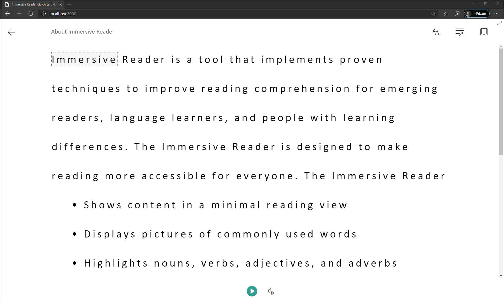

The [Immersive Reader](https://www.onenote.com/learningtools) is an inclusively designed tool that implements proven techniques to improve reading comprehension.

In this quickstart, you build a web app from scratch and integrate the Immersive Reader by using the Immersive Reader client library. A full working sample of this quickstart is available [here](https://github.com/microsoft/immersive-reader-sdk/tree/master/js/samples/quickstart-nodejs).

If you don't have an Azure subscription, create a [free account](https://azure.microsoft.com/free/cognitive-services/) before you begin.

## Prerequisites

* An Immersive Reader resource configured for Azure Active Directory authentication. Follow [these instructions](../../how-to-create-immersive-reader.md) to get set up. You will need some of the values created here when configuring the environment properties. Save the output of your session into a text file for future reference.
* [Node.js](https://nodejs.org/) and [Yarn](https://yarnpkg.com)
* An IDE such as [Visual Studio Code](https://code.visualstudio.com/)

## Create a Node.js web app with Express

Create a Node.js web app with the `express-generator` tool.

```bash
npm install express-generator -g
express --view=pug quickstart-nodejs
cd quickstart-nodejs
```

Install yarn dependencies, and add dependencies `request` and `dotenv`, which will be used later in the quickstart.

```bash
yarn
yarn add request
yarn add dotenv
```

## Set up authentication

### Configure authentication values

Create a new file called _.env_ in the root of your project. Paste the following code into it, supplying the values given when you created your Immersive Reader resource.
Do not include quotation marks or the "{" and "}" characters.

```text
TENANT_ID={YOUR_TENANT_ID}
CLIENT_ID={YOUR_CLIENT_ID}
CLIENT_SECRET={YOUR_CLIENT_SECRET}
SUBDOMAIN={YOUR_SUBDOMAIN}
```

Be sure not to commit this file into source control, as it contains secrets that should not be made public.

Next, open _app.js_ and add the following to the top of the file. This loads the properties defined in the .env file as environment variables into Node.

```javascript
require('dotenv').config();
```

### Update the router to acquire the token
Open the _routes\index.js_ file and replace the automatically generated code with the following code.

This code creates an API endpoint that acquires an Azure AD authentication token using your service principal password. It also retrieves the subdomain. It then returns an object containing the token and subdomain.

```javascript
var express = require('express');
var router = express.Router();
var request = require('request');

/* GET home page. */
router.get('/', function(req, res, next) {
  res.render('index', { title: 'Express' });
});

router.get('/GetTokenAndSubdomain', function(req, res) {
    try {
        request.post({
            headers: {
                'content-type': 'application/x-www-form-urlencoded'
            },
            url: `https://login.windows.net/${process.env.TENANT_ID}/oauth2/token`,
            form: {
                grant_type: 'client_credentials',
                client_id: process.env.CLIENT_ID,
                client_secret: process.env.CLIENT_SECRET,
                resource: 'https://cognitiveservices.azure.com/'
            }
        },
        function(err, resp, tokenResult) {
            if (err) {
                console.log(err);
                return res.status(500).send('CogSvcs IssueToken error');
            }

            var tokenResultParsed = JSON.parse(tokenResult);

            if (tokenResultParsed.error) {
                console.log(tokenResult);
                return res.send({error :  "Unable to acquire Azure AD token. Check the debugger for more information."})
            }

            var token = tokenResultParsed.access_token;
            var subdomain = process.env.SUBDOMAIN;
            return res.send({token, subdomain});
        });
    } catch (err) {
        console.log(err);
        return res.status(500).send('CogSvcs IssueToken error');
    }
});

module.exports = router;
```

The **GetTokenAndSubdomain** API endpoint should be secured behind some form of authentication (for example, [OAuth](https://oauth.net/2/)) to prevent unauthorized users from obtaining tokens to use against your Immersive Reader service and billing; that work is beyond the scope of this quickstart.

## Add sample content

Now, we'll add sample content to this web app. Open _views\index.pug_ and replace the automatically generated code with this sample:

```pug
doctype html
html
   head
      title Immersive Reader Quickstart Node.js

      link(rel='stylesheet', href='https://stackpath.bootstrapcdn.com/bootstrap/3.4.1/css/bootstrap.min.css')

      // A polyfill for Promise is needed for IE11 support.
      script(src='https://cdn.jsdelivr.net/npm/promise-polyfill@8/dist/polyfill.min.js')

      script(src='https://contentstorage.onenote.office.net/onenoteltir/immersivereadersdk/immersive-reader-sdk.1.0.0.js')
      script(src='https://code.jquery.com/jquery-3.3.1.min.js')

      style(type="text/css").
        .immersive-reader-button {
          background-color: white;
          margin-top: 5px;
          border: 1px solid black;
          float: right;
        }
   body
      div(class="container")
        button(class="immersive-reader-button" data-button-style="iconAndText" data-locale="en")

        h1(id="ir-title") About Immersive Reader
        div(id="ir-content" lang="en-us")
          p Immersive Reader is a tool that implements proven techniques to improve reading comprehension for emerging readers, language learners, and people with learning differences. The Immersive Reader is designed to make reading more accessible for everyone. The Immersive Reader

            ul
                li Shows content in a minimal reading view
                li Displays pictures of commonly used words
                li Highlights nouns, verbs, adjectives, and adverbs
                li Reads your content out loud to you
                li Translates your content into another language
                li Breaks down words into syllables

          h3 The Immersive Reader is available in many languages.

          p(lang="es-es") El Lector inmersivo está disponible en varios idiomas.
          p(lang="zh-cn") 沉浸式阅读器支持许多语言
          p(lang="de-de") Der plastische Reader ist in vielen Sprachen verfügbar.
          p(lang="ar-eg" dir="rtl" style="text-align:right") يتوفر \"القارئ الشامل\" في العديد من اللغات.

script(type="text/javascript").
  function getTokenAndSubdomainAsync() {
        return new Promise(function (resolve, reject) {
            $.ajax({
                url: "/GetTokenAndSubdomain",
                type: "GET",
                success: function (data) {
                    if (data.error) {
                        reject(data.error);
                    } else {
                        resolve(data);
                    }
                },
                error: function (err) {
                    reject(err);
                }
            });
        });
    }

    $(".immersive-reader-button").click(function () {
        handleLaunchImmersiveReader();
    });

    function handleLaunchImmersiveReader() {
        getTokenAndSubdomainAsync()
            .then(function (response) {
                const token = response["token"];
                const subdomain = response["subdomain"];
                // Learn more about chunk usage and supported MIME types https://docs.microsoft.com/azure/cognitive-services/immersive-reader/reference#chunk
                const data = {
                    title: $("#ir-title").text(),
                    chunks: [{
                        content: $("#ir-content").html(),
                        mimeType: "text/html"
                    }]
                };
                // Learn more about options https://docs.microsoft.com/azure/cognitive-services/immersive-reader/reference#options
                const options = {
                    "onExit": exitCallback,
                    "uiZIndex": 2000
                };
                ImmersiveReader.launchAsync(token, subdomain, data, options)
                    .catch(function (error) {
                        alert("Error in launching the Immersive Reader. Check the console.");
                        console.log(error);
                    });
            })
            .catch(function (error) {
                alert("Error in getting the Immersive Reader token and subdomain. Check the console.");
                console.log(error);
            });
    }

    function exitCallback() {
        console.log("This is the callback function. It is executed when the Immersive Reader closes.");
    }
```


Notice that all of the text has a **lang** attribute, which describes the languages of the text. This attribute helps the Immersive Reader provide relevant language and grammar features.

## Build and run the app

Our web app is now ready. Start the app by running:

```bash
npm start
```

Open your browser and navigate to _http://localhost:3000_. You should see the following:


## Launch the Immersive Reader

When you click on the "Immersive Reader" button, you'll see the Immersive Reader launched with the content on the page.



## Next steps

* Explore the [Immersive Reader SDK](https://github.com/microsoft/immersive-reader-sdk) and the [Immersive Reader SDK Reference](../../reference.md)