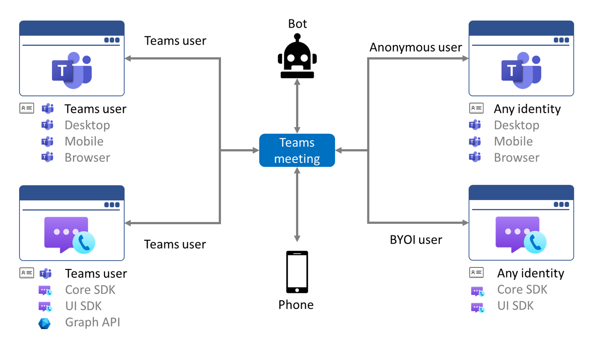
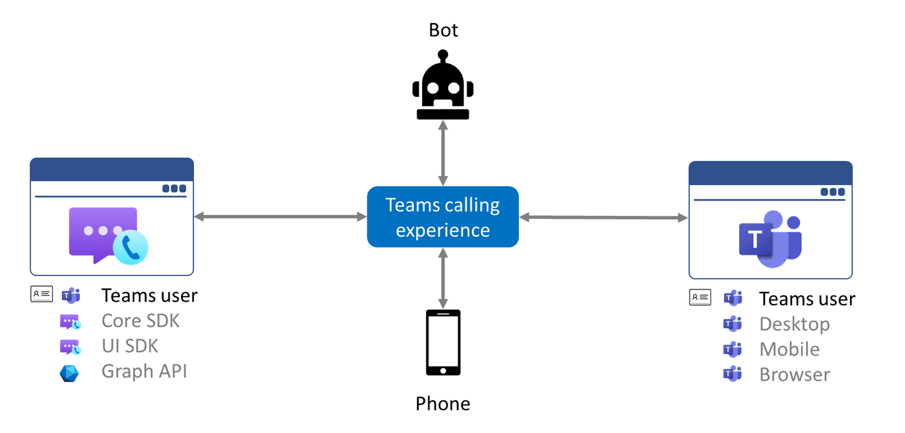

# Teams interoperability

Azure Communication Services can be used to build custom applications and experiences that enable interaction with Microsoft Teams users over voice, video, chat, and screen sharing. The [Communication Services UI Library](ui-library/ui-library-overview.md) provides customizable, production-ready UI components that can be easily added to these applications. The following video demonstrates some of the capabilities of Teams interoperability:

 

> [!VIDEO https://www.microsoft.com/en-us/videoplayer/embed/RWGTqQ]

## User identity models

Azure Communication Services supports two types of Teams interoperability depending on the identity of the user:

- **[External user](#external-user).** You control user authentication, and users of your custom applications don't need to have Azure Active Directory identities or Teams licenses. This model allows you to build custom applications for non-Teams users to connect and communicate with Teams users.
- **[Teams user](#teams-user).** Azure Active Directory controls user authentication, and users of your custom application must have Teams licenses. This model allows you to build custom applications for Teams users to enable specialized workflows or experiences that are impossible with the existing Teams clients.

Applications can implement both authentication models and leave the choice of authentication up to the user. The following table compares two models:

|Feature|External user| Teams user|
|---|---|---|
|Target user base|Customers|Enterprise|
|Identity provider|Any|Azure Active Directory|
| Display name |Any with the suffix "(External)"| Azure Active Directory user's value of the property "Display name" |
|Authentication & authorization|Custom*| Azure Active Directory and custom*|
|Calling available via | Communication Services Calling SDKs | Communication Services Calling SDKs |
|Chat is available via | Communication Services Chat SDKs | Graph API |
|Join Teams meetings | Yes | Yes |
|Make and receive calls as Teams users | No | Yes |
|PSTN support| Not supported for Communication Services users in Teams meetings | Microsoft Teams Phone, calling plan, direct routing, operator connect|

\* Server logic issuing access tokens can perform any custom authentication and authorization of the request.

## External user

The bring your own identity (BYOI) authentication model allows you to build custom applications for external users to connect and communicate with Teams users. You control user authentication, and users of your custom applications don't need to have Azure Active Directory identities or Teams licenses. The first scenario that has been enabled allows users of your application to join Microsoft Teams meetings as external accounts, similar to [anonymous users that join meetings](/microsoftteams/meeting-settings-in-teams#allow-anonymous-users-to-join-meetings) using the Teams web application. This is ideal for business-to-consumer applications that combine employees (familiar with Teams) and external users (using a custom application) into a meeting experience. In the future, we will be enabling additional scenarios, including direct calling and chat which will allow your application to initiate calls and chats with Teams users outside the context of a Teams meeting.

For more information, see [Join a Teams meeting](join-teams-meeting.md).

It is currently not possible for a Teams user to join a call that was initiated using the Azure Communication Services Calling SDK.

## Teams user

Developers can use [Communication Services Calling SDK with Teams identity](./interop/teams-user-calling.md) to build custom applications for Teams users. Custom applications can enable specialized workflows for Teams users, such as managing incoming and outgoing phone calls or bringing Teams calling experience into devices not supported with the standard Teams client. Azure Active Directory authenticates Teams users, and all attributes and details about the user are bound to their Azure Active Directory account.

When a Communication Services endpoint connects to a Teams meeting or Teams call using a Teams identity, the endpoint is treated like a Teams user with a Teams client. The experience is driven by policies assigned to users within and outside of the organization. Teams users can join Teams meetings, place calls to other Teams users, receive calls from phone numbers, and transfer an ongoing call to the Teams call queue or share screen. 

Teams users authenticate against Azure Active Directory in the client application. Developers then exchange authentication tokens from Azure Active Directory for access tokens via the Communication Services Identity SDK. This exchange creates a connection between Azure Active Directory and Communication Services. You are encouraged to implement an exchange of tokens in your backend services as credentials for Azure Communication Services sign exchange requests. In your backend services, you can require any additional authentication.

## Teams meeting and calling experiences

There are several ways that users can join a Teams meeting:

- Via Teams clients as authenticated **Teams users**. This includes the desktop, mobile, and web Teams clients.
- Via Teams clients as unauthenticated **Anonymous users**. 
- Via custom Communication Services applications as **External users** using the bring your own identity authentication model. 
- Via custom Communication Services applications as **Teams users** using the Teams identity authentication model.

Using the Teams identity authentication model, a Communication Services application allows **Teams users** to join calls with other **Teams users** who are using the Teams clients:

## Privacy
Interoperability between Azure Communication Services and Microsoft Teams enables your applications and users to participate in Teams calls, meetings, and chats. It is your responsibility to ensure that the users of your application are notified when recording or transcription are enabled in a Teams call or meeting.

Microsoft will indicate to you via the Azure Communication Services API that recording or transcription has commenced, and you must communicate this fact, in real-time, to your users within your application's user interface. You agree to indemnify Microsoft for all costs and damages incurred due to your failure to comply with this obligation.

## Pricing
All usage of Azure Communication Service APIs and SDKs increments [Azure Communication Service billing meters](https://azure.microsoft.com/pricing/details/communication-services/). Interactions with Microsoft Teams, such as joining a meeting or initiating a phone call using a Teams allocated number, will increment these meters. However, there is no additional fee for the Teams interoperability capability itself, and there is no pricing distinction between the BYOI and Microsoft 365 authentication options.

If your Azure application has a user spend 10 minutes in a meeting with a user of Microsoft Teams, those two users combined consumed 20 calling minutes. The 10 minutes exercised through the custom application and using Azure APIs and SDKs will be billed to your resource. However, the 10 minutes consumed by the user in the native Teams application is covered by the applicable Teams license and is not metered by Azure.

## Teams in Government Clouds (GCC)
Azure Communication Services interoperability isn't compatible with Teams deployments using [Microsoft 365 government clouds (GCC)](/MicrosoftTeams/plan-for-government-gcc) at this time.

## Next steps

Find more details for External user interoperability:
- [Get access tokens for external user](../quickstarts/access-tokens.md)
- [Join Teams meeting call as a external user](../quickstarts/voice-video-calling/get-started-teams-interop.md)
- [Join Teams meeting chat as a external user](../quickstarts/chat/meeting-interop.md)

Find more details forTeams user interoperability:
- [Get access tokens for Teams users](../quickstarts/manage-teams-identity.md)
- [Make a call as a Teams users to a Teams user](../quickstarts/voice-video-calling/get-started-with-voice-video-calling-custom-teams-client.md)
