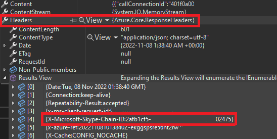
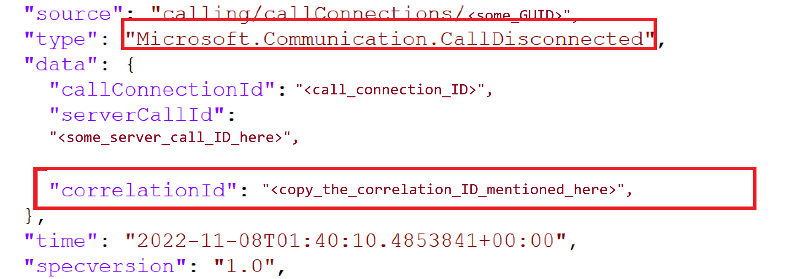
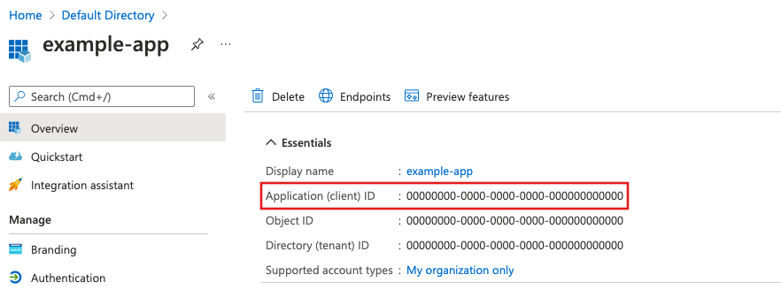
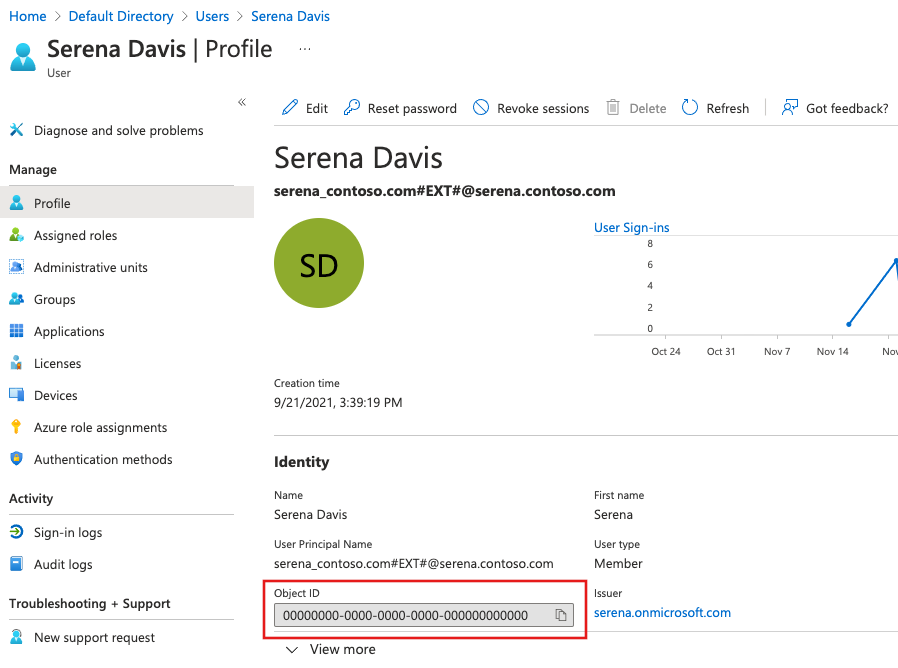

# Troubleshooting in Azure Communication Services

This document helps you troubleshoot issues that you may experience within your Communication Services solution. If you're troubleshooting SMS, you can [enable delivery reporting with Event Grid](../quickstarts/sms/handle-sms-events.md) to capture SMS delivery details.

## Getting help

We encourage developers to submit questions, suggest features, and report problems as issues. To aid in getting help, we have a [dedicated support and help options page](../support.md) that lists your options for support. 

To help you troubleshoot certain types of issues, you may be asked for any of the following pieces of information:

* **MS-CV ID**: This ID is used to troubleshoot calls and messages.
* **Call ID**: This ID is used to identify Communication Services calls.
* **SMS message ID**: This ID is used to identify SMS messages.
* **Short Code Program Brief ID**: This ID is used to identify a short code program brief application.
* **Toll-free verification campaign brief ID**: This ID is used to identify a toll-free verification campaign brief application.
* **Email message ID**: This ID is used to identify Send Email requests.
* **Correlation ID**: This ID is used to identify requests made using Call Automation. 
* **Call logs**: These logs contain detailed information can be used to troubleshoot calling and network issues.

Also take a look at our [service limits](service-limits.md) documentation for more information on throttling and limitations.

## Access your MS-CV ID

The MS-CV ID can be accessed by configuring diagnostics in the `clientOptions` object instance when initializing your SDKs. Diagnostics can be configured for any of the Azure SDKs including Chat, Identity, and VoIP calling.

### Client options example

The following code snippets demonstrate diagnostics configuration. When the SDKs are used with diagnostics enabled, diagnostics details can be emitted to the configured event listener:

# [C#](#tab/csharp)
```
// 1. Import Azure.Core.Diagnostics
using Azure.Core.Diagnostics;

// 2. Initialize an event source listener instance
using var listener = AzureEventSourceListener.CreateConsoleLogger();
Uri endpoint = new Uri("https://<RESOURCE-NAME>.communication.azure.net");
var (token, communicationUser) = await GetCommunicationUserAndToken();
CommunicationUserCredential communicationUserCredential = new CommunicationUserCredential(token);

// 3. Setup diagnostic settings
var clientOptions = new ChatClientOptions()
{
    Diagnostics =
    {
        LoggedHeaderNames = { "*" },
        LoggedQueryParameters = { "*" },
        IsLoggingContentEnabled = true,
    }
};

// 4. Initialize the ChatClient instance with the clientOptions
ChatClient chatClient = new ChatClient(endpoint, communicationUserCredential, clientOptions);
ChatThreadClient chatThreadClient = await chatClient.CreateChatThreadAsync("Thread Topic", new[] { new ChatThreadMember(communicationUser) });
```

# [Python](#tab/python)
```
from azure.communication.chat import ChatClient, CommunicationUserCredential
endpoint = "https://communication-services-sdk-live-tests-for-python.communication.azure.com"
chat_client = ChatClient(
    endpoint,
    CommunicationUserCredential(token),
    http_logging_policy=your_logging_policy)
```
---

## Access IDs required for Call Automation
When troubleshooting issues with the Call Automation SDK, like call management or recording problems, you need to collect the IDs that help identify the failing call or operation. You can provide either of the two IDs mentioned here. 
- From the header of API response, locate the field `X-Ms-Skype-Chain-Id`.
 
     
- From the callback events your application receives after executing an action. For example `CallConnected` or `PlayFailed`, locate the correlationID.

    

In addition to one of these IDs, please provide the details on the failing use case and the timestamp for when the failure was observed. 

## Access your client call ID

When troubleshooting voice or video calls, you may be asked to provide a `call ID`. This value can be accessed via the `id` property of the `call` object:

# [JavaScript](#tab/javascript)
```javascript
// `call` is an instance of a call created by `callAgent.startCall` or `callAgent.join` methods
console.log(call.id)
```

# [iOS](#tab/ios)
```objc
// The `call id` property can be retrieved by calling the `call.getCallId()` method on a call object after a call ends
// todo: the code snippet suggests it's a property while the comment suggests it's a method call
print(call.callId)
```

# [Android](#tab/android)
```java
// The `call id` property can be retrieved by calling the `call.getCallId()` method on a call object after a call ends
// `call` is an instance of a call created by `callAgent.startCall(…)` or `callAgent.join(…)` methods
Log.d(call.getCallId())
```
---

## Access your SMS message ID

For SMS issues, you can collect the message ID from the response object.

# [.NET](#tab/dotnet)
```
// Instantiate the SMS client
const smsClient = new SmsClient(connectionString);
async function main() {
  const result = await smsClient.send({
    from: "+18445792722",
    to: ["+1972xxxxxxx"],
    message: "Hello World 👋🏻 via Sms"
  }, {
    enableDeliveryReport: true // Optional parameter
  });
console.log(result); // your message ID is in the result
}
```
---
## Access your short code program brief ID
The program brief ID can be found on the [Azure portal](https://portal.azure.com) in the Short Codes blade. 

:::image type="content" source="./media/short-code-trouble-shooting.png" alt-text="Screenshot showing a short code program brief ID.":::

---
## Access your toll-free verification campaign brief ID
The program brief ID can be found on the [Azure portal](https://portal.azure.com) in the Regulatory Documents blade. 

:::image type="content" source="./media/toll-free-troubleshooting.png" alt-text="Screenshot showing a toll free verification campaign brief ID.":::

---

## Access your email operation ID
When troubleshooting send email or email message status requests, you may be asked to provide an `operation ID`. This value can be accessed in the response:

# [.NET](#tab/dotnet)
```csharp
var emailSendOperation = await emailClient.SendAsync(
    wait: WaitUntil.Completed,
    senderAddress: sender,
    recipientAddress: recipient,
    subject: subject,
    htmlContent: htmlContent);

/// Get the OperationId so that it can be used for tracking the message for troubleshooting
Console.WriteLine($"Email operation id = {emailSendOperation.Id}");
```
---

## Accessing Support Files in the Calling SDK

Calling SDK provides convenience methods to get access to the Log Files. These files can serve valuable to Microsoft support specialists and engineers. Pro-actively collecting these logs when issues are detected is recommended.

## Enable and Access Call Logs

### [JavaScript]

The Azure Communication Services Calling SDK relies internally on [@azure/logger](https://www.npmjs.com/package/@azure/logger) library to control logging.
Use the `setLogLevel` method from the `@azure/logger` package to configure the log output level. Create a logger and pass it into the CallClient constructor:

```javascript
import { setLogLevel, createClientLogger, AzureLogger } from '@azure/logger';
setLogLevel('verbose');
let logger = createClientLogger('ACS');
const callClient = new CallClient({ logger });
```

You can use AzureLogger to redirect the logging output from Azure SDKs by overriding the `AzureLogger.log` method:
You can log to the browser console, a file, buffer, send to our own service, etc. If you are going to send logs over
the network to your own service, do not send a request per log line because this will affect browser performance. Instead, accumulate logs lines and send them in batches.
```javascript
// Redirect log output
AzureLogger.log = (...args) => {
    // To console, file, buffer, REST API, etc...
    console.log(...args); 
};
```

### Native SDK (Android/iOS)

For Android, iOS and Windows the Azure Communication Services Calling SDK offers access to log files.

For Calling Native SDK's, refer to [the log file access tutorials](../tutorials/log-file-retrieval-tutorial.md)

### UI Libraries (Android, iOS)

If you are using the Azure Communication Services UI Libraries for Android or iOS, user feedback can be solicited through the built-in support form.

For more information on how to use the support functionality of the Calling UI Support form, see the [Support Form integration tutorial](../tutorials/collecting-user-feedback/collecting-user-feedback.md). This document guides you through adding the necessary event handler, and creating a basic client/server implementation for centralized storage of support information. This guide is designed to guide you on your path towards an integration with the support services your organization uses.

## Building end to end Support Flows in your ACS Integrations

Whether you are using Calling SDK or Calling UI SDK, providing support to end users is a key component of any robust integration. The following document highlights the key considerations at each point of the Support feedback loop, and provides jumping off points to learn more.

[Providing User Support](../concepts/voice-video-calling/retrieve-support-files.md)

---
<a name='finding-azure-active-directory-information'></a>

## Finding Microsoft Entra information

* **Getting Directory ID**
* **Getting Application ID**
* **Getting User ID**

## Getting Directory ID 
To find your Directory (tenant) ID, follow these steps:

1. Navigate to [Azure portal](https://portal.azure.com) and sign in to the Azure portal using the credentials.
1. From the left-pane, select Microsoft Entra ID.
1. From **Overview** page in Microsoft Entra ID, copy the Directory (tenant) ID and store it in your application code.

    

## Getting Application ID 
To find your Application ID, follow these steps:

1. Navigate to [Azure portal](https://portal.azure.com) and sign in to the Azure portal using the credentials.
1. From the left-pane, select Microsoft Entra ID.
1. From **App registrations** in Microsoft Entra ID, select your application.
1. Copy the **Application ID** and store it in your application code.

   

   The directory (tenant) ID can also be found in the application overview page.

## Getting User ID
To find your User ID, follow these steps:

1. Navigate to [Azure portal](https://portal.azure.com) and sign in to the Azure portal using the credentials.
1. From the left-pane, select Microsoft Entra ID.
1. From **Users** in Microsoft Entra ID, select your user.
1. From **Profile** page in Microsoft Entra users, copy the **Object ID** and store it in your application code.

   

## Getting immutable resource ID 
Sometimes you also need to provide immutable resource ID of your Communication Service resource. To find it, follow these steps:

1. Navigate to [Azure portal](https://portal.azure.com) and sign in to the Azure portal using the credentials.
1. Open your Communication Service resource.
1. From the left-pane, select **Overview**, and switch to a **JSON view**
    :::image type="content" source="./media/troubleshooting/switch-communication-resource-to-json.png" alt-text="Screenshot of how to switch Communication Resource overview to a JSON view.":::
1. From **Resource JSON** page, copy the `immutableResourceId` value, and provide it to your support team.
    :::image type="content" source="./media/troubleshooting/communication-resource-id-json.png" alt-text="Screenshot of Resource JSON.":::

## Verification of Teams license eligibility to use Azure Communication Services support for Teams users

There are two ways to verify your Teams License eligibility to use Azure Communication Services support for Teams users:

* **Verification via Teams web client**
* **Checking your current Teams license via Microsoft Graph API**

#### Verification via Teams web client 
To verify your Teams License eligibility via Teams web client, follow these steps:

1. Open your browser and navigate to [Teams web client](https://teams.microsoft.com/).
1. Sign in with credentials that have a valid Teams license. 
1. If the authentication is successful and you remain in the https://teams.microsoft.com/ domain, then your Teams License is eligible. If authentication fails or you're redirected to the https://teams.live.com/v2/ domain, then your Teams License isn't eligible to use Azure Communication Services support for Teams users. 

#### Checking your current Teams license via Microsoft Graph API
You can find your current Teams license using [licenseDetails](/graph/api/resources/licensedetails) Microsoft Graph API that returns the licenses assigned to a user. Follow these steps to use the Graph Explorer tool to view licenses assigned to a user:

1. Open your browser and navigate to [Graph Explorer](https://developer.microsoft.com/graph/graph-explorer)
1. Sign in to Graph Explorer using the credentials.
    :::image type="content" source="./media/troubleshooting/graph-explorer-sign-in.png" alt-text="Screenshot of how to sign in to Graph Explorer.":::
1. In the query box, enter the following API and click **Run Query** :
    <!-- { "blockType": "request" } -->
    ```http
    https://graph.microsoft.com/v1.0/me/licenseDetails
    ```
    :::image type="content" source="./media/troubleshooting/graph-explorer-query-box.png" alt-text="Screenshot of how to enter API in Graph Explorer.":::

    Or you can query for a particular user by providing the user ID using the following API:
    <!-- { "blockType": "request" } -->
    ```http
    https://graph.microsoft.com/v1.0/users/{id}/licenseDetails
    ```
1.  The **Response preview**  pane displays output as follows:

    Note that the response object shown here might be shortened for readability.
    <!-- {
    "blockType": "response",
    "truncated": true,
    "isCollection": true
    } -->
    ```http
    {
        "@odata.context": "https://graph.microsoft.com/v1.0/$metadata#users('071cc716-8147-4397-a5ba-b2105951cc0b')/assignedLicenses",
        "value": [
            {
                "skuId": "b05e124f-c7cc-45a0-a6aa-8cf78c946968",
                "servicePlans":[
                    {
                        "servicePlanId":"57ff2da0-773e-42df-b2af-ffb7a2317929",
                        "servicePlanName":"TEAMS1",
                        "provisioningStatus":"Success",
                        "appliesTo":"User"
                    }
                ]
            }
        ]
    }
    ```
1. Find license detail where property `servicePlanName` has one of the values in the [Eligible Teams Licenses table](../quickstarts/eligible-teams-licenses.md)


## Calling SDK error codes

The Azure Communication Services Calling SDK uses the following error codes to help you troubleshoot calling issues. These error codes are exposed through the `call.callEndReason` property after a call ends.

| Error code | Description | Action to take |
| -------- | ---------------| ---------------|
| 403 | Forbidden / Authentication failure. | Ensure that your Communication Services token is valid and not expired. |
| 404 | Call not found. | Ensure that the number you're calling (or call you're joining) exists. |
| 408 | Call controller timed out. | Call Controller timed out waiting for protocol messages from user endpoints. Ensure clients are connected and available. |
| 410 | Local media stack or media infrastructure error. | Ensure that you're using the latest SDK in a supported environment. |
| 430 | Unable to deliver message to client application. | Ensure that the client application is running and available. |
| 480 | Remote client endpoint not registered. | Ensure that the remote endpoint is available. |
| 481 | Failed to handle incoming call. | File a support request through the Azure portal. |
| 487 | Call canceled, locally declined, ended due to an endpoint mismatch issue, or failed to generate media offer. | Expected behavior. |
| 490, 491, 496, 497, 498 | Local endpoint network issues. | Check your network. |
| 500, 503, 504 | Communication Services infrastructure error. | File a support request through the Azure portal. |
| 603 | Call globally declined by remote Communication Services participant | Expected behavior. |

## Call Automation SDK error codes 
The below error codes are exposed by Call Automation SDK.

| Error Code | Description | Actions to take |
|--|--|--|
| 400 | Bad request           | The input request is invalid. Look at the error message to determine which input is incorrect.
| 400 | Play Failed           | Ensure your audio file is WAV, 16KHz, Mono and make sure the file url is publicly accessible. |
| 400 | Recognize Failed      | Check the error message. The message highlights if this failure is due to timeout being reached or if operation was canceled. For more information about the error codes and messages you can check our how-to guide for [gathering user input](../how-tos/call-automation/recognize-action.md#event-codes).
| 401 | Unauthorized          | HMAC authentication failed. Verify whether the connection string used to create CallAutomationClient is correct.
| 403 | Forbidden             | Request is forbidden. Make sure that you can have access to the resource you are trying to access. 
| 404 | Resource not found    | The call you are trying to act on doesn't exist. For example, transferring a call that has already disconnected.
| 429 | Too many requests     | Retry after a delay suggested in the Retry-After header, then exponentially backoff.
| 500 | Internal server error | Retry after a delay. If it persists, raise a support ticket.
| 500 | Play Failed           | File a support request through the Azure portal. |
| 500 | Recognize Failed      | Check error message and confirm the audio file format is valid (WAV, 16KHz, Mono), if the file format is valid then file a support request through Azure portal. |
| 502 | Bad gateway           | Retry after a delay with a fresh http client.

Consider the below tips when troubleshooting certain issues. 
- Your application is not getting IncomingCall Event Grid event: Make sure the application endpoint has been [validated with Event Grid](../../event-grid/webhook-event-delivery.md) at the time of creating event subscription. The provisioning status for your event subscription is marked as succeeded if the validation was successful. 
- Getting the error 'The field CallbackUri is invalid': Call Automation does not support HTTP endpoints. Make sure the callback url you provide supports HTTPS.
- PlayAudio action does not play anything: Currently only Wave file (.wav) format is supported for audio files. The audio content in the wave file must be mono (single-channel), 16-bit samples with a 16,000 (16KHz) sampling rate.
- Actions on PSTN endpoints aren't working: CreateCall, Transfer, AddParticipant and Redirect to phone numbers require you to set the  SourceCallerId in the action request. Unless you are using Direct Routing, the source caller ID should be a phone number owned by your Communication Services resource for the action to succeed. 

Refer to [this article](./known-issues.md) to learn about any known issues being tracked by the product team. 

## Chat SDK error codes

The Azure Communication Services Chat SDK uses the following error codes to help you troubleshoot chat issues. The error codes are exposed through the `error.code` property in the error response.

| Error code | Description | Action to take |
| -------- | ---------------| ---------------|
| 401 | Unauthorized | Ensure that your Communication Services token is valid and not expired. |
| 403 | Forbidden | Ensure that the initiator of the request has access to the resource. |
| 429 | Too many requests | Ensure that your client-side application handles this scenario in a user-friendly manner. If the error persists, please file a support request. |
| 503 | Service Unavailable | File a support request through the Azure portal. |

## SMS error codes

The Azure Communication Services SMS SDK uses the following error codes to help you troubleshoot SMS issues. The error codes are exposed through the "DeliveryStatusDetails" field in the SMS delivery report. 

| Error code | Description | Action to take |
| -------- | ---------------| ---------------|
| 2000 | Message Delivered Successfully |  |
| 4000 | Message is rejected due to fraud detection | Ensure you aren't exceeding the maximum number of messages allowed for your number|
| 4001 | Message is rejected due to invalid Source/From number format| Ensure the To number is in E.164 format and From number format is in E.164 or Short code format |
| 4002 | Message is rejected due to invalid Destination/To number format| Ensure the To number is in E.164 format |
| 4003 | Message failed to deliver due to unsupported destination| Check if the destination you're trying to send to is supported |
| 4004 | Message failed to deliver since Destination/To number doesn't exist| Ensure the To number you're sending to is valid |
| 4005 | Message is blocked by Destination carrier|  |
| 4006 | The Destination/To number isn't reachable| Try resending the message at a later time |
| 4007 | The Destination/To number has opted out of receiving messages from you| Mark the Destination/To number as opted out so that no further message attempts are made to the number|
| 4008 | You've exceeded the maximum number of messages allowed for your profile| Ensure you aren't exceeding the maximum number of messages allowed for your number or use queues to batch the messages |
| 4009 | Message is rejected by Microsoft Entitlement System| Most often this happens if fraudulent activity is detected. Please contact support for more details |
| 4010 | Message was blocked due to the toll-free number not being verified | [Review unverified sending limits](./sms/sms-faq.md#toll-free-verification) and submit toll-free verification as soon as possible |
| 5000 | Message failed to deliver. Please reach out Microsoft support team for more details| File a support request through the Azure portal |
| 5001 | Message failed to deliver due to temporary unavailability of application/system|  |
| 5002 | Carrier does not support delivery report | Most often this happens if a carrier does not support delivery reports. No action required as message may have been delivered already. |
| 9999 | Message failed to deliver due to unknown error/failure| Try resending the message |


## Related information
- Access logs for [voice and video](./analytics/logs/voice-and-video-logs.md), [chat](./analytics/logs/chat-logs.md), [email](./analytics/logs/email-logs.md), [recording](./analytics/logs/recording-logs.md), [SMS](./analytics/logs/sms-logs.md) and [call automation](./analytics/logs/call-automation-logs.md).
- Log Filename APIs for Calling SDK
- [Metrics](metrics.md)
- [Service limits](service-limits.md)
