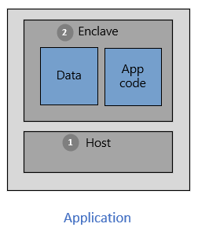

# Application enclave development 

With Azure confidential computing, you can create application enclaves for virtual machines (VMs) that run Intel Software Guard Extensions (SGX). It's important to understand the related tools and software before you begin development.

> [!NOTE]
> If you haven't already read the [introduction to Intel SGX VMs and enclaves](confidential-computing-enclaves.md), do so before continuing.

## Application enclaves

Application enclaves are isolated environments that protect specific code and data. When creating enclaves, you must determine what part of the application runs within the enclave. When you create or manage enclaves, be sure to use compatible SDKs and frameworks for the chosen deployment stack. 

You can develop and deploy application enclaves using [confidential VMs with Intel SGX enabled](virtual-machine-solutions-sgx.md). 

### Developing applications

There are two partitions in an application built with enclaves. 

The **host** is the "untrusted" component. Your enclave application runs on top of the host. The host is an untrusted environment. When you deploy enclave code on the host, the host can't access that code.

The **enclave** is the "trusted" component. The application code and its cached data and memory run in the enclave. The enclave environment protects your secrets and sensitive data. Make sure your secure computations happen in an enclave.

To use the power of enclaves and isolated environments, choose tools that support confidential computing. Various tools support enclave application development. For example, you can use these open-source frameworks: 

- [The Open Enclave Software Development Kit (OE SDK)](enclave-development-oss.md#oe-sdk)
- [The Intel SGX SDK](enclave-development-oss.md#intel-sdk)
- [The EGo Software Development Kit](enclave-development-oss.md#ego)
- [The Confidential Consortium Framework (CCF)](enclave-development-oss.md#ccf)

As you design an application, identify and determine what part of needs to run in enclaves. Code in the trusted component is isolated from the rest of your application. After the enclave initializes and the code loads to memory, untrusted components can't read or change that code.

## Next steps 

- [Start developing applications with open-source software](enclave-development-oss.md)
