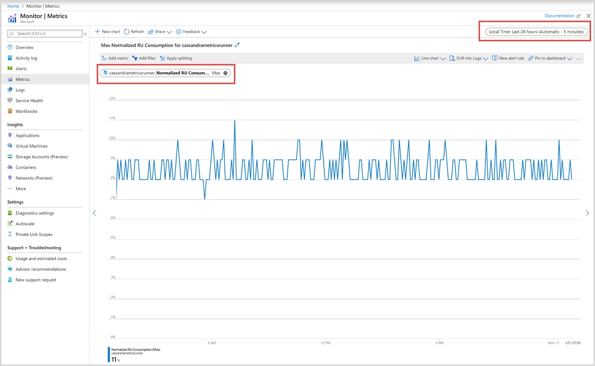
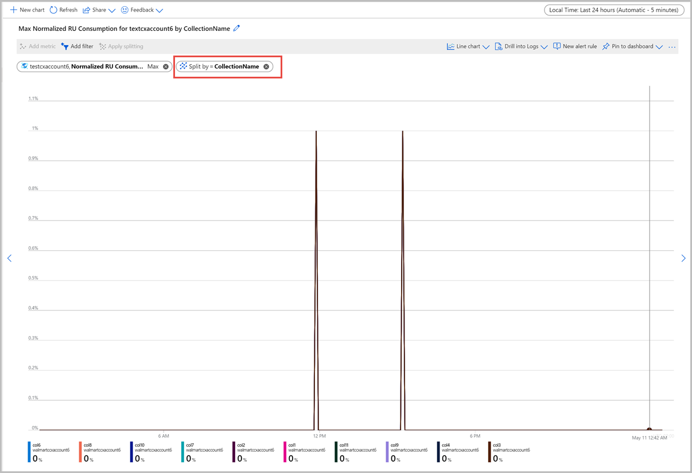

# How to monitor normalized RU/s for an Azure Cosmos container or an account

Azure Monitor for Azure Cosmos DB provides a metrics view to monitor your account and create dashboards. The Azure Cosmos DB metrics are collected by default, this feature does not require you to enable or configure anything explicitly.

The **Normalized RU Consumption** metric is used to see how well saturated the replicas are with regard to the request units consumption across the partition key ranges. Azure Cosmos DB distributes the throughput equally across all the physical partitions. This metric provides a per second view of the maximum throughput utilization within a replica set. By using this metric, if you see high percentage of request units utilization, you should increase the throughput to meet the needs of your workload.

## What to expect and do when normalized RU/s is higher

When the normalized RU/s consumption reaches 100%, the client receives rate limiting errors. The client should respect the wait time and retry. If there is a short spike that reaches 100% utilization, it means that the throughput on the replica reached its maximum performance limit. For example, a single operation such as a stored procedure that consumes all the RU/s on a replica will lead to a short spike in normalized RU/s consumption. In such cases, there will not be any immediate rate limiting errors if the request rate is low. That's because, Azure Cosmos DB allows requests to charge more than the provisioned RU/s for the specific request and other requests within that time period are rate limited.

The Azure Monitor metrics help you to find the operations per status code by using the **Total Requests** metric. Later you can filter on these requests by the 429 status code and split them by **Operation Type**.

To find the requests which are rate limited, the recommended way is to get this information through diagnostic logs.

If there is continuous peak of 100% normalized RU/s consumption or close to 100%, it's recommended to increase the throughput. You can find out which operations are heavy and their peak usage by utilizing the Azure monitor metrics and Azure monitor logs.

The **Normalized RU Consumption** metric is also used to see which partition key range is more warm in terms of usage; thus giving you the skew of throughput towards a partition key range. You can later follow up to see the **PartitionKeyRUConsumption** log in Azure Monitor logs to get information about which logical partition keys are hot in terms of usage.

## View the normalized request unit consumption metric

1. Sign in to the [Azure portal](https://portal.azure.com/).

2. Select **Monitor** from the left-hand navigation bar, and select **Metrics**.

   

3. From the **Metrics** pane > **Select a resource** > choose the required **subscription**, and **resource group**. For the **Resource type**, select **Azure Cosmos DB accounts**, choose one of your existing Azure Cosmos accounts, and select **Apply**.

   

4. Next you can select a metric from the list of available metrics. You can select metrics specific to request units, storage, latency, availability, Cassandra, and others. To learn in detail about all the available metrics in this list, see the [Metrics by category](monitor-cosmos-db-reference.md) article. In this example, let’s select **Normalized RU Consumption** metric and **Max** as the aggregation value.

   In addition to these details, you can also select the **Time range** and **Time granularity** of the metrics. At max, you can view metrics for the past 30 days.  After you apply the filter, a chart is displayed based on your filter.

   

### Filters for normalized request unit consumption

You can also filter metrics and the chart displayed by a specific **CollectionName**, **DatabaseName**, **PartitionKeyRangeID**, and **Region**. To filter the metrics, select **Add filter** and choose the required property such as **CollectionName** and corresponding value you are interested in. The graph then displays the Normalized RU Consumption units consumed for the container for the selected period.  

You can group metrics by using the **Apply splitting** option.  

The normalized request unit consumption metric for each container are displayed as shown in the following image:

## Next steps

* Monitor Azure Cosmos DB data by using [diagnostic settings](cosmosdb-monitor-resource-logs.md) in Azure.
* [Audit Azure Cosmos DB control plane operations](audit-control-plane-logs.md)
