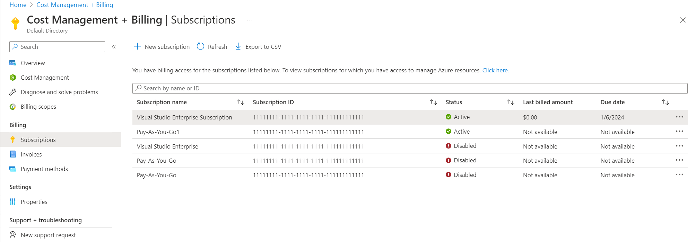

# Manage access to billing information for Azure

You can provide others access to the billing information for your account in the Azure portal. The type of billing roles and the instructions to provide access to the billing information vary by the type of your billing account. To determine the type of your billing account, see [Check the type of your billing account](#check-the-type-of-your-billing-account).

The article applies to customers with Microsoft Online Service program accounts. If you're an Azure customer with an Enterprise Agreement (EA) and are the Enterprise Administrator, you can give permissions to the Department Administrators and Account Owners in the Enterprise portal. For more information, see [Understand Azure Enterprise Agreement administrative roles in Azure](understand-ea-roles.md). If you are a Microsoft Customer Agreement customer, see, [Understand Microsoft Customer Agreement administrative roles in Azure](understand-mca-roles.md).

## Account administrators for Microsoft Online Service program accounts

An Account Administrator is the only owner for a Microsoft Online Service Program billing account. The role is assigned to a person who signed up for Azure. Account Administrators are authorized to perform various billing tasks like create subscriptions, view invoices or change the billing for a subscription.

## Give others access to view billing information

Account administrator can grant others access to Azure billing information by assigning one of the following roles on a subscription in their account.

- Service Administrator
- Co-administrator
- Owner
- Contributor
- Reader
- Billing reader

These roles have access to billing information in the [Azure portal](https://portal.azure.com/). People that are assigned these roles can also use the [Billing APIs](consumption-api-overview.md#usage-details-api) to programmatically get invoices and usage details.

To assign roles, see [Assign Azure roles using the Azure portal](../../role-based-access-control/role-assignments-portal.md).

> [!note]
> If you're an EA customer, an Account Owner can assign the above role to other users of their team. But for these users to view billing information, the Enterprise Administrator must enable AO view charges in the Enterprise portal.

###  Allow users to download invoices

After an Account administrator has assigned the appropriate roles to other users, they must turn on access to download invoices in the Azure portal. Invoices older than December 2016 are available only to the Account Administrator.

1. Sign in to the [Azure portal](https://portal.azure.com/), as an Account Administrator,

1. Search on **Cost Management + Billing**.

    

1. Select **Subscriptions** from the left-hand pane. Depending on your access, you may need to select a billing scope and then select **Subscriptions**.

    

1. Select **Invoices** and then **Access to invoice**.

    

1. Select **On** and save.

    

The Account Administrator can also configure to have invoices sent via email. To learn more, see [Get your invoice in email](download-azure-invoice-daily-usage-date.md).

## Give read-only access to billing

Assign the Billing Reader role to someone that needs read-only access to the subscription billing information but not the ability to manage or create Azure services. This role is appropriate for users in an organization who are responsible for the financial and cost management for Azure subscriptions.

The Billing Reader feature is in preview, and does not yet support non-global clouds.

- Assign the Billing Reader role to a user at the subscription scope.  
     For detailed steps, see [Assign Azure roles using the Azure portal](../../role-based-access-control/role-assignments-portal.md).

> [!NOTE]
> If you're an EA customer, an Account Owner or Department Administrator can assign the Billing Reader role to team members. But for that Billing Reader to view billing information for the department or account, the Enterprise Administrator must enable  **AO view charges** or **DA view charges** policies in the Enterprise portal.

## Check the type of your billing account
[!INCLUDE [billing-check-account-type](../../../includes/billing-check-account-type.md)]

## Need help? Contact us.

If you have questions or need help,  [create a support request](https://go.microsoft.com/fwlink/?linkid=2083458).

## Next steps

- Users in other roles, such as Owner or Contributor, can access not just billing information, but Azure services as well. To manage these roles, see [Assign Azure roles using the Azure portal](../../role-based-access-control/role-assignments-portal.md).
- For more information about roles, see [Azure built-in roles](../../role-based-access-control/built-in-roles.md).