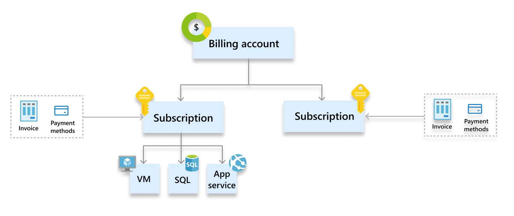
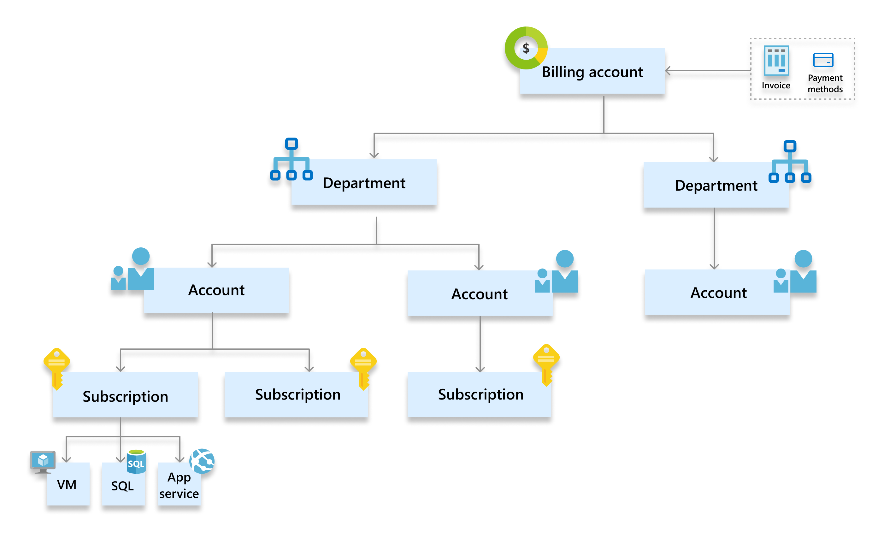
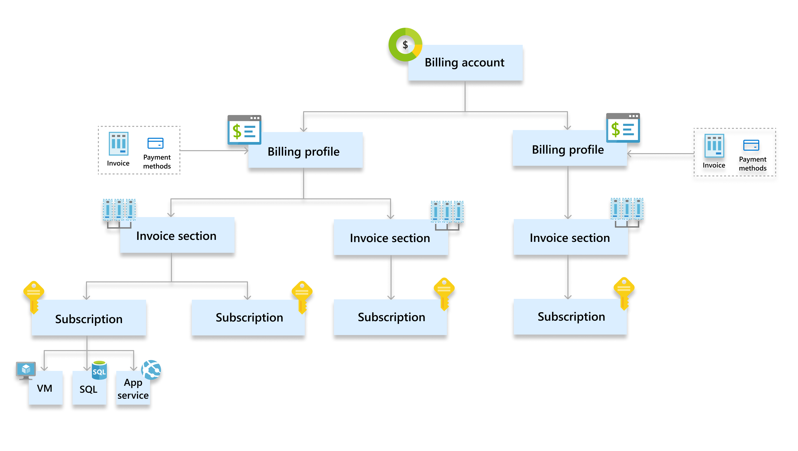
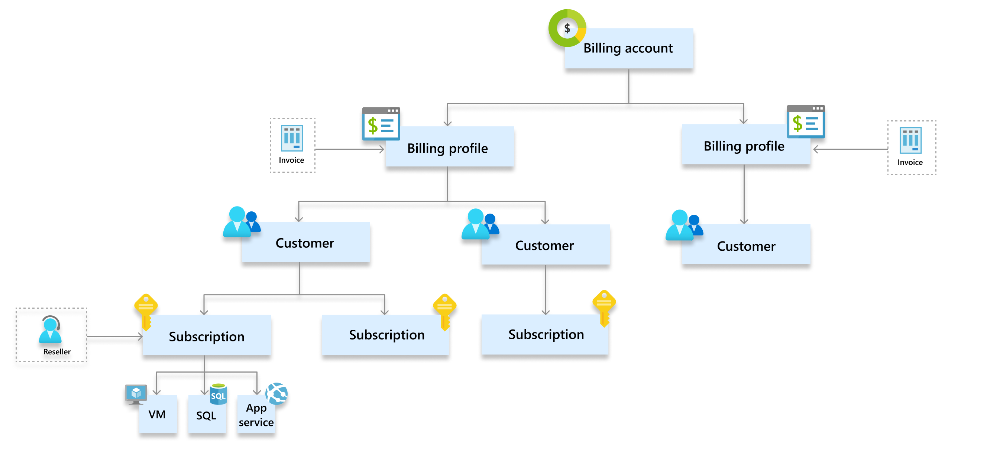

# Billing accounts and scopes in the Azure portal

A billing account is created when you sign up to use Azure. You use your billing account to manage your invoices, payments, and track costs. You can have access to multiple billing accounts. For example, you might have signed up for Azure for your personal projects. You could also have access through your organization's Enterprise Agreement or Microsoft Customer Agreement. For each of these scenarios, you would have a separate billing account.

Azure portal supports the following type of billing accounts:

- **Microsoft Online Services Program**: A billing account for a Microsoft Online Services Program is created when you sign up for Azure through the Azure website. For example, when you sign up for an [Azure Free Account](https://azure.microsoft.com/offers/ms-azr-0044p/), [account with pay-as-you-go rates](https://azure.microsoft.com/offers/ms-azr-0003p/) or as a [Visual studio subscriber](https://azure.microsoft.com/pricing/member-offers/credit-for-visual-studio-subscribers/).

- **Enterprise Agreement**: A billing account for an Enterprise Agreement is created when your organization signs an [Enterprise Agreement (EA)](https://azure.microsoft.com/pricing/enterprise-agreement/) to use Azure. You can have a maximum of 2000 subscriptions in an Enterprise Agreement.

- **Microsoft Customer Agreement**: A billing account for a Microsoft Customer Agreement is created when your organization works with a Microsoft representative to sign a Microsoft Customer Agreement. Some customers in select regions, who sign up through the Azure website for an [account with pay-as-you-go rates](https://azure.microsoft.com/offers/ms-azr-0003p/) or an [Azure Free Account](https://azure.microsoft.com/offers/ms-azr-0044p/) may have a billing account for a Microsoft Customer Agreement as well. You can have a maximum of 20 subscriptions in a Microsoft Customer Agreement for an individual. A Microsoft Customer Agreement for an enterprise doesn't have a limit on the number of subscriptions. For more information, see [Get started with your billing account for Microsoft Customer Agreement](../understand/mca-overview.md).

- **Microsoft Partner Agreement**: A billing account for a Microsoft Partner Agreement is created for Cloud Solution Provider (CSP) partners to manage their customers in the new commerce experience. Partners need to have at least one customer with an [Azure plan](/partner-center/purchase-azure-plan) to manage their billing account in the Azure portal. For more information, see [Get started with your billing account for Microsoft Partner Agreement](../understand/mpa-overview.md).

To determine the type of your billing account, see [Check the type of your billing account](#check-the-type-of-your-account).

## Scopes for billing accounts
A scope is a node within a billing account that you use to view and manage billing. It is where you manage billing data, payments, invoices, and conduct general account management.

If you don't have access to view or manage billing accounts, you probably don't have permission to access. You can ask your billing account administrator to grant you access. For more information, see the following articles:

- [Microsoft Online Services Program access](manage-billing-access.md)
- [Microsoft Customer Agreement access](understand-mca-roles.md)
- [Enterprise Agreement access](understand-ea-roles.md)

### Microsoft Online Services Program

|Scope  |Definition  |
|---------|---------|
|Billing account     | Represents an agreement that a customer accepts to use Azure. It contains one or more subscriptions.  |
|Subscription     |  Represents a grouping of Azure resources. Invoice is generated at this scope. Other billing information such as payment methods and usage address is associated to this scope.|

### Enterprise Agreement

|Scope  |Definition  |
|---------|---------|
|Billing account    | Represents an Enterprise Agreement enrollment. It contains one or more departments and accounts. Invoice is generated at this scope. |
|Department     |  Optional grouping of accounts to segment costs into logical groupings and set budget.     |
|Account     |  Represents a single account owner. Account owners have permissions to create and manage Azure subscriptions that are billed to the enrollment. |

### Microsoft Customer Agreement

|Scope  |Tasks  |
|---------|---------|
|Billing account     |   Represents an agreement that a customer accepts to use Microsoft products and services. It contains one or more billing profiles. |
|Billing profile     |   Represents an invoice and the related billing information such as payment methods and billing address. It contains one or more invoice sections. |
|Invoice section     |   Represents a grouping of costs in an invoice. Azure subscriptions and other purchases such as Azure Marketplace and App source products are associated to this scope.    |

### Microsoft Partner Agreement

|Scope  |Tasks  |
|---------|---------|
|Billing account     |   Represents a partner agreement to manage customers' Microsoft products and services in the new commerce experience. It contains one or more billing profiles and customers.   |
|Billing profile     |   Represents an invoice for a currency.     |
|Customer    |   Represents a customer for a Cloud Solution Provider (CSP) partner.  Azure subscriptions and other purchases such as Azure Marketplace and App source products are associated to this scope.  |
|Reseller    |   Reseller that provides services to a customer. It's an optional field for a subscription and is applicable only for Indirect providers in the CSP two-tier model.     |

## Switch billing scope in the Azure portal

1. Sign in to the [Azure portal](https://portal.azure.com).

2. Search for **Cost Management + Billing**.

   

3. In the overview page, select **Switch scope**.

   

   > [!Note]
    >
    > You will not see Switch scope if you only have access to one scope.

4. Select a scope to view details.

   

## Check the type of your account
[!INCLUDE [billing-check-mca](../../../includes/billing-check-account-type.md)]

## Need help? Contact us.

If you have questions or need help,  [create a support request](https://go.microsoft.com/fwlink/?linkid=2083458).

## Next steps
- Learn how to start [analyzing your costs](../costs/quick-acm-cost-analysis.md).