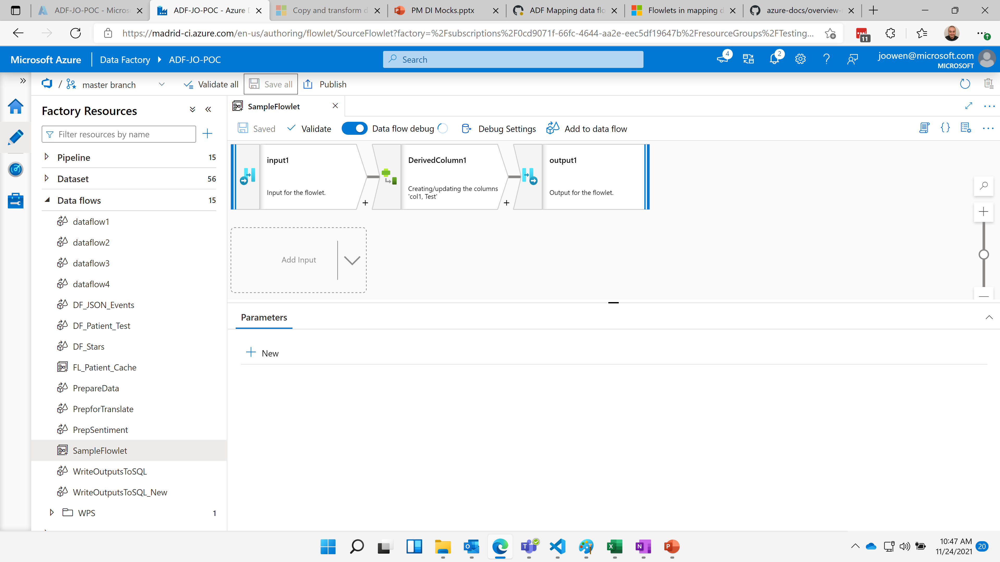
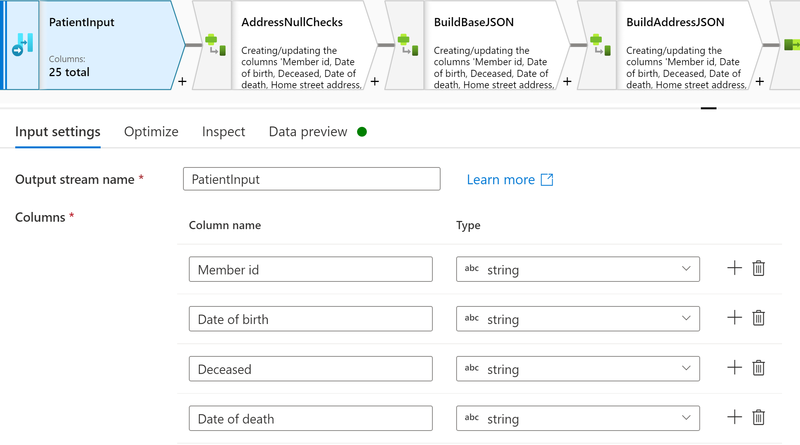
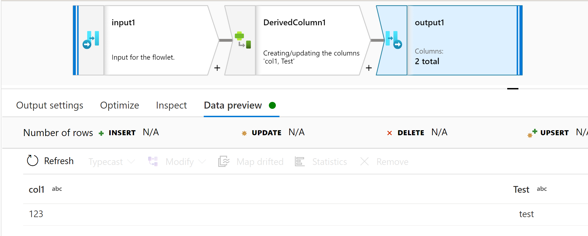
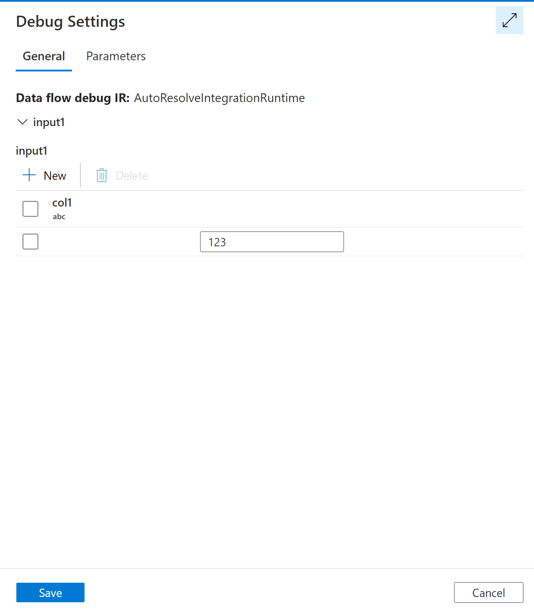

# Flowlets in mapping data flow

## What is a flowlet?

 A flowlet is a reusable container of activities that can be created from an existing mapping data flow or started from scratch. By reusing patterns you can prevent logic duplication and apply the same logic across many mapping data flows.
 
 With flowlets you can create logic to do things such as address cleaning or string trimming. You can then map the input and outputs to columns in the calling data flow for a dynamic code reuse experience.

> [!VIDEO https://www.microsoft.com/en-us/videoplayer/embed/RWQK3m]

## Getting started
To create a flowlet, select the new flowlet action from the mapping data flow menu options.

This creates a new flowlet where you can add in your inputs, outputs, and transformation activities.

## Flowlet design surface
The flowlet design surface is similar to the mapping data flow design surface. The primary differences are the input, output, and debugging experiences that are described below.

### Flowlet input

The input of a flowlet defines the input columns expected from a calling mapping data flow. That calling mapping data flow maps columns from a stream into the columns you have defined from the input. This allows your flowlet  to perform reusable logic on columns while giving flexibility on the calling mapping data flow for which columns the flowlet applies to.

### Flowlet output

The output of a flowlet defines the output columns that can be expected to emit to the calling mapping data flow. After any transformations are performed in your flowlet the resulting output columns will be sent to the calling mapping data flow.

### Debugging a flowlet
Debugging a flowlet has a couple of differences from the mapping data flow debug experience. 

First, the preview data is only available at the output of the flowlet. To preview data, make sure to select the flowlet output and then the Preview Data tab.

Second, because flowlets are dynamically mapped to inputs, in order to debug them flowlets allow users to enter test data to send through the flowlet. Under the debug settings, you should see a grid to fill out with test data that matches the input columns. Note for inputs with a large number of columns you might need to select on the full screen icon.

## Other methods for creating a flowlet
Flowlets can also be created from existing mapping data flows. This allows users to quickly reuse logic already created.

For a single transformation activity, you can right-click the mapping data flow activity and select Create a new flowlet. This creates a flowlet with that activity and in input to match the activity's inputs.

If you have mulit-select turned on, you can also select multiple mapping data flow activities. This can be done by either lassoing multiple activities by drawing a rectangle to select them or using shift+select to select multiple activities. Then you'll right-click and select Create a new flowlet.

## Running a flowlet inside of a mapping data flow
Once the flowlet is created, you can run the flowlet from your mapping data flow activity with the flowlet transformation. 

For more information, see [Flowlet transformation in mapping data flow | Microsoft Docs.](data-flow-flowlet.md)
