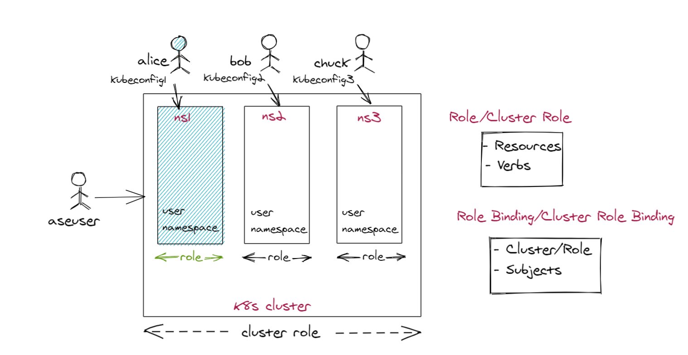

# Kubernetes Role-based Access Control on your Azure Stack Edge device

On your Azure Stack Edge device, when you configure compute role, a Kubernetes cluster is created. You can use Kubernetes role-based access control (RBAC) to limit access to the cluster resources on your device.

This articles provides an overview for the RBAC system provided by Kubernetes, and how is Kubernetes RBAC implemented on your Azure Stack Edge device. 

## RBAC for Kubernetes

Kubernetes RBAC lets you assign users, or groups of users, permission to do things like create or modify resources, or view logs from running application workloads. These permissions can be scoped to a single namespace, or granted across the entire cluster. 

When you set up the Kubernetes cluster, a single user is created corresponding to this cluster and is called the cluster admin user.  A `kubeconfig` file is associated with the cluster admin user. The `kubeconfig` file is a text file that contains all the configuration information required to connect to the cluster to authenticate the user. 

### Namespaces and users

In the real world, it is important to divide the cluster into multiple namespaces. 

- **Multiple users**: If you have multiple users, then multiple namespaces will allow those users to each deploy their applications and services in their specific namespaces in isolation from one another. 
- **Single user**: Even if there is a single user, multiple namespaces would allow that user to run multiple versions of the applications in the same Kubernetes cluster.

### Roles and RoleBindings

Kubernetes has the concept of role and role binding that lets you give permissions to user or resources at a namespace level and at a cluster level. 

- **Roles**: You can define permissions to users as a **Role** and then use **Roles** to grant permissions within a namespace. 
- **RoleBindings**: Once you have defined the roles, you can use **RoleBindings** to assign roles for a given namespace. 

This approach lets you logically segregate a single Kubernetes cluster, with users only able to access the application resources in their assigned namespace. 

## RBAC on Azure Stack Edge

In the current implementation of RBAC, Azure Stack Edge allows you to take the following actions from a restricted PowerShell runspace:

- Create namespaces.  
- Create additional users.
- Grant you admin access to the namespaces that you created. Keep in mind that you won't have access to cluster admin role or a view of the cluster-wide resources.
- Get `kubeconfig` file with information to access the Kubernetes cluster.

The Azure Stack Edge device has multiple system namespaces and you can create user namespaces with `kubeconfig` files to access those namespaces. The users have full control over these namespaces and can create or modify users, or grant users access. Only the cluster admin has full access to system namespaces and cluster-wide resources. An `aseuser` has read-only access to system namespaces.

Here is a diagram that depicts the implementation of RBAC on Azure Stack Edge device.

In this diagram, Alice, Bob, and Chuck have access to assigned user namespaces only, which in this case are `ns1`, `ns2`, and `ns3` respectively. Within these namespaces, they have admin access. The cluster admin on the other hand has admin access to system namespaces and cluster-wide resources.

You can use `kubectl` commands to create namespaces, assign users, assign users, or download `kubeconfig` files. Here is a high level workflow:

1. Create a namespace and a user.  

    `New-HcsKubernetesNamespace -Namespace`  

2. Create a user.  

    `New-HcsKubernetesUser -UserName`  

3. Associate the namespace with the user you created.  

    `Grant-HcsKubernetesNamespaceAccess -Namespace -UserName`  

4. Save the user configuration to `C:\Users\<username>\.kube`.  

5. Install `kubectl` and start deploying applications into `kubectl`. 

For detailed step-by-step instructions, go to [Access Kubernetes cluster via kuebctl on your Azure Stack Edge](azure-stack-edge-gpu-create-kubernetes-cluster.md).

When working with namespaces and users on your Azure Stack Edge devices, the following caveats apply:

- You are not allowed to perform any operations such as create users, grant or revoke namespace access to user, for any of the system namespaces. Examples of system namespaces include `kube-system`, `metallb-system`, `kubernetes-dashboard`, `default`, `kube-node-lease`, `kube-public`. System namespaces also include the namespaces reserved for deployment types such as `iotedge` (IoT Edge namespace) and `azure-arc` (Azure Arc namespace).
- You can create user namespaces and within those namespaces create additional users and grant or revoke namespace access to those users.
- You are not allowed to create any namespaces with names that are identical to those for any system namespace. The names for system namespaces are reserved.  
- You are not allowed to create any user namespaces with names that are already in use by other user namespaces. For example, if you have a `test-ns` that you created, you cannot create another `test-ns` namespace.
- You are not allowed to create users with names that are already reserved. For example, `aseuser` is a reserved cluster admin and cannot be used.

For more information on Azure Stack Edge namespaces, see [Namespace types](azure-stack-edge-gpu-kubernetes-workload-management.md#namespaces-types).

<!--To deploy applications on an Azure Stack Edge device, use the following :
 
- First, you will use the PowerShell runspace to create a user, create a namespace, and grant user access to that namespace.
- Next, you will use the Azure Stack Edge resource in the Azure portal to create persistent volumes using either static or dynamic provisioning for the stateful applications that you will deploy.
- Finally, you will use the services to expose applications externally and within the Kubernetes cluster.-->

## Next steps

To understand how you can create a user, create a namespace, and grant user access to the namespace, see [Access a Kubernetes cluster via kubectl](azure-stack-edge-gpu-create-kubernetes-cluster.md).

