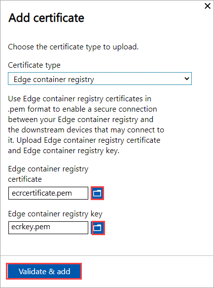
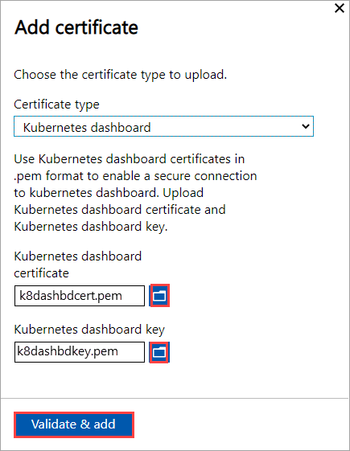
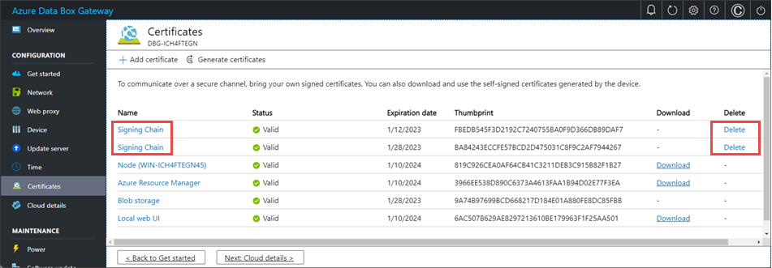

# Upload, import, export, and delete certificates on Azure Stack Edge Pro GPU

[!INCLUDE [applies-to-GPU-and-pro-r-and-mini-r-skus](../../includes/azure-stack-edge-applies-to-gpu-pro-r-mini-r-sku.md)]

To ensure secure and trusted communication between your Azure Stack Edge device and the clients connecting to it, you can use self-signed certificates or bring your own certificates. This article describes how to manage these certificates, including how to upload, import, and export these certificates. You can also view certificate expiration dates and delete your old signing certificates.

To know more about how to create these certificates, see [Create certificates using Azure PowerShell](azure-stack-edge-gpu-create-certificates-powershell.md).


## Upload certificates on your device

If you bring your own certificates, then the certificates that you created for your device by default reside in the **Personal store** on your client. These certificates need to be exported on your client into appropriate format files that can then be uploaded to your device.


### Prerequisites

Before you upload your root certificates and endpoint certificates on to the device, make sure the certificates are exported in appropriate format.

- The root certificate must be exported as DER format with `.cer` extension. For detailed steps, see [Export certificates as DER format](azure-stack-edge-gpu-prepare-certificates-device-upload.md#export-certificates-as-der-format).
- The endpoint certificates must be exported as *.pfx* files with private keys. For detailed steps, see [Export certificates as *.pfx* file with private keys](azure-stack-edge-gpu-prepare-certificates-device-upload.md#export-certificates-as-pfx-format-with-private-key). 

### Upload certificates 

To upload the root and endpoint certificates on the device, use the **+ Add certificate** option on the **Certificates** page in the local web UI. Follow these steps:

1. Upload the root certificates first. In the local web UI, go to **Certificates**.
1. Select **+ Add certificate**.

    

1. Save the certificate.

#### Upload endpoint certificate

1. Next upload the endpoint certificates. 

    

    Choose the certificate files in *.pfx* format and enter the password you supplied when you exported the certificate. The Azure Resource Manager certificate may take a few minutes to apply.

    If the signing chain is not updated first, and you try to upload the endpoint certificates, then you will get an error.

    

    Go back and upload the signing chain certificate and then upload and apply the endpoint certificates.

> [!IMPORTANT]
> If the device name or the DNS domain are changed, new certificates must be created. The client certificates and the device certificates should then be updated with the new device name and DNS domain. 

#### Upload Kubernetes certificates

The Kubernetes certificates can be for Edge Container Registry or for Kubernetes dashboard. In each case, a certificate and a key file must be uploaded. Follow these steps to create and upload Kubernetes certificates:


1. You'll use `openssl` to create the Kubernetes dashboard certificate or Edge Container Registry. Make sure to install openssl on the system you would use to create the certificates. On a Windows system, you can use Chocolatey to install `openssl`. After you've installed Chocolatey, open PowerShell and type:
    
    ```powershell
    choco install openssl
    ```
1. Use `openssl` to create these certificates. A `cert.pem` certificate file and `key.pem` key file are created.  

    - For Edge Container Registry, use the following command:
    
        ```powershell
        openssl req -newkey rsa:4096 -nodes -sha256 -keyout key.pem -x509 -days 365 -out cert.pem -subj "/CN=<ecr.endpoint-suffix>"
        ``` 
        Here is an example output: 

        ```powershell
        PS C:\WINDOWS\system32> openssl req -newkey rsa:4096 -nodes -sha256 -keyout key.pem -x509 -days 365 -out cert.pem -subj "/CN=ecr.dbe-1d6phq2.microsoftdatabox.com"
        Generating a RSA private key
        .....................++++....++++
        writing new private key to 'key.pem'
        -----
        PS C:\WINDOWS\system32>
        ```    
    - For Kubernetes dashboard certificate, use the following command:  
     
        ```powershell
        openssl req -newkey rsa:4096 -nodes -sha256 -keyout key.pem -x509 -days 365 -out cert.pem -subj "/CN=<<kubernetes-dashboard.endpoint-suffix> OR <endpoint-suffix>>"
        ```
        Here is an example output: 

        ```powershell
        PS C:\WINDOWS\system32> openssl req -newkey rsa:4096 -nodes -sha256 -keyout key.pem -x509 -days 365 -out cert.pem -subj "/CN=kubernetes-dashboard.dbe-1d8phq2.microsoftdatabox.com"
        Generating a RSA private key
        .....................++++....++++
        writing new private key to 'key.pem'
        -----
        PS C:\WINDOWS\system32>
        ```          
1. Upload the Kubernetes certificate and the corresponding key file that you generated earlier.
    
    - For Edge Container Registry

         

    - For Kubernetes dashboard

         

## Import certificates on the client accessing the device

You can use the device-generated certificates or bring your own certificates. When using device-generated certificates, you must download the certificates on your client before you can import those into the appropriate certificate store. See [Download certificates to your client accessing the device](azure-stack-edge-gpu-deploy-configure-certificates.md#generate-device-certificates).

In both the cases, the certificates that you created and uploaded to your device must be imported on your Windows client (accessing the device) into the appropriate certificate store. 

- The root certificate that you exported as the DER should now be imported in the **Trusted Root Certificate Authorities** on your client system. For detailed steps, see [Import certificates into the Trusted Root Certificate Authorities store](#import-certificates-as-der-format).

- The endpoint certificates that you exported as the `.pfx` must be exported as DER with `.cer` extension. This `.cer` is then imported in the **Personal certificate store** on your system. For detailed steps, see [Import certificates into the Personal certificate store](#import-certificates-as-der-format).

### Import certificates as DER format 

To import certificates on a Windows client, take the following steps:

1. Right-click the file and select **Install certificate**. This action starts the Certificate Import Wizard.

    

2. For **Store location**, select **Local Machine**, and then select **Next**.

    

3. Select **Place all certificates in the following store**, and then select **Browse**. 

    - To import into personal store, navigate to the Personal store of your remote host, and then select **Next**.

        

    - To import into trusted store, navigate to the Trusted Root Certificate Authority, and then select **Next**.

        

4. Select **Finish**. A message to the effect that the import was successful appears.


## View certificate expiry

If you bring in your own certificates, the certificates will expire typically in 1 year or 6 months. To view the expiration date on your certificate, go to the **Certificates** page in the local web UI of your device. If you select a specific certificate, you can view the expiration date on your certificate.

## Delete signing chain certificate

You can delete an old, expired signing chain certificate from your device. When you do, any dependent certificates in the signing chain will no longer be valid. Only signing chain certificates can be deleted.

To delete a signing chain certificate from your Azure Stack Edge device, take the following steps:

1. In the local web UI of your device, go to **CONFIGURATION** > **Certificates**.

1. Select the signing chain certificate you want to delete. Then select **Delete**.

    [  ](media/azure-stack-edge-gpu-manage-certificates/delete-signing-certificate-01.png)

1. On the **Delete certificate** pane, verify the certificate's thumbprint, and then select **Delete**. Certificate deletion can't be reversed.

    

    After certificate deletion is complete, all dependent certificates in the signing chain are no longer valid.

1. To see the status updates, refresh the display. The signing chain certificate will no longer be displayed, and dependent certificates will have **Not valid** status.

## Next steps

Learn how to [Troubleshoot certificate issues](azure-stack-edge-gpu-certificate-troubleshooting.md)
