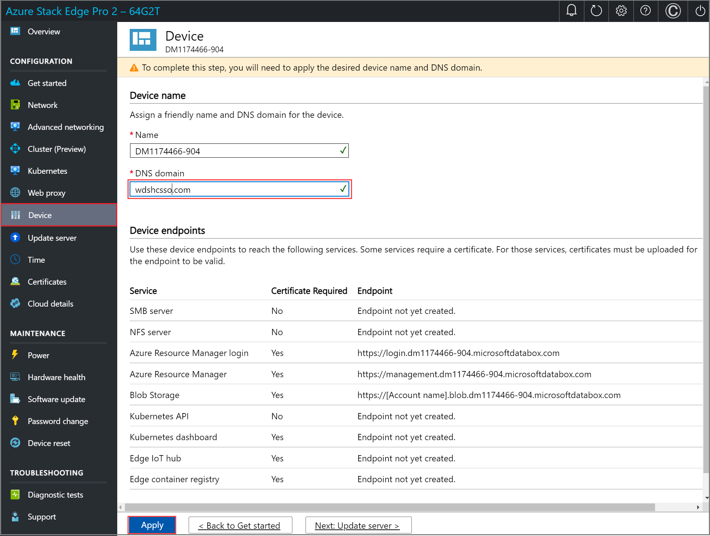
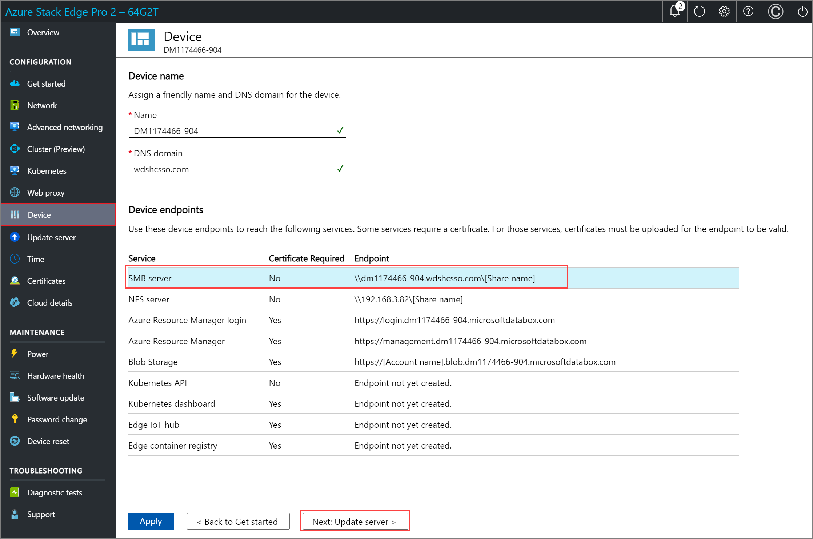
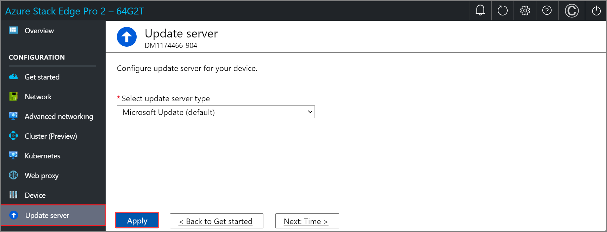
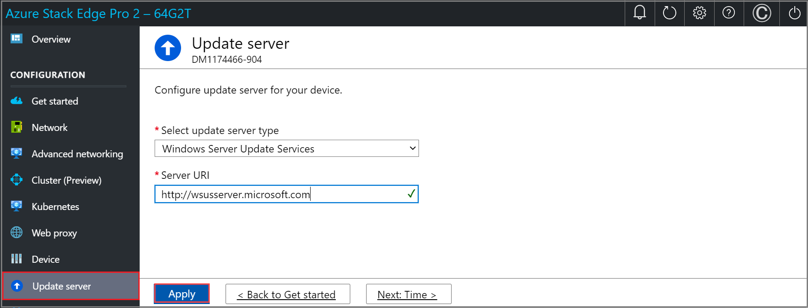
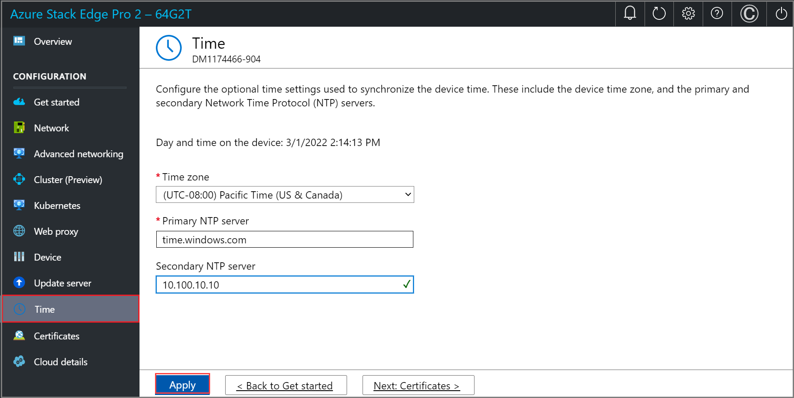

# Tutorial: Configure the device settings for Azure Stack Edge Pro 2

This tutorial describes how you configure device-related settings for your Azure Stack Edge Pro 2 device. You can set up your device name, update server, and time server via the local web UI.

The device settings can take around 5-7 minutes to complete.

In this tutorial, you learn about:

> [!div class="checklist"]
>
> * Prerequisites
> * Configure device settings
> * Configure update 
> * Configure time

## Prerequisites

Before you configure device-related settings on your Azure Stack Edge Pro 2, make sure that:

* For your physical device:

    - You've installed the physical device as detailed in [Install Azure Stack Edge Pro 2](azure-stack-edge-pro-2-deploy-install.md).
    - You've configured network and enabled and configured compute network on your device as detailed in [Tutorial: Configure network for Azure Stack Edge Pro 2](azure-stack-edge-pro-2-deploy-configure-network-compute-web-proxy.md).

## Configure device settings

Follow these steps to configure device-related settings:

1. On the **Device** page of the local web UI of your device, take the following steps:

    1. Enter a friendly name for your device. The friendly name must contain from 1 to 13 characters and can have letter, numbers, and hyphens.

    2. Provide a **DNS domain** for your device. This domain is used to set up the device as a file server.

    3. To validate and apply the configured device settings, select **Apply**.

        

        If you’ve changed the device name and the DNS domain, the automatically generated self-signed certificates on the device won’t work. You'll see a warning to this effect.
    

        

    4. When the device name and the DNS domain are changed, the SMB endpoint is created.  

    5. After the settings are applied, select **Next: Update server**.

        

## Configure update server

1. On the **Update server** page of the local web UI of your device, you can now configure the location from where to download the updates for your device.  

    - You can get the updates directly from the **Microsoft Update server**.

        

        You can also choose to deploy updates from the **Windows Server Update services** (WSUS). Provide the path to the WSUS server.
        
        

        > [!NOTE] 
        > If a separate Windows Update server is configured and if you choose to connect over *https* (instead of *http*), then signing chain certificates required to connect to the update server are needed. For information on how to create and upload certificates, go to [Manage certificates](azure-stack-edge-gpu-manage-certificates.md). 

2. Select **Apply**.
3. After the update server is configured, select **Next: Time**.
    

## Configure time

Follow these steps to configure time settings on your device. 

> [!IMPORTANT]
> Though the time settings are optional, we strongly recommend that you configure a primary NTP and a secondary NTP server on the local network for your device. If a local server is not available, you can configure a public NTP server.

NTP servers are required because your device must synchronize time so that it can authenticate with your cloud service providers.

1. On the **Time** page of the local web UI of your device, you can select the time zone, and the primary and secondary NTP servers for your device.  
    
    1. In the **Time zone** drop-down list, select the time zone that corresponds to the geographic location in which the device is being deployed.
        The default time zone for your device is PST. Your device will use this time zone for all scheduled operations.

    2. In the **Primary NTP server** box, enter the primary server for your device or accept the default value of time.windows.com.  
        Ensure that your network allows NTP traffic to pass from your datacenter to the internet.

    3. Optionally, in the **Secondary NTP server** box, enter a secondary server for your device.

    4. To validate and apply the configured time settings, select **Apply**.

        

2. After the settings are applied, select **Next: Certificates**.

## Next steps

In this tutorial, you learn about:

> [!div class="checklist"]
>
> * Prerequisites
> * Configure device settings
> * Configure update 
> * Configure time

To learn how to configure certificates for your Azure Stack Edge Pro 2 device, see:

> [!div class="nextstepaction"]
> [Configure certificates](./azure-stack-edge-pro-2-deploy-configure-certificates.md)
