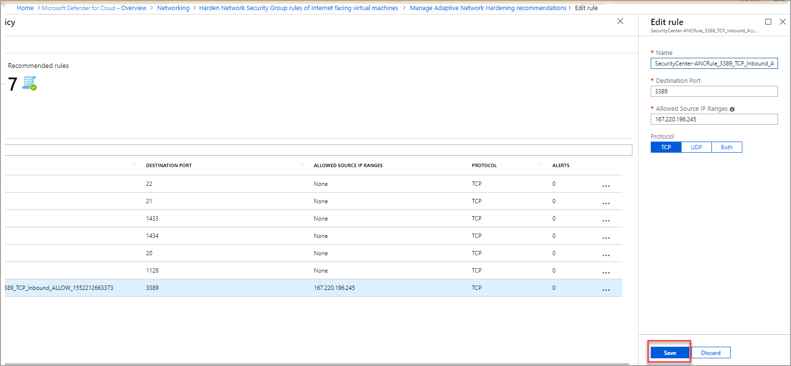
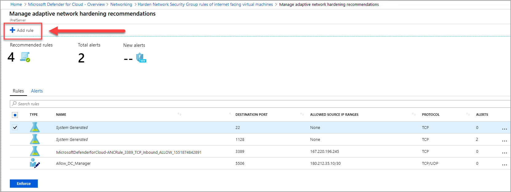

# Improve your network security posture with adaptive network hardening

Adaptive network hardening is an agentless feature of Microsoft Defender for Cloud - nothing needs to be installed on your machines to benefit from this network hardening tool.

This page explains how to configure and manage adaptive network hardening in Defender for Cloud.

## Availability

|Aspect|Details|
|----|:----|
|Release state:|General availability (GA)|
|Pricing:|Requires [Microsoft Defender for Servers Plan 2](plan-defender-for-servers-select-plan.md#plan-features)|
|Required roles and permissions:|Write permissions on the machine’s NSGs|
|Clouds:|:::image type="icon" source="./media/icons/yes-icon.png"::: Commercial clouds :::image type="icon" source="./media/icons/no-icon.png"::: National (Azure Government, Microsoft Azure operated by 21Vianet) :::image type="icon" source="./media/icons/no-icon.png"::: Connected AWS accounts|

## What is adaptive network hardening?

Applying [network security groups (NSG)](../virtual-network/network-security-groups-overview.md) to filter traffic to and from resources, improves your network security posture. However, there can still be some cases in which the actual traffic flowing through the NSG is a subset of the NSG rules defined. In these cases, further improving the security posture can be achieved by hardening the NSG rules, based on the actual traffic patterns.

Adaptive network hardening provides recommendations to further harden the NSG rules. It uses a machine learning algorithm that factors in actual traffic, known trusted configuration, threat intelligence, and other indicators of compromise, and then provides recommendations to allow traffic only from specific IP/port tuples.

For example, let's say the existing NSG rule is to allow traffic from 140.20.30.10/24 on port 22. Based on traffic analysis, adaptive network hardening might recommend narrowing the range to allow traffic from 140.23.30.10/29, and deny all other traffic to that port. For the full list of supported ports, see the common questions entry [Which ports are supported?](faq-defender-for-servers.yml).

## View hardening alerts and recommended rules

1. From Defender for Cloud's menu, open the **Workload protections** dashboard.
1. Select the adaptive network hardening tile (1), or the insights panel item related to adaptive network hardening (2).

    :::image type="content" source="./media/adaptive-network-hardening/traffic-hardening.png" alt-text="Accessing the adaptive network hardening tools." lightbox="./media/adaptive-network-hardening/traffic-hardening.png":::

    > [!TIP]
    > The insights panel shows the percentage of your VMs currently defended with adaptive network hardening.

1. The details page for the **Adaptive Network Hardening recommendations should be applied on internet facing virtual machines** recommendation opens with your network VMs grouped into three tabs:
   - **Unhealthy resources**: VMs that currently have recommendations and alerts that were triggered by running the adaptive network hardening algorithm.
   - **Healthy resources**: VMs without alerts and recommendations.
   - **Unscanned resources**: VMs that the adaptive network hardening algorithm cannot be run on because of one of the following reasons:
      - **VMs are Classic VMs**: Only Azure Resource Manager VMs are supported.
      - **Not enough data is available**: In order to generate accurate traffic hardening recommendations, Defender for Cloud requires at least 30 days of traffic data.
      - **VM is not protected by Microsoft Defender for Servers**: Only VMs protected with [Microsoft Defender for Servers](defender-for-servers-introduction.md) are eligible for this feature.

    :::image type="content" source="./media/adaptive-network-hardening/recommendation-details-page.png" alt-text="Details page of the recommendation Adaptive network hardening recommendations should be applied on internet facing virtual machines.":::

1. From the **Unhealthy resources** tab, select a VM to view its alerts and the recommended hardening rules to apply.

    - The **Rules** tab lists the rules that adaptive network hardening recommends you add
    - The **Alerts** tab lists the alerts that were generated due to traffic, flowing to the resource, which is not within the IP range allowed in the recommended rules.

1. Optionally, edit the rules:

    - [Modify a rule](#modify-a-rule)
    - [Delete a rule](#delete-a-rule)
    - [Add a rule](#add-a-new-rule)

1. Select the rules that you want to apply on the NSG, and select **Enforce**.

    > [!TIP]
    > If the allowed source IP ranges shows as 'None', it means that recommended rule is a *deny* rule, otherwise, it is an *allow* rule.

    :::image type="content" source="./media/adaptive-network-hardening/hardening-alerts.png" alt-text="Managing adaptive network hardening rules.":::

      > [!NOTE]
      > The enforced rules are added to the NSG(s) protecting the VM. (A VM could be protected by an NSG that is associated to its NIC, or the subnet in which the VM resides, or both)

## Modify a rule

You might want to modify the parameters of a rule that has been recommended. For example, you might want to change the recommended IP ranges.

Some important guidelines for modifying an adaptive network hardening rule:

- You cannot change **allow** rules to become **deny** rules.

- You can modify the parameters of **allow** rules only.

    Creating and modifying "deny" rules is done directly on the NSG. For more information, see [Create, change, or delete a network security group](../virtual-network/manage-network-security-group.md).

- A **Deny all traffic** rule is the only type of "deny" rule that would be listed here, and it cannot be modified. You can, however, delete it (see [Delete a rule](#delete-a-rule)). To learn about this type of rule, see the common questions entry [When should I use a "Deny all traffic" rule?](faq-defender-for-servers.yml).

To modify an adaptive network hardening rule:

1. To modify  some of the parameters of a rule, in the **Rules** tab, select on the three dots (...) at the end of the rule's row, and select **Edit**.

   

1. In the **Edit rule** window, update the details that you want to change, and select **Save**.

   > [!NOTE]
   > After selecting **Save**, you have successfully changed the rule. *However, you have not applied it to the NSG.* To apply it, you must select the rule in the list, and select **Enforce** (as explained in the next step).

   

1. To apply the updated rule, from the list, select the updated rule and select **Enforce**.

    

## Add a new rule

You can add an "allow" rule that was not recommended by Defender for Cloud.

> [!NOTE]
> Only "allow" rules can be added here. If you want to add "deny" rules, you can do so directly on the NSG. For more information, see [Create, change, or delete a network security group](../virtual-network/manage-network-security-group.md).

To add an adaptive network hardening rule:

1. From the top toolbar, select **Add rule**.

   

1. In the **New rule** window, enter the details and select **Add**.

   > [!NOTE]
   > After selecting **Add**, you have successfully added the rule, and it is listed with the other recommended rules. However, you have not *applied* it on the NSG. To activate it, you must select the rule in the list, and select **Enforce** (as explained in the next step).

1. To apply the new rule, from the list, select the new rule and select **Enforce**.

    

## Delete a rule

When necessary, you can delete a recommended rule for the current session. For example, you might determine that applying a suggested rule could block legitimate traffic.

To delete an adaptive network hardening rule for your current session:

- In the **Rules** tab, select the three dots (...) at the end of the rule's row, and select **Delete**.

    

## Next step

- View common questions about [adaptive network hardening](faq-defender-for-servers.yml#which-ports-are-supported-by-adaptive-network-hardening-)
