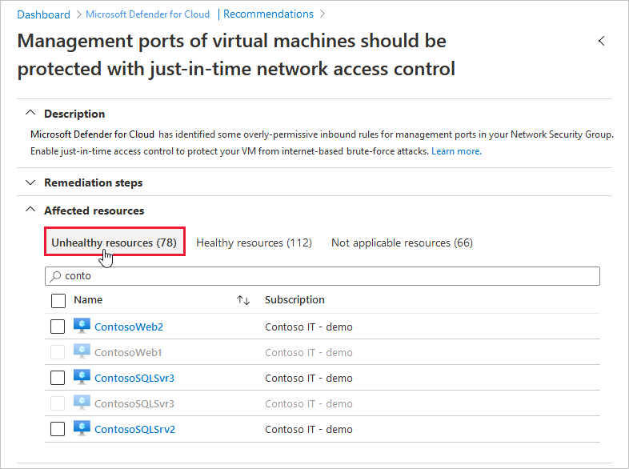

# Understanding just-in-time (JIT) VM access

This page explains the principles behind Microsoft Defender for Cloud's just-in-time (JIT) VM access feature and the logic behind the recommendation.

To learn how to apply JIT to your VMs using the Azure portal (either Defender for Cloud or Azure Virtual Machines) or programmatically, see [How to secure your management ports with JIT](just-in-time-access-usage.md).

## The risk of open management ports on a virtual machine

Threat actors actively hunt accessible machines with open management ports, like RDP or SSH. All of your virtual machines are potential targets for an attack. When a VM is successfully compromised, it's used as the entry point to attack further resources within your environment.

## Why JIT VM access is the solution 

As with all cybersecurity prevention techniques, your goal should be to reduce the attack surface. In this case, that means having fewer open ports, especially management ports.

Your legitimate users also use these ports, so it's not practical to keep them closed.

To solve this dilemma, Microsoft Defender for Cloud offers JIT. With JIT, you can lock down the inbound traffic to your VMs, reducing exposure to attacks while providing easy access to connect to VMs when needed.

## How JIT operates with network resources in Azure and AWS

In Azure, you can block inbound traffic on specific ports, by enabling just-in-time VM access. Defender for Cloud ensures "deny all inbound traffic" rules exist for your selected ports in the [network security group](../virtual-network/network-security-groups-overview.md#security-rules) (NSG) and [Azure Firewall rules](../firewall/rule-processing.md). These rules restrict access to your Azure VMs’ management ports and defend them from attack. 

If other rules already exist for the selected ports, then those existing rules take priority over the new "deny all inbound traffic" rules. If there are no existing rules on the selected ports, then the new rules take top priority in the NSG and Azure Firewall.

In AWS, by enabling JIT-access the relevant rules in the attached EC2 security groups, for the selected ports, are revoked which blocks inbound traffic on those specific ports.

When a user requests access to a VM, Defender for Cloud checks that the user has [Azure role-based access control (Azure RBAC)](../role-based-access-control/role-assignments-portal.md) permissions for that VM. If the request is approved, Defender for Cloud configures the NSGs and Azure Firewall to allow inbound traffic to the selected ports from the relevant IP address (or range), for the amount of time that was specified. In AWS, Defender for Cloud creates a new EC2 security group that allows inbound traffic to the specified ports. After the time has expired, Defender for Cloud restores the NSGs to their previous states. Connections that are already established are not interrupted.

> [!NOTE]
> JIT does not support VMs protected by Azure Firewalls controlled by [Azure Firewall Manager](../firewall-manager/overview.md).  The Azure Firewall must be configured with Rules (Classic) and cannot use Firewall policies.

## How Defender for Cloud identifies which VMs should have JIT applied

The diagram below shows the logic that Defender for Cloud applies when deciding how to categorize your supported VMs: 

### [**Azure**](#tab/defender-for-container-arch-aks)

### [**AWS**](#tab/defender-for-container-arch-eks)
:::image type="content" source="media/just-in-time-explained/aws-jit-logic-flow.png" alt-text="A chart that explains the logic flow for the AWS Just in time (J I T) virtual machine (V M) logic flow.":::

---

When Defender for Cloud finds a machine that can benefit from JIT, it adds that machine to the recommendation's **Unhealthy resources** tab. 

## FAQ - Just-in-time virtual machine access

### What permissions are needed to configure and use JIT?

JIT Requires [Microsoft Defender for Servers Plan 2](defender-for-servers-introduction.md#defender-for-servers-plans) to be enabled on the subscription. 

**Reader** and **SecurityReader** roles can both view the JIT status and parameters.

If you want to create custom roles that can work with JIT, you'll need the details from the table below.

If you are setting up JIT on your Amazon Web Service (AWS) VM, you will need to [connect your AWS account](quickstart-onboard-aws.md) to Microsoft Defender for Cloud.

> [!TIP]
> To create a least-privileged role for users that need to request JIT access to a VM, and perform no other JIT operations, use the [Set-JitLeastPrivilegedRole script](https://github.com/Azure/Azure-Security-Center/tree/main/Powershell%20scripts/JIT%20Scripts/JIT%20Custom%20Role) from the Defender for Cloud GitHub community pages.

| To enable a user to: | Permissions to set|
| --- | --- |
|Configure or edit a JIT policy for a VM | *Assign these actions to the role:*  <ul><li>On the scope of a subscription or resource group that is associated with the VM:  `Microsoft.Security/locations/jitNetworkAccessPolicies/write` </li><li> On the scope of a subscription or resource group of VM:  `Microsoft.Compute/virtualMachines/write`</li></ul> | 
|Request JIT access to a VM | *Assign these actions to the user:*  <ul><li> `Microsoft.Security/locations/jitNetworkAccessPolicies/initiate/action` </li><li> `Microsoft.Security/locations/jitNetworkAccessPolicies/*/read` </li><li> `Microsoft.Compute/virtualMachines/read` </li><li> `Microsoft.Network/networkInterfaces/*/read` </li> <li> `Microsoft.Network/publicIPAddresses/read` </li></ul> |
|Read JIT policies| *Assign these actions to the user:*  <ul><li>`Microsoft.Security/locations/jitNetworkAccessPolicies/read`</li><li>`Microsoft.Security/locations/jitNetworkAccessPolicies/initiate/action`</li><li>`Microsoft.Security/policies/read`</li><li>`Microsoft.Security/pricings/read`</li><li>`Microsoft.Compute/virtualMachines/read`</li><li>`Microsoft.Network/*/read`</li>|

> [!Note]
> Only the `Microsoft.Security` permissions are relevant for AWS.

## Next steps

This page explained _why_ just-in-time (JIT) virtual machine (VM) access should be used. To learn about _how_ to enable JIT and request access to your JIT-enabled VMs, see the following:

> [!div class="nextstepaction"]
> [How to secure your management ports with JIT](just-in-time-access-usage.md)
