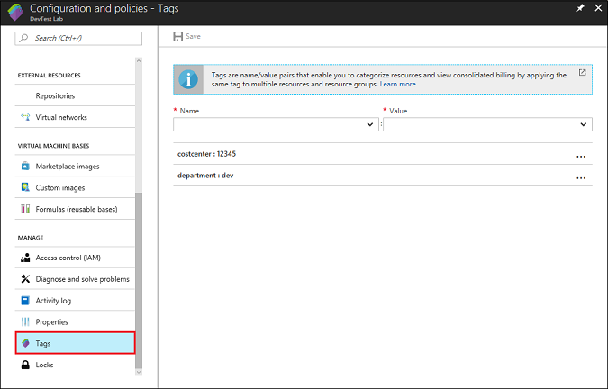

# Add tags to a lab in Azure DevTest Labs

You can create custom tags and apply them to your DevTest Labs resources to logically categorize your resources. Later, you can quickly and easily see all the resources in your subscription that have that tag. Tags are helpful when you need to organize resources for billing or management.

Resources that are supported by tags include

* Compute VMs
* NICs
* IP addresses
* Load balancers
* Storage accounts
* Managed disks

You can apply tags when you [Create a lab](devtest-lab-create-lab.md) and later manage them through the Tags blade under Configuration and settings.

Every tag is made up of a **name**/**value** pair. For example, you might create a tag with the name *costcenter* that has a value of *34543*. A tag such as this might help you later identify lab resources that are billable to this specific area of your organization. You get to choose names and values that make sense for how you want to organize your subscription.

## Steps to manage tags in an existing lab

1. Sign in to the [Azure portal](https://go.microsoft.com/fwlink/p/?LinkID=525040).
1. If necessary, select **All Services**, and then select **DevTest Labs** from the list. Your lab might already be shown on the Dashboard under **All Resources**.
1. From the list of labs, select the lab in which you want to add or manage tags.
1. On the lab's **Overview** area, select **Configuration and policies**.

    

1. On the left under **General**, select **Tags**.
1. To create a new tag for this lab, enter a **Name**/**Value** pair and select **Save**. You can also select an existing tag from the list to view or manage the resources associated with that tag.

    

> [!NOTE]
> Tags created at the lab level flow through all billable resources that the lab spins up in your subscription. For example, lab level tags flow to the underlying compute VMs of lab VMs.You can use tags in the context of cost management. Lab level tags show up in the tag filter for the cost management.

## Understanding limitations to tags

The following limitations apply to tags:

* Each resource or resource group can have a maximum of 15 tag name/value pairs. This limitation applies only to tags directly applied to the resource group or resource. A resource group can contain many resources that each have 15 tag name/value pairs.
* The tag name is limited to 512 characters, and the tag value is limited to 256 characters. For storage accounts, the tag name is limited to 128 characters, and the tag value is limited to 256 characters.
* Tags applied to the resource group are not inherited by the resources in that resource group.

[Use tags to organize your Azure resources](../azure-resource-manager/management/tag-resources.md) provides greater details about using tags in Azure, including how to manage tags using PowerShell or Azure CLI.

[!INCLUDE [devtest-lab-try-it-out](../../includes/devtest-lab-try-it-out.md)]

## Next steps
* You can apply restrictions and conventions across your subscription by using customized policies. A policy that you define might require that all resources have a value for a particular tag. For more information, see [Set policies and schedules](devtest-lab-set-lab-policy.md).
* Explore the [DevTest Labs Azure Resource Manager quickstart template gallery](https://github.com/Azure/azure-devtestlab/tree/master/samples/DevTestLabs/QuickStartTemplates).
