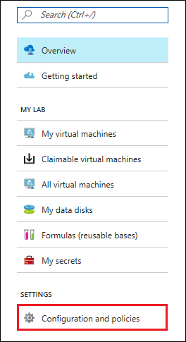
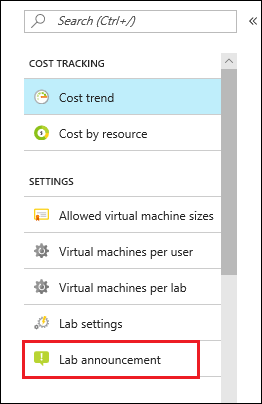
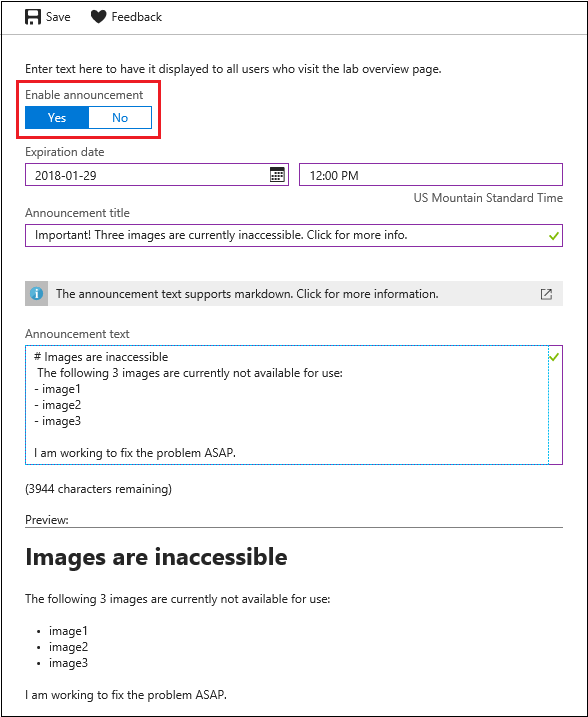

# Post an announcement to a lab in Azure DevTest Labs

As a lab administrator, you can post a custom announcement in an existing lab to notify users about recent changes or additions to the lab. For example, you might want to inform users about:

- New VM sizes that are available
- Images that are currently unusable
- Updates to lab policies

Once posted, the announcement is displayed on the lab's Overview page and the user can select it for more details.

The announcement feature is meant to be used for temporary notifications.  You can easily disable an announcement after it is no longer needed.

## Steps to post an announcement in an existing lab

1. Sign in to the [Azure portal](https://go.microsoft.com/fwlink/p/?LinkID=525040).
1. If necessary, select **All Services**, and then select **DevTest Labs** from the list. (Your lab might already be shown on the Dashboard under **All Resources**).
1. From the list of labs, select the lab in which you want to post an announcement.
1. On the lab's **Overview** area, select **Configuration and policies**.

    

1. On the left under **SETTINGS**, select **Lab announcement**.

    

1. To create a message for the users in this lab, set **Enabled** to **Yes**.

1. You can enter an **Expiration date** to specify a date and time after which the announcement is no longer shown to users. If you don't enter an expiration date, the announcement remains until you disable it.

   > [!NOTE]
   > After the announcement expires, it is no longer shown to users, but still exists in the **Lab announcement** pane. You can make edits to it and re-enable it to make it active again.
   >
   >

1. Enter an **Announcement title** and the **Announcement text**.

   The title can be up to 100 characters and is shown to the user on the lab's Overview page. If the user selects the title, the announcement text is displayed.

   The announcement text accepts markdown. As you enter the announcement text, you can view the message in the Preview area at the bottom of the screen.

    


1. Select **Save** once your announcement is ready to post.

When you no longer want to show this announcement to lab users, return to the **Lab announcement** page and set **Enabled** to **No**. If you specified an expiration date, the announcement is disabled automatically at that date and time.

## Steps for users to view an announcement

1. From the [Azure portal](https://go.microsoft.com/fwlink/p/?LinkID=525040), select a lab.

1. If the lab has an announcement posted for it, an information notice is shown at the top of the lab's Overview page. This information notice is the announcement title that was specified when the announcement was created.

    

1. The user can select the message to view the entire announcement.

    

[!INCLUDE [devtest-lab-try-it-out](../../includes/devtest-lab-try-it-out.md)]

## Azure Resource Manager template
You can specify an announcement as part of an Azure Resource Manager template as shown in the following example:

```json
{
    "$schema": "https://schema.management.azure.com/schemas/2014-04-01-preview/deploymentTemplate.json#",
    "contentVersion": "1.0.0.0",
    "parameters": {
        "name": {
            "type": "string",
            "defaultValue": "devtestlabfromarm"
        },
        "regionId": {
            "type": "string",
            "defaultValue": "eastus"
        }
    },
    "resources": [
        {
            "apiVersion": "2017-04-26-preview",
            "name": "[parameters('name')]",
            "type": "Microsoft.DevTestLab/labs",
            "location": "[parameters('regionId')]",
            "tags": {},
            "properties": {
                "labStorageType": "Premium",
                "announcement":
                {
                    "title": "Important! Three images are currently inaccessible. Click for more information.",
                    "markdown":"# Images are inaccessible\n\nThe following 3 images are currently not available for use: \n\n- image1\n- image2\n- image3\n\nI am working to fix the problem ASAP.",
                    "enabled": "Enabled",
                    "expirationDate":"2018-12-31T06:00:00+00:00",
                    "expired": "false"
                },
                "support": {
                    "markdown": "",
                    "enabled": "Enabled"
                }
            },
            "resources": [
                {
                    "apiVersion": "2017-04-26-preview",
                    "name": "LabVmsShutdown",
                    "location": "[parameters('regionId')]",
                    "type": "schedules",
                    "dependsOn": [
                        "[resourceId('Microsoft.DevTestLab/labs', parameters('name'))]"
                    ],
                    "properties": {
                        "status": "Enabled",
                        "timeZoneId": "Eastern Standard Time",
                        "dailyRecurrence": {
                            "time": "1900"
                        },
                        "taskType": "LabVmsShutdownTask",
                        "notificationSettings": {
                            "status": "Disabled",
                            "timeInMinutes": 30
                        }
                    }
                },
                {
                    "apiVersion": "2017-04-26-preview",
                    "name": "[concat('Dtl', parameters('name'))]",
                    "type": "virtualNetworks",
                    "location": "[parameters('regionId')]",
                    "dependsOn": [
                        "[resourceId('Microsoft.DevTestLab/labs', parameters('name'))]"
                    ]
                }
            ]
        }
    ]
}
```

You can deploy an Azure Resource Manager template by using one of the following ways:

- [Azure portal](../azure-resource-manager/templates/deploy-portal.md)
- [Azure PowerShell](../azure-resource-manager/templates/deploy-powershell.md)
- [Azure CLI](../azure-resource-manager/templates/deploy-cli.md)
- [REST API](../azure-resource-manager/templates/deploy-rest.md)

## Next steps
* If you change or set a lab policy, you might want to post an announcement to inform users. [Set policies and schedules](devtest-lab-set-lab-policy.md) provides information about applying restrictions and conventions across your subscription by using customized policies.
* Explore the [DevTest Labs Azure Resource Manager QuickStart template gallery](https://github.com/Azure/azure-devtestlab/tree/master/samples/DevTestLabs/QuickStartTemplates).
