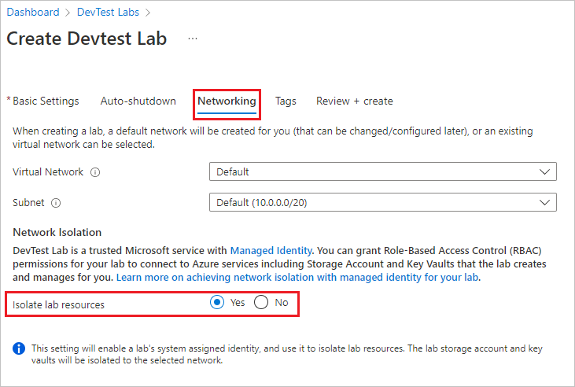
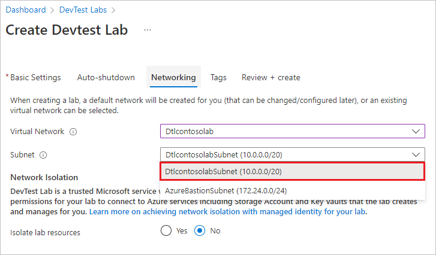
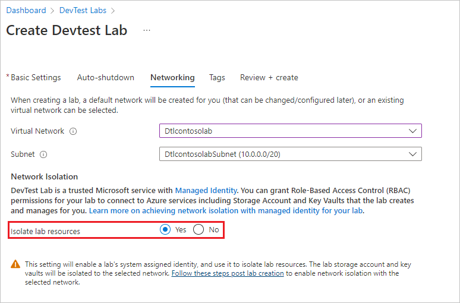
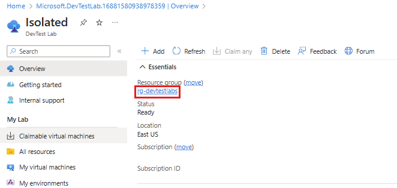
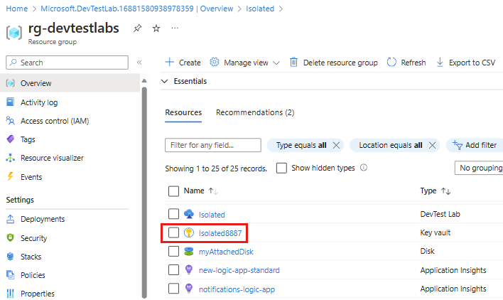

# Network isolation in Azure DevTest Labs

This article walks you through creating a network-isolated lab in Azure DevTest Labs.

By default, Azure DevTest Labs creates a new [Azure virtual network](../virtual-network/virtual-networks-overview.md) for each lab. The virtual network acts as a security boundary to isolate lab resources from the public internet. To ensure lab resources follow organizational networking policies, you can use several other networking options:

- Isolate all lab [virtual machines (VMs)](devtest-lab-configure-vnet.md) and [environments](connect-environment-lab-virtual-network.md) in a pre-existing virtual network that you select.
- Join an Azure virtual network to an on-premises network, to securely connect to on-premises resources. For more information, see [DevTest Labs enterprise reference architecture: Connectivity components](devtest-lab-reference-architecture.md#connectivity-components).
- Completely isolate the lab, including VMs, environments, the lab storage account, and key vaults, to a selected virtual network. This article describes how to configure network isolation.

## Enable network isolation

You can enable network isolation in the Azure portal only during lab creation. To convert an existing lab and associated lab resources to isolated network mode, use the PowerShell script [Convert-DtlLabToIsolatedNetwork.ps1](https://github.com/Azure/azure-devtestlab/blob/master/Tools/ConvertDtlLabToIsolatedNetwork/Convert-DtlLabToIsolatedNetwork.ps1).

During lab creation, you can enable network isolation for the default lab virtual network, or choose another, pre-existing virtual network to use for the lab.

### Use the default virtual network and subnet

To enable network isolation for the **Default** virtual network and subnet that DevTest Labs creates for the lab:

1. During [lab creation](devtest-lab-create-lab.md), on the **Create DevTest Lab** screen, select the **Networking** tab.
1. Next to **Isolate lab resources**, select **Yes**.
1. Finish creating the lab.

After you create the lab, no further action is needed. The lab handles isolating resources from now on.

### Use a different virtual network and subnet

To use a different, existing virtual network for the lab, and enable network isolation for that network:

1. During [lab creation](devtest-lab-create-lab.md), on the **Networking** tab of the **Create DevTest Lab** screen, select a network from the dropdown list. The list only shows networks in the same region and subscription as the lab.

   

1. Select a subnet.

   

1. Next to **Isolate lab resources**, select **Yes**.

   

1. Finish creating the lab.

## Configure service endpoints

If you enabled network isolation for a virtual network other than the default, complete the following steps to isolate the lab storage account and key vault to the network you selected. Do these steps after you create the lab, but before you do any other lab configuration or create any lab resources.

### Configure the endpoint for the lab storage account

1. On the lab's **Overview** page, select the **resource group**. 

   

1. On the resource group **Overview** page, select the lab's storage account. The naming convention for the lab storage account is `a\<labName>\<4-digit number>`. For example, if the lab name is `contosolab`, the storage account name could be `acontosolab1234`.

   

1. On the storage account page, select **Networking** from the left navigation. On the **Firewalls and virtual networks** tab, ensure that **Allow Azure services on the trusted services list to access this storage account.** is selected.

   DevTest Labs is a [trusted Microsoft service](../storage/common/storage-network-security.md#trusted-microsoft-services), so selecting this option lets the lab operate normally in a network isolated mode.

1. Select **Add existing virtual network**.

   

1. On the **Add networks** pane, select the virtual network and subnet you chose when you created the lab, and then select **Enable**.

   

1. Once the service endpoint is successfully enabled, select **Add**.

1. On the **Networking** page, select **Save**.

   

Azure Storage now allows inbound connections from the added virtual network, which enables the lab to operate successfully in a network isolated mode.

You can automate these steps with PowerShell or Azure CLI to configure network isolation for multiple labs. For more information, see [Configure Azure Storage firewalls and virtual networks](../storage/common/storage-network-security.md).

### Configure the endpoint for the lab key vault

1. On the lab's **Overview** page, select the **resource group**. 

1. On the resource group **Overview** page, select the lab's key vault.

   

1. On the key vault page, select **Networking** from the left navigation. On the **Firewalls and virtual networks** tab, ensure that **Allow trusted Microsoft services to bypass this firewall** is set to **Yes**.

1. Select **Add existing virtual networks**.

   

1. On the **Add networks** pane, select the virtual network and subnet you chose when you created the lab, and then select **Enable**.

1. Once the service endpoint is successfully enabled, select **Add**.

1. On the **Networking** page, select **Save**.

## Considerations

Here are some things to remember when using a lab in a network isolated mode:

### Enable access to the storage account from outside the lab

The lab owner must explicitly enable access to a network isolated lab's storage account from an allowed endpoint. Actions like uploading a VHD to the storage account for creating custom images require this access. You can enable access by creating a lab VM, and securely accessing the lab's storage account from that VM.

For more information, see [Connect to a storage account using an Azure Private Endpoint](../private-link/tutorial-private-endpoint-storage-portal.md).

### Provide storage account to export lab usage data

To [export usage data](personal-data-delete-export.md) for a network isolated lab, the lab owner must explicitly provide a storage account and generate a blob within the account to store the data. Exporting usage data fails in network isolated mode if the user doesn't explicitly provide the storage account to use.

For more information, see [Export or delete personal data from Azure DevTest Labs](personal-data-delete-export.md).

### Set key vault access policies

Enabling the key vault service endpoint affects only the firewall. Make sure to configure the appropriate key vault access permissions in the key vault **Access policies** section.

For more information, see [Assign a Key Vault access policy](../key-vault/general/assign-access-policy.md).

## Next steps

- [Azure Resource Manager (ARM) templates in Azure DevTest Labs](devtest-lab-use-arm-and-powershell-for-lab-resources.md)
- [Manage Azure DevTest Labs storage accounts](encrypt-storage.md)
- [Store secrets in a key vault in Azure DevTest Labs](devtest-lab-store-secrets-in-key-vault.md)