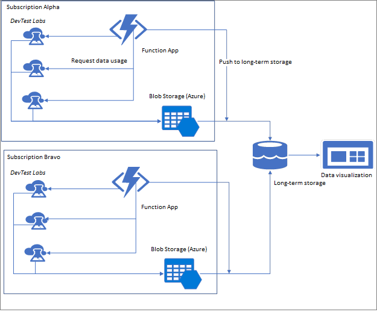

# Report Azure DevTest Labs usage across multiple labs and subscriptions

Most large organizations want to track resource usage, to be more effective in visualizing trends and outliers. Based on resource usage, lab owners or managers can customize labs to [improve resource usage and costs](../cost-management-billing/cost-management-billing-overview.md). In Azure DevTest Labs, you can download resource usage per lab, allowing a deeper historical look into usage patterns. These usage patterns help pinpoint changes to improve efficiency. Most enterprises want both individual lab usage and overall usage across [multiple labs and subscriptions](/azure/architecture/cloud-adoption/decision-guides/subscriptions/). 

This article discusses how to handle resource usage information across multiple labs and subscriptions.

## Individual lab usage

This section discusses how to export resource usage for a single lab.

Before you can export DevTest Labs resource usage, you have to set up an Azure Storage account for the files that contain the usage data. There are two common ways to run data export:

* [DevTest Labs REST API](/rest/api/dtl/labs/exportresourceusage) 
* The PowerShell Az.Resource module [Invoke-AzResourceAction](/powershell/module/az.resources/invoke-azresourceaction) with the action of `exportResourceUsage`, the lab resource ID, and the necessary parameters. 

    The [export or delete personal data](personal-data-delete-export.md) article contains a sample PowerShell script with detailed information on the data that is exported. 

    > [!NOTE]
    > The date parameter doesn't include a time stamp so the data includes everything from midnight based on the time zone where the lab is located.

Once the export is complete, there will be multiple CSV files in the blob storage with the different resource information.
  
Currently there are two CSV files:

* *virtualmachines.csv* - contains information about the virtual machines in the lab
* *disks.csv* - contains information about the different disks in the lab 

These files are stored in the *labresourceusage* blob container. The files are under the lab name, lab unique ID, date executed, and either `full` or the start date of the export request. An example blob structure is:

* `labresourceusage/labname/1111aaaa-bbbb-cccc-dddd-2222eeee/<End>DD26-MM6-2019YYYY/full/virtualmachines.csv`
* `labresourceusage/labname/1111aaaa-bbbb-cccc-dddd-2222eeee/<End>DD-MM-YYYY/26-6-2019/20-6-2019<Start>DD-MM-YYYY/virtualmachines.csv`

## Exporting usage for all labs

To export the usage information for multiple labs, consider using: 

* [Azure Functions](../azure-functions/index.yml), available in many languages, including PowerShell, or 
* [Azure Automation runbook](../automation/index.yml), use PowerShell, Python, or a custom graphical designer to write the export code.

Using these technologies, you can execute the individual lab exports on all the labs at a specific date and time. 

Your Azure function should push the data to the longer-term storage. When you export data for multiple labs, the export may take some time. To help with performance and reduce the possibility of duplication of information, we recommend executing each lab in parallel. To accomplish parallelism, run Azure Functions asynchronously. Also take advantage of the timer trigger that Azure Functions offers.

## Using a long-term storage

A long-term storage consolidates the export information from different labs into a single data source. Another benefit of using the long-term storage is being able to remove the files from the storage account to reduce duplication and cost. 

The long-term storage can be used to do any text manipulation, for example: 

* Adding friendly names
* Creating complex groupings
* Aggregating the data

Some common storage solutions are: [SQL Server](https://azure.microsoft.com/services/sql-database/), [Azure Data Lake](https://azure.microsoft.com/services/storage/data-lake-storage/), and [Azure Cosmos DB](https://azure.microsoft.com/services/cosmos-db/). The long-term storage solution you choose depends on preference. You might consider choosing the tool depending what it offers for interaction availability when visualizing the data.

## Visualizing data and gathering insights

Use a data visualization tool of your choice to connect to your long-term storage to display the usage data and gather insights to verify usage efficiency. For example, [Power BI](/power-bi/power-bi-overview) can be used to organize and display the usage data. 

You can use [Azure Data Factory](https://azure.microsoft.com/services/data-factory/) to create, link, and manage your resources within a single location interface. If greater control is needed, the individual resource can be created within a single resource group and managed independently of the Data Factory service.  

## Next Steps

Once you set up the system and data is moving to the long-term storage, the next step is to come up with the questions that the data needs to answer. For example: 

-	What is the VM size usage?

    Are users selecting high performance (more expensive) VM sizes?
-	Which Marketplace images are being used?

    Are custom images the most common VM base, should a common Image store be built like [Shared Image Gallery](../virtual-machines/shared-image-galleries.md) or [Image factory](image-factory-create.md).
-	Which custom images are being used, or not used?
