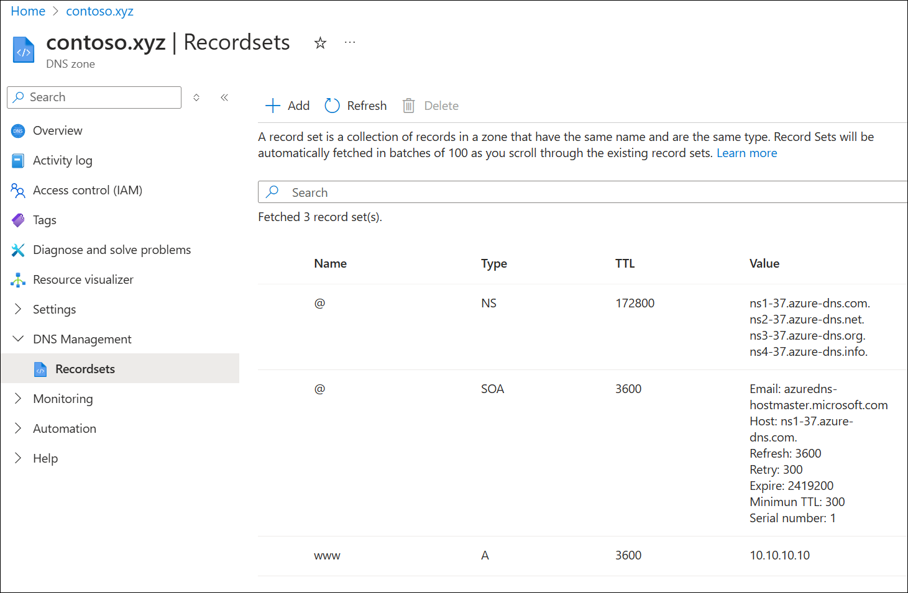

# Quickstart: Create an Azure DNS zone and record using the Azure portal

You can configure Azure DNS to resolve host names in your public domain. For example, if you purchased the *contoso.xyz* domain name from a domain name registrar, you can configure Azure DNS to host the *contoso.xyz* domain and resolve *`www.contoso.xyz`* to the IP address of your web server or web app.

In this quickstart, you create a test domain, and then create an address record to resolve *www* to the IP address *10.10.10.10*. 

:::image type="content" source="media/dns-getstarted-portal/environment-diagram.png" alt-text="Diagram of DNS deployment environment using the Azure portal." lightbox="media/dns-getstarted-portal/environment-diagram.png":::

> [!IMPORTANT]
> The names and IP addresses in this quickstart are examples that do not represent real-world scenarios. The private IP address 10.10.10.10 is used here with a public DNS zone for testing purposes.

You can also perform these steps using [Azure PowerShell](dns-getstarted-powershell.md) or the cross-platform [Azure CLI](dns-getstarted-cli.md).

If you don't have an Azure subscription, create a [free account](https://azure.microsoft.com/free/?WT.mc_id=A261C142F) before you begin.

For all portal steps, sign in to the [Azure portal](https://portal.azure.com).

## Prerequisites

An Azure account with an active subscription is required. [Create an account for free](https://azure.microsoft.com/free/?WT.mc_id=A261C142F).

## Sign in to the Azure portal

Sign in to the [Azure portal](https://portal.azure.com) with your Azure account.

## Create a DNS zone

A DNS zone contains the DNS entries for a domain. To start hosting your domain in Azure DNS, create a DNS zone for that domain name. 

**To create the DNS zone:**

1. At the upper left, select **Create a resource**, enter **DNS zone** into **Search services and marketplace** and then select **DNS zone**.
2. On the **DNS zone** page, select **Create**.

&nbsp;&nbsp;&nbsp;&nbsp;&nbsp;&nbsp;&nbsp;&nbsp;&nbsp;&nbsp;

3. On the **Create DNS zone** page, type or select the following values:

   - **Resource group**: Select **Create new**, enter *MyResourceGroup*, and select **OK**. The resource group name must be unique within the Azure subscription. 
   - **Name**: Type *contoso.xyz* for this quickstart example. The DNS zone name can be any value that isn't already configured on the Azure DNS servers. A real-world value would be a domain that you bought from a domain name registrar.
   - **Resource group location**: Select a location for the new resource group. In this example, the location selected is **West US**.

4. Select **Review + create** and then select **Create**.

   

   It may take a minute to create the zone.

## Create a DNS record

Next, DNS records are created for your domain inside the DNS zone. A new address record, known as an '**A**' record, is created to resolve a host name to an IPv4 address.

**To create an 'A' record:**

1. In the Azure portal, under **Resources**, open the **contoso.xyz** DNS zone.
2. At the top of the **contoso.xyz** DNS zone page, select **Record sets** and then select **+ Add**. The **Add a record set** window appears.
3. In the **Add a record set** window, enter or select the following values:

   - **Name**: Type *www*. This record name is the host name that you want to resolve to the specified IP address.
   - **Type**: Select **A**. 'A' records are the most common, but there are other record types for mail servers ('MX'), IP v6 addresses ('AAAA'), and so on.
   - **Alias record set**: Choose **No**.
   - **TTL**: Enter **1**. *Time-to-live* of the DNS request specifies how long DNS servers and clients can cache a response.
   - **TTL unit**: Select **Hours**. The time unit for the **TTL** entry is specified here. 
   - **IP address**: For this quickstart example, enter **10.10.10.10**. This value is the IP address that the record name resolves to. In a real-world scenario, you would enter the public IP address for your web server.
4. Select **Add** to create the A record.

Since this quickstart is just for quick testing purposes, there's no need to configure the Azure DNS name servers at a domain name registrar. In a real production domain, you must enable users on the Internet to resolve the host name and connect to your web server or app. To accomplish this task, visit your domain name registrar and replace the name server records with the Azure DNS name servers. For more information, see [Tutorial: Host your domain in Azure DNS](dns-delegate-domain-azure-dns.md#delegate-the-domain).

## Test the name resolution

Now that you have a test DNS zone with a test 'A' record, you can test the name resolution. 

**To test DNS name resolution:**

1. On the **contoso.xyz | Recordsets** page, copy one of the name server names from the name server list. For example: ns1-37.azure-dns.com.

   [  ](./media/dns-getstarted-portal/view-zone.png#lightbox)

1. Open a command prompt, and run the following command:

   ```
   nslookup www.contoso.xyz <name server name>
   ```

   For example:

   ```
   nslookup www.contoso.xyz ns1-37.azure-dns.com.
   ```

   See the following example:

   

The host name **www\.contoso.xyz** resolves to **10.10.10.10**, just as you configured it. This result verifies that name resolution is working correctly. 

## Clean up resources

When you no longer need the resources you created in this quickstart, remove them by deleting the **MyResourceGroup** resource group. Open the **MyResourceGroup** resource group, and select **Delete resource group**.

## Next steps

> [!div class="nextstepaction"]
> [Create DNS records for a web app in a custom domain](./dns-web-sites-custom-domain.md)
