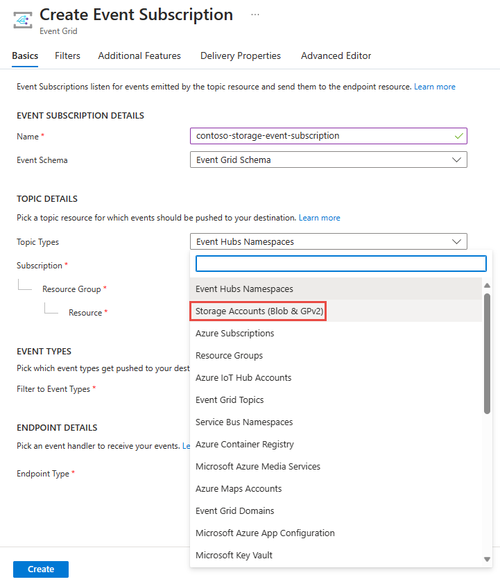
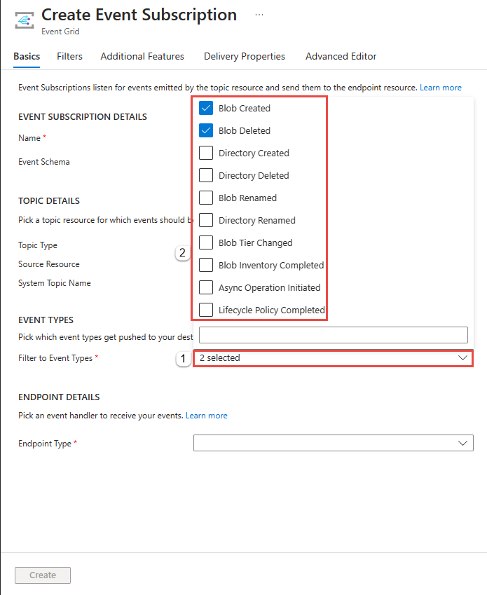
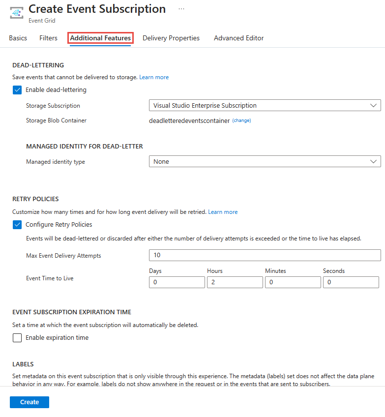

# Subscribe to events through portal

This article describes how to create Event Grid subscriptions through the portal. 

## Create event subscriptions

To create an Event Grid subscription for any of the supported [event sources](overview.md#event-sources), use the following steps. This article shows how to create an Event Grid subscription for an Azure subscription.

1. Select **All services**.

   

1. Search for **Event Grid Subscriptions** and select it from the available options.

   

1. Select **+ Event Subscription**.

   

1. Select the type of subscription you want to create. For example, to subscribe to events for your Azure subscription, select **Azure Subscriptions** and the target subscription.

   

1. To subscribe to all event types for this event source, keep the **Subscribe to all event types** option checked. Otherwise, select the event types for this subscription.

   

1. Provide more details about the event subscription, such as the endpoint for handling events and a subscription name.

   
    
    > [!NOTE]
    > - For a list of supported event handlers, see [Event handlers](event-handlers.md).
    > - If you enable managed identity for a topic or domain, you'll need to add the managed identity to the appropriate role-based access control (RBAC) role on the destination for the messages to be delivered successfully. For more information, see [Supported destinations and Azure roles](add-identity-roles.md#supported-destinations-and-azure-roles).
1. To enable dead lettering and customize retry policies, select **Additional Features**.

   

1. Select a container to use for storing events that aren't delivered, and set how retries are sent.

   

1. When done, select **Create**.

## Create subscription on resource

Some event sources support creating an event subscription through the portal interface for that resource. Select the event source, and look for **Events** in left pane.

The portal presents you with options for creating an event subscription that is relevant to that source.

## Next steps

* For information about event delivery and retries, [Event Grid message delivery and retry](delivery-and-retry.md).
* For an introduction to Event Grid, see [About Event Grid](overview.md).
* To quickly get started using Event Grid, see [Create and route custom events with Azure Event Grid](custom-event-quickstart.md).
