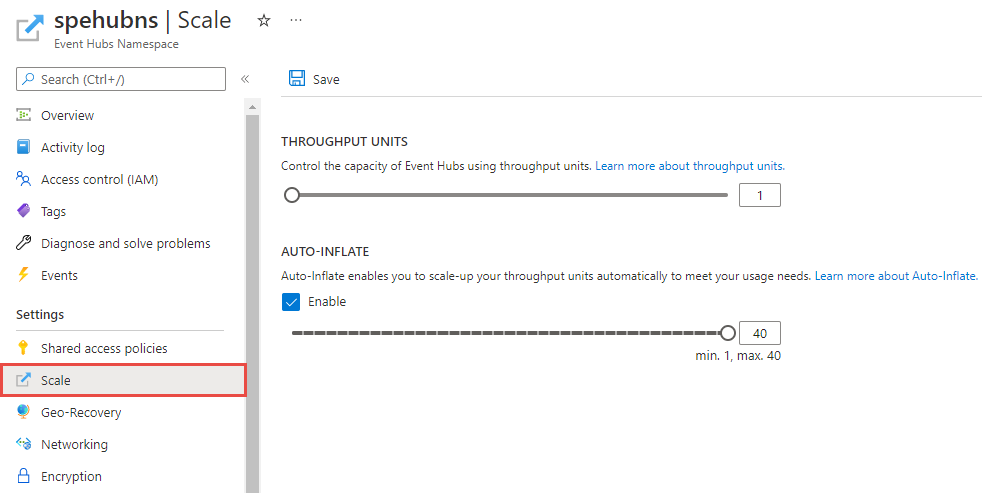

# Automatically scale up Azure Event Hubs throughput units
Azure Event Hubs is a highly scalable data streaming platform. As such, Event Hubs usage often increases after starting to use the service. Such usage requires increasing the predetermined [throughput units](event-hubs-scalability.md#throughput-units) to scale Event Hubs and handle larger transfer rates. The **Auto-inflate** feature of Event Hubs automatically scales up by increasing the number of throughput units, to meet usage needs. Increasing throughput units prevents throttling scenarios, in which:

* Data ingress rates exceed set throughput units.
* Data egress request rates exceed set throughput units.

The Event Hubs service increases the throughput when load increases beyond the minimum threshold, without any requests failing with ServerBusy errors.

## How Auto-inflate works

Event Hubs traffic is controlled by [throughput units](event-hubs-scalability.md#throughput-units). A single throughput unit allows 1 MB per second of ingress and twice that amount of egress. Standard event hubs can be configured with 1-20 throughput units. Auto-inflate enables you to start small with the minimum required throughput units you choose. The feature then scales automatically to the maximum limit of throughput units you need, depending on the increase in your traffic. Auto-inflate provides the following benefits:

- An efficient scaling mechanism to start small and scale up as you grow.
- Automatically scale to the specified upper limit without throttling issues.
- More control over scaling, because you control when and how much to scale.

## Enable Auto-inflate on a namespace

You can enable or disable Auto-inflate on a Standard tier Event Hubs namespace by using either of the following methods:

- The [Azure portal](https://portal.azure.com).
- An [Azure Resource Manager template](https://github.com/Azure/azure-quickstart-templates/tree/master/quickstarts/microsoft.eventhub/eventhubs-create-namespace-and-enable-inflate).

> [!NOTE]
> Basic tier Event Hubs namespaces do not support Auto-inflate.

### Enable Auto-inflate through the portal


#### Enable at the time of creation
You can enable the Auto-inflate feature **when creating an Event Hubs namespace**:


With this option enabled, you can start small with your throughput units and scale up as your usage needs increase. The upper limit for inflation does not immediately affect pricing, which depends on the number of throughput units used per hour.

#### Enable auto-inflate for an existing event hub
You can also enable the Auto-inflate feature and modify its settings by using the following instructions:

1. On the **Event Hubs Namespace** page, select **Disabled** under **Auto-inflate throughput units**.

    
2. In the **Scale Settings** page, select the checkbox for **Enable** (if the autoscale feature wasn't enabled).

    
3. Enter the **maximum** number of throughput units or use the scrollbar to set the value.
4. (optional) Update the **minimum** number of throughput units at the top of this page.


> [!NOTE]
> When you apply the auto-inflate configuration to increase throughput units, the Event Hubs service emits diagnostic logs that give you information about why and when the throughput increased. To enable diagnostic logging for an event hub, select **Diagnostic settings** on the left menu on the Event Hub page in the Azure portal. For more information, see [Set up diagnostic logs for an Azure event hub](event-hubs-diagnostic-logs.md).

### Enable Auto-Inflate using an Azure Resource Manager template

You can enable Auto-inflate during an Azure Resource Manager template deployment. For example, set the
`isAutoInflateEnabled` property to **true** and set `maximumThroughputUnits` to 10. For example:

```json
"resources": [
        {
            "apiVersion": "2017-04-01",
            "name": "[parameters('namespaceName')]",
            "type": "Microsoft.EventHub/Namespaces",
            "location": "[variables('location')]",
            "sku": {
                "name": "Standard",
                "tier": "Standard"
            },
            "properties": {
                "isAutoInflateEnabled": true,
                "maximumThroughputUnits": 10
            },
            "resources": [
                {
                    "apiVersion": "2017-04-01",
                    "name": "[parameters('eventHubName')]",
                    "type": "EventHubs",
                    "dependsOn": [
                        "[concat('Microsoft.EventHub/namespaces/', parameters('namespaceName'))]"
                    ],
                    "properties": {},
                    "resources": [
                        {
                            "apiVersion": "2017-04-01",
                            "name": "[parameters('consumerGroupName')]",
                            "type": "ConsumerGroups",
                            "dependsOn": [
                                "[parameters('eventHubName')]"
                            ],
                            "properties": {}
                        }
                    ]
                }
            ]
        }
    ]
```

For the complete template, see the [Create Event Hubs namespace and enable inflate](https://github.com/Azure/azure-quickstart-templates/tree/master/quickstarts/microsoft.eventhub/eventhubs-create-namespace-and-enable-inflate) template on GitHub.


## Next steps

You can learn more about Event Hubs by visiting the following links:

* [Event Hubs overview](./event-hubs-about.md)
