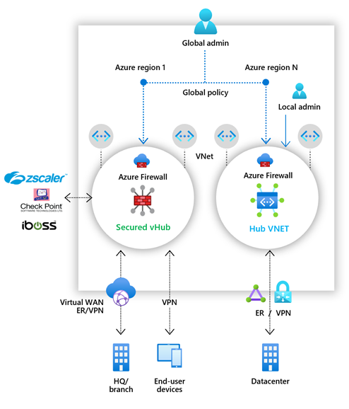

# What is Azure Firewall Manager?

Azure Firewall Manager is a security management service that provides central security policy and route management for cloud-based security perimeters. 

Firewall Manager can provide security management for two network architecture types:

- **Secured virtual hub**

   An [Azure Virtual WAN Hub](../virtual-wan/virtual-wan-about.md#resources) is a Microsoft-managed resource that lets you easily create hub and spoke architectures. When security and routing policies are associated with such a hub, it is referred to as a *[secured virtual hub](secured-virtual-hub.md)*. 
- **Hub virtual network**

   This is a standard Azure virtual network that you create and manage yourself. When security policies are associated with such a hub, it is referred to as a *hub virtual network*. At this time, only Azure Firewall Policy is supported. You can peer spoke virtual networks that contain your workload servers and services. You can also manage firewalls in standalone virtual networks that aren't peered to any spoke.

For a detailed comparison of *secured virtual hub* and *hub virtual network* architectures, see [What are the Azure Firewall Manager architecture options?](vhubs-and-vnets.md).

## Azure Firewall Manager features

Azure Firewall Manager offers the following features:

### Central Azure Firewall deployment and configuration​

You can centrally deploy and configure multiple Azure Firewall instances that span different Azure regions and subscriptions. 

### Hierarchical policies (global and local)​

You can use Azure Firewall Manager to centrally manage Azure Firewall policies across multiple secured virtual hubs. Your central IT teams can author global firewall policies to enforce organization wide firewall policy across teams. Locally authored firewall policies allow a DevOps self-service model for better agility.

### Integrated with third-party security-as-a-service for advanced security

In addition to Azure Firewall, you can integrate third-party security as a service (SECaaS) providers to provide additional network protection for your VNet and branch Internet connections.

This feature is available only with secured virtual hub deployments.

- VNet to Internet (V2I) traffic filtering

   - Filter outbound virtual network traffic with your preferred third-party security provider.
   - Leverage advanced user-aware Internet protection for your cloud workloads running on Azure.

- Branch to Internet (B2I) traffic filtering

   Leverage your Azure connectivity and global distribution to easily add third-party filtering for branch to Internet scenarios.

For more information about security partner providers, see [What are Azure Firewall Manager security partner providers?](trusted-security-partners.md)

### Centralized route management

Easily route traffic to your secured hub for filtering and logging without the need to manually set up User Defined Routes (UDR) on spoke virtual networks. 

This feature is available only with secured virtual hub deployments.

You can use third-party providers for Branch to Internet (B2I) traffic filtering, side by side with Azure Firewall for Branch to VNet (B2V), VNet to VNet (V2V) and VNet to Internet (V2I). You can also use third-party providers for V2I traffic filtering as long as Azure Firewall isn't required for B2V or V2V. 

## Region availability

Azure Firewall Policies can be used across regions. For example, you can create a policy in West US, and use it in East US. 

## Known issues

Azure Firewall Manager has the following known issues:

|Issue  |Description  |Mitigation  |
|---------|---------|---------|
|Traffic splitting|Office 365 and Azure Public PaaS traffic splitting isn't currently supported. As such, selecting a third-party provider for V2I or B2I also sends all Azure Public PaaS and Office 365 traffic via the partner service.|Investigating traffic splitting at the hub.
|One secured virtual hub per region|You can't have more than one secured virtual hub per region.|Create multiple virtual WANs in a region.|
|Base policies must be in same region as local policy|Create all your local policies in the same region as the base policy. You can still apply a policy that was created in one region on a secured hub from another region.|Investigating|
|Filtering inter-hub traffic in secure virtual hub deployments|Secured Virtual Hub to Secured Virtual Hub communication filtering isn't yet supported. However, hub to hub communication still works if private traffic filtering via Azure Firewall isn't enabled.|Investigating|
|Spokes in different region than the virtual hub|Spokes in different region than the virtual hub aren't supported.|Investigating  Create a hub per region and peer VNets in the same region as the hub.|
|Branch to branch traffic with private traffic filtering enabled|Branch to branch traffic isn't supported when private traffic filtering is enabled. |Investigating.  Don't secure private traffic if branch to branch connectivity is critical.|
|All Secured Virtual Hubs sharing the same virtual WAN must be in the same resource group.|This behavior is aligned with Virtual WAN Hubs today.|Create multiple Virtual WANs to allow Secured Virtual Hubs to be created in different resource groups.|
|Bulk IP address addition fails|The secure hub firewall goes into a failed state if you add multiple public IP addresses.|Add smaller public IP address increments. For example, add 10 at a time.|
|Application rules fail in a secure hub with custom DNS (preview) configured.|DNS proxy/Custom DNS (preview) doesn’t work in scenarios where a firewall management NIC is configured. This includes secure hub deployments and cases where forced tunneling is enabled.|Fix under investigation.|

## Next steps

- Review [Azure Firewall Manager deployment overview](deployment-overview.md)
- Learn about [secured Virtual Hubs](secured-virtual-hub.md).
