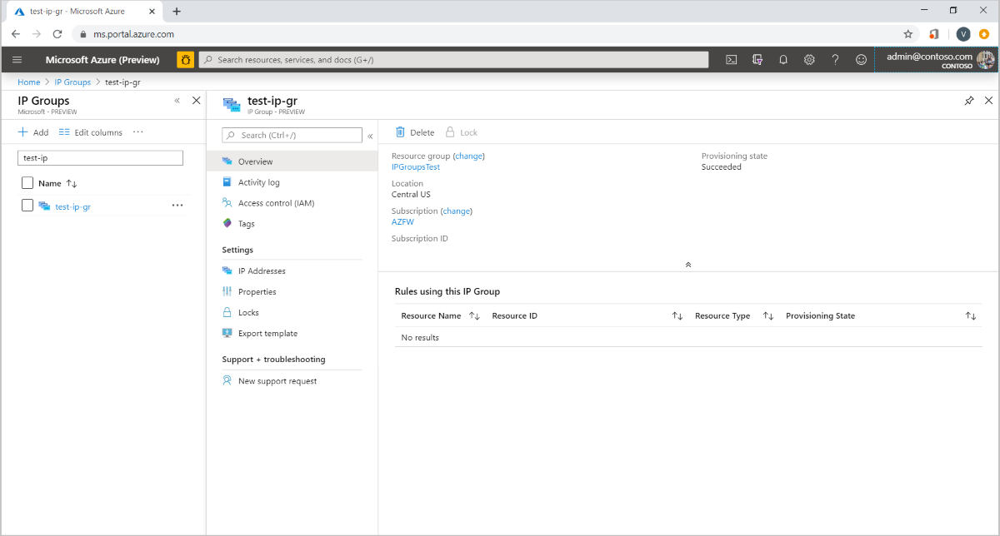

# IP Groups in Azure Firewall

IP Groups allow you to group and manage IP addresses for Azure Firewall rules in the following ways:

- As a source address in DNAT rules
- As a source or destination address in network rules
- As a source address in application rules


An IP Group can have a single IP address, multiple IP addresses, one or more IP address ranges or addresses and ranges in combination.

IP Groups can be reused in Azure Firewall DNAT, network, and application rules for multiple firewalls across regions and subscriptions in Azure. Group names must be unique. You can configure an IP Group in the Azure portal, Azure CLI, or REST API. A sample template is provided to help you get started.

## Sample format

The following IPv4 address format examples are valid to use in IP Groups:

- Single address: 10.0.0.0
- CIDR notation: 10.1.0.0/32
- Address range: 10.2.0.0-10.2.0.31

## Create an IP Group

An IP Group can be created using the Azure portal, Azure CLI, or REST API. For more information, see [Create an IP Group](create-ip-group.md).

## Browse IP Groups
1. In the Azure portal search bar, type **IP Groups** and select it. You can see the list of the IP Groups, or you can select **Add** to create a new IP Group.
2. Select an IP Group to open the overview page. You can edit, add, or delete IP addresses or IP Groups.

   

## Manage an IP Group

You can see all the IP addresses in the IP Group and the rules or resources that are associated with it. To delete an IP Group, you must first dissociate the IP Group from the resource that is using it.

1. To view or edit the IP addresses, select **IP Addresses** under **Settings** on the left pane.
2. To add a single or multiple IP address(es), select **Add IP Addresses**. This opens the **Drag or Browse** page for an upload, or you can enter the address manually.
3.    Selecting the ellipses (**…**) to the right to edit or delete IP addresses. To edit or delete multiple IP addresses, select the boxes and select **Edit** or **Delete** at the top.
4. Finally, can export the file in the CSV file format.

> [!NOTE]
> If you delete all the IP addresses in an IP Group while it is still in use in a rule, that rule is skipped.


## Use an IP Group

You can now select **IP Group** as a **Source type** or **Destination type** for the IP address(es) when you create Azure Firewall DNAT, application, or network rules.


## Parallel IP Group updates (preview)

You can now update multiple IP Groups in parallel at the same time. This is particularly useful for administrators who want to make configuration changes more quickly and at scale, especially when making those changes using a dev ops approach (templates, ARM, CLI, and Azure PowerShell).

With this support, you can now:

- Update 20 IP Groups at a time
- Update the firewall and firewall policy during IP Group updates
- Use the same IP Group in parent and child policy
- Update multiple IP Groups referenced by firewall policy or classic firewall simultaneously
- Receive new and improved error messages
   - Fail and succeed states

     For example, if there is an error with one IP Group update out of 20 parallel updates, the other updates proceed, and the errored IP Group fails. In addition, if the IP Group update fails, and the firewall is still healthy, the firewall remains in a *Succeeded* state. To check if the IP Group update has failed or succeeded, you can view the status on the IP Group resource.

To activate Parallel IP Group support, you can register the feature using either Azure PowerShell or the Azure portal.

### Azure PowerShell

Use the following Azure PowerShell commands:

```azurepowershell
Connect-AzAccount
Select-AzSubscription -Subscription <subscription_id> or <subscription_name>
Register-AzProviderFeature -FeatureName AzureFirewallParallelIPGroupUpdate -ProviderNamespace Microsoft.Network
Register-AzResourceProvider -ProviderNamespace Microsoft.Network
```
It can take several minutes for this to take effect. Once the feature is completely registered, consider performing an update on Azure Firewall for the change to take effect immediately.

### Azure portal

1. Navigate to **Preview features** in the Azure portal.
2. Search and register **AzureFirewallParallelIPGroupUpdate**.
3. Ensure the feature is enabled.

:::image type="content" source="media/ip-groups/preview-features-parallel.png" alt-text="Screenshot showing the parallel IP groups feature.":::

## Region availability

IP Groups are available in all public cloud regions.

## IP address limits

For IP Group limits, see [Azure subscription and service limits, quotas, and constraints](../azure-resource-manager/management/azure-subscription-service-limits.md#azure-firewall-limits)

## Related Azure PowerShell cmdlets

The following Azure PowerShell cmdlets can be used to create and manage IP Groups:

- [New-AzIpGroup](/powershell/module/az.network/new-azipgroup)
- [Remove-AzIPGroup](/powershell/module/az.network/remove-azipgroup)
- [Get-AzIpGroup](/powershell/module/az.network/get-azipgroup)
- [Set-AzIpGroup](/powershell/module/az.network/set-azipgroup)
- [New-AzFirewallNetworkRule](/powershell/module/az.network/new-azfirewallnetworkrule)
- [New-AzFirewallApplicationRule](/powershell/module/az.network/new-azfirewallapplicationrule)
- [New-AzFirewallNatRule](/powershell/module/az.network/new-azfirewallnatrule)

## Next steps

- Learn how to [deploy and configure an Azure Firewall](tutorial-firewall-deploy-portal.md).
