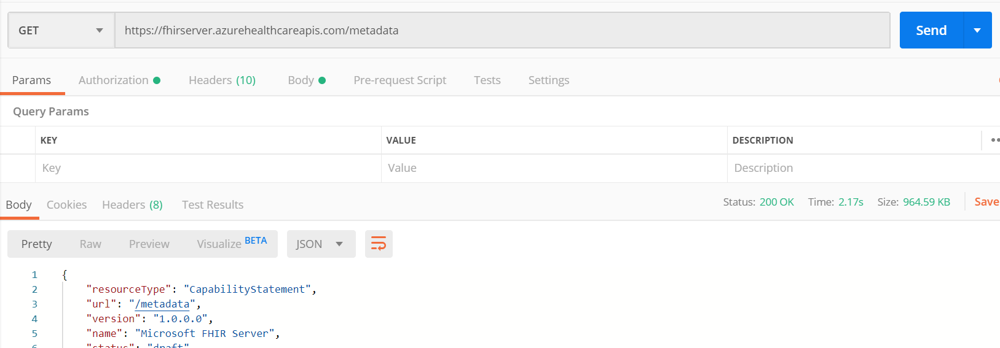
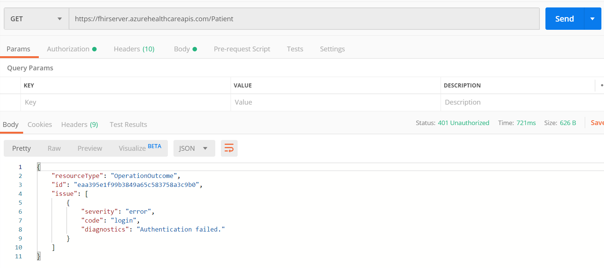
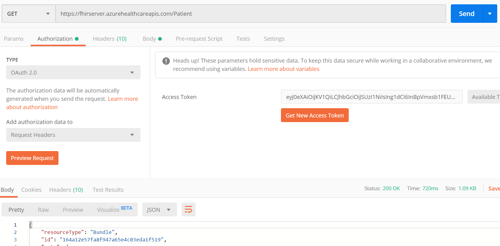
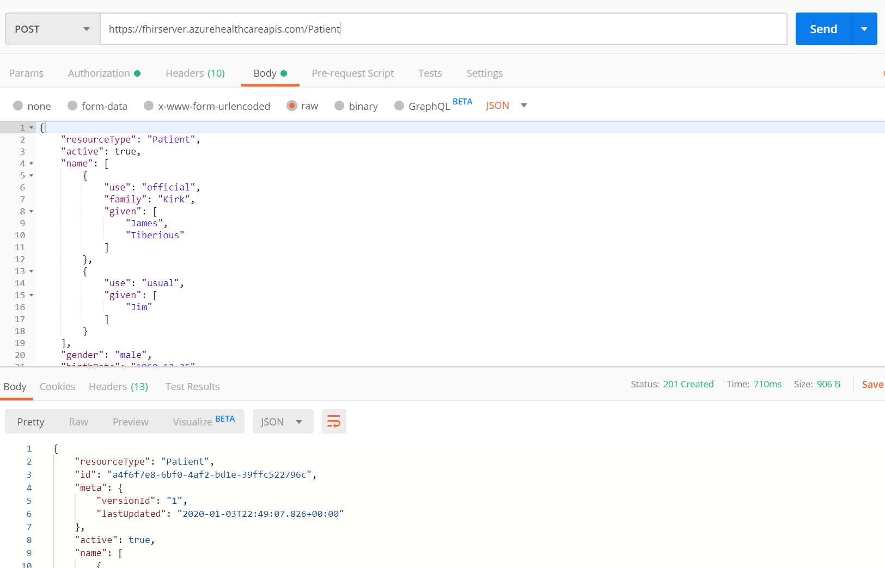

# Testing the FHIR API on Azure API for FHIR

In the previous tutorial, you deployed the Azure API for FHIR and registered your client application. You're now ready to test your Azure API for FHIR. 

## Retrieve capability statement

First we'll get the capability statement for your Azure API for FHIR. 
1. Open Postman.
1. Retrieve the capability statement by doing `GET https://\<FHIR-SERVER-NAME>.azurehealthcareapis.com/metadata`. In the image below the FHIR server name is **fhirserver**.



Next we'll attempt to retrieve a patient. To retrieve a patient, enter `GET https://\<FHIR-SERVER-NAME>.azurehealthcareapis.com/Patient`. You’ll receive a 401 Unauthorized error. This error is because you haven't proven that you should have access to patient data.

## Get patient from FHIR server



In order to gain access, you need an access token.
1. Select **Authorization** and set the Type to **OAuth2.0** in Postman.
1. Select **Get New Access Token**.
1. Fill in the fields and select **Request Token**. Below you can see the values for each field for this tutorial.

|Field                |Value                                                               |
|---------------------|--------------------------------------------------------------------|
|Token Name           |A name for your token                                               |
|Grant Type           |Authorization Code                                                  |
|Callback URL         |https://www.getpostman.com/oauth2/callback                          |
|Auth URL             |https://login.microsoftonline.com/\<AZURE-AD-TENANT-ID>/oauth2/?resource=https://\<FHIR-SERVER-NAME>.azurehealthcareapis.com|
|Access Token URL     |https://login.microsoftonline.com/\<AZURE-AD-TENANT-ID>/oauth2/token|
|Client ID            |The client ID that you copied during the previous steps             |
|Client Secret        |\<BLANK>                                                            |
|Scope                |\<BLANK>                                                            |
|State                |1234                                                                |
|Client Authentication|Send client credentials in body                                     |

4. Sign in with your credentials and select **Accept**
1. Scroll down on the result and select **Use Token**
1. Select **Send** again at the top and this time you should get a result


## Post patient into FHIR server

Now you have access, you can create a new patient. Here's a sample of a simple patient you can add into your FHIR server. Enter this `json` into the **Body** section of Postman.

``` json
    {
	    "resourceType": "Patient",
	    "active": true,
    	"name": [
    		{
    			"use": "official",
    			"family": "Kirk",
    			"given": [
    				"James",
    				"Tiberious"
    			]
    		},
    		{
    			"use": "usual",
    			"given": [
    				"Jim"
    			]
    		}
    	],
	    "gender": "male",
	    "birthDate": "1960-12-25"
    }
```
This POST will create a new patient in your FHIR server with the name James Tiberious Kirk.


If you do the GET command to retrieve a patient again, you'll see James Tiberious Kirk listed in the output.

> [!NOTE]
> When sending requests to the Azure API for FHIR, you need to ensure that you've set the content-type header to `application/json`

## Troubleshooting access issues

If you ran into issues during any of these steps, review the documents we have put together on Azure Active Directory and the Azure API for FHIR. 

* [Azure AD and Azure API for FHIR](azure-active-directory-identity-configuration.md) - This document outlines some of the basic principles of Azure Active Directory and how it interacts with the Azure API for FHIR.
* [Access token validation](azure-api-fhir-access-token-validation.md) - This how-to guide gives more specific details on access token validation and steps to take to resolve access issues.

## Next Steps

Now that you can successfully connect to your client application, you’re ready to write your web application.

>[!div class="nextstepaction"]
>[Write a web application](tutorial-web-app-write-web-app.md)

FHIR&#174; is a registered trademark of [HL7](https://hl7.org/fhir/) and is used with the permission of HL7.


