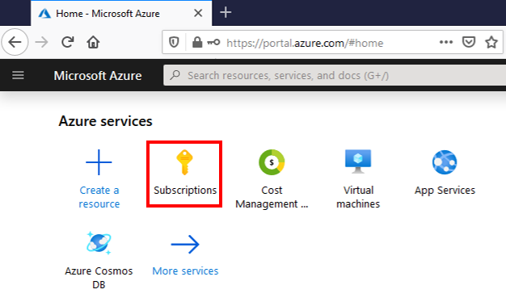
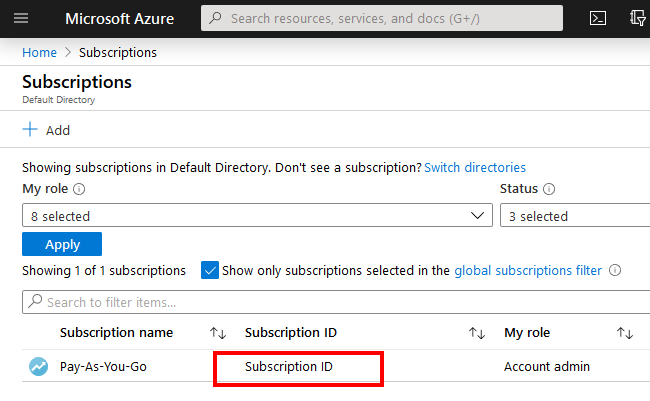

# Associate peer ASN to Azure subscription using the portal

Before you submit a peering request, you should first associate your ASN with Azure subscription using the steps below.

If you prefer, you can complete this guide using the [PowerShell](howto-subscription-association-powershell.md).

## Create PeerAsn to associate your ASN with Azure Subscription

### Sign in to the portal
[!INCLUDE [Account](./includes/account-portal.md)]

### Register for peering resource provider
Register for peering resource provider in your subscription by following the steps below. If you do not execute this, then Azure resources required to set up peering are not accessible.

1. Click on **Subscriptions** on the top left corner of the portal. If you don't see it, click on **More services** and search for it.

    > [!div class="mx-imgBorder"]
    > 

1. Click on the subscription you want to use for peering.

    > [!div class="mx-imgBorder"]
    > 

1. Once the subscription opens, on the left, click on **Resource providers**. Then, in the right pane, search for *peering* in the search window, or use the scroll bar to find **Microsoft.Peering** and look at the **Status**. If the status is ***Registered***, skip the steps below and proceed to section **Create PeerAsn**. If the status is ***NotRegistered***, select **Microsoft.Peering** and click on **Register**.

    > [!div class="mx-imgBorder"]
    > 

1. Observe that the status changes to ***Registering***.

    > [!div class="mx-imgBorder"]
    > 

1. Wait for a min or so for it to complete registration. Then, click on **Refresh** and verify that the status is ***Registered***.

    > [!div class="mx-imgBorder"]
    > 

### Create PeerAsn
As an Internet Service Provider or Internet Exchange Provider, you can create a new PeerAsn resource for associating an Autonomous System Number (ASN) with an Azure subscription. You can associate multiple ASNs to a subscription by navigating to the  [Associate a PeerASN page](https://go.microsoft.com/fwlink/?linkid=2129592) for each ASN you need to associate.

1. On the **Associate a Peer ASN** page, under **Basics** tab, fill out the fields as shown below.

    > [!div class="mx-imgBorder"]
    > 

    * **Name** corresponds to resource name and can be anything you choose.  
    * Choose the **Subscription** that you need to associate the ASN with.
    * **Peer name** corresponds to your company's name and needs to be as close as possible to your PeeringDB profile. Note that value supports only characters a-z, A-Z, and space
    * Enter your ASN in the **Peer ASN** field.
    * Click on **Create new** and enter **EMAIL ADDRESS** and **PHONE NUMBER** for your Network Operations Center (NOC)
1. Then, click on **Review + create** and observe that portal runs basic validation of the information you entered. This is displayed in a ribbon on the top, as *Running final validation...*.

    > [!div class="mx-imgBorder"]
    > 

1. Once the message in the ribbon turns to *Validation Passed*, verify your information and submit the request by clicking **Create**. If the validation doesn't pass, then click on **Previous** and repeat the steps above to modify your request and ensure the values you enter have no errors.

    > [!div class="mx-imgBorder"]
    > 

1. After you submit the request, wait for it to complete deployment. If deployment fails, contact [Microsoft peering](mailto:peering@microsoft.com). A successful deployment will appear as below.

    > [!div class="mx-imgBorder"]
    > 

### View status of a PeerAsn
Once PeerAsn resource is deployed successfully, you will need to wait for Microsoft to approve the association request. It may take up to 12 hours for approval. Once approved, you will receive a notification to the email address entered in the above section.

> [!IMPORTANT]
> Wait for the ValidationState to turn "Approved" before submitting a peering request. It may take up to 12 hours for this approval.

## Modify PeerAsn
Modifying PeerAsn is not currently supported. If you need to modify, contact [Microsoft peering](mailto:peering@microsoft.com).

## Delete PeerAsn
Deleting a PeerAsn is not currently supported. If you need to delete PeerAsn, contact [Microsoft peering](mailto:peering@microsoft.com).

## Next steps

* [Create or modify a Direct peering using the portal](howto-direct-portal.md)
* [Convert a legacy Direct peering to Azure resource using the portal](howto-legacy-direct-portal.md)
* [Create or modify Exchange peering using the portal](howto-exchange-portal.md)
* [Convert a legacy Exchange peering to Azure resource using the portal](howto-legacy-exchange-portal.md)

## Additional resources

For more information, visit [Internet peering FAQs](faqs.md)