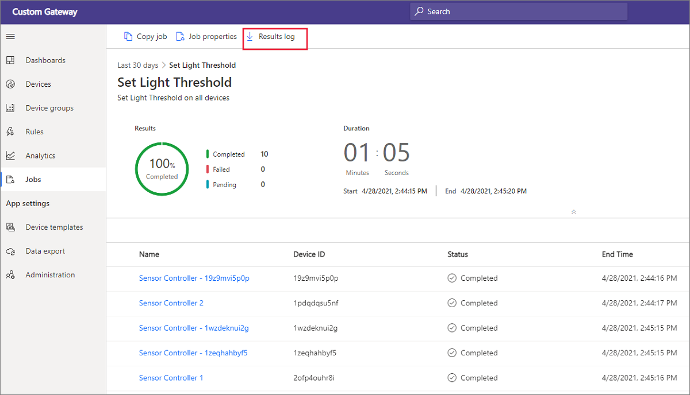
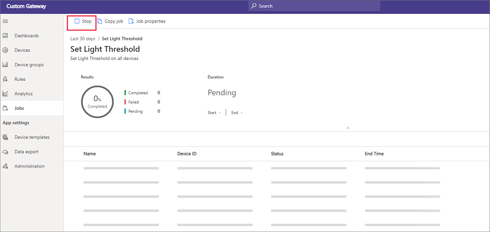

# Create and run a job in your Azure IoT Central application

You can use Microsoft Azure IoT Central to manage your connected devices at scale using jobs. Jobs let you do bulk updates to device properties and run commands. This article shows you how to get started using jobs in your own application.

## Create and run a job

This section shows you how to create and run a job. It shows you how to set the light threshold for a group of logistic gateway devices.

1. Navigate to **Jobs** from the left pane.

2. Select **+ New** to create a new job:

    

3. Enter a name and description to identify the job you're creating.

4. Select the target device group you want your job to apply to. You can see how many devices your job configuration applies to in the **Summary** section.

5. Next, choose either **Cloud property**, **Property**, or **Command** as the type of job to configure. To set up a **Property** job configuration, select a property and set its new value. To set up a **Command**, choose the command to run. A property job can set multiple properties:

    

6. After creating your job, choose **Run** or **Save**. The job now appears on your main **Jobs** page. On this page, you can see your currently running job and the history of any previously run or saved jobs. Your saved job can be opened again at any time to continue editing it or to run it:

    

    > [!NOTE]
    > You can view up 30 days of history for your previously run jobs.

7. To get an overview of your job, select the job to view from the list. This overview contains the job details, devices, and device status values. From this overview, you can also select **Download Job Details** to download a CSV file of your job details, including the devices and their status values. This information can be useful for troubleshooting:

    

## Manage jobs

To stop one of your running jobs, open it and select **Stop**. The job status changes to reflect the job is stopped. The **Summary** section shows which devices have completed, failed, or are still pending.

To run a job that's currently stopped, select it, and then select **Run**. The job status changes to reflect the job is now running again. The **Summary** section continues to update with the latest progress.

## Copy a job

To copy one of your existing jobs, select it on the **Jobs** page and select **Copy**. A copy of the job configuration opens for you to edit, and **Copy** is appended to the job name. You can save or run the new job:

## View job status

After a job is created, the **Status** column updates with the latest status message of the job. The following table lists the possible status values:

| Status message       | Status meaning                                          |
| -------------------- | ------------------------------------------------------- |
| Completed            | This job has been executed on all devices.              |
| Failed               | This job has failed and not fully executed on devices.  |
| Pending              | This job hasn't yet begun executing on devices.         |
| Running              | This job is currently executing on devices.             |
| Stopped              | This job has been manually stopped by a user.           |

The status message is followed by an overview of the devices in the job. The following table lists the possible device status values:

| Status message       | Status meaning                                                     |
| -------------------- | ------------------------------------------------------------------ |
| Succeeded            | The number of devices that the job successfully executed on.       |
| Failed               | The number of devices that the job has failed to execute on.       |

### View the device status values

To view the status of the job and all the affected devices, open the job. Next to each device name, you see one of the following status messages:

| Status message       | Status meaning                                                                |
| -------------------- | ----------------------------------------------------------------------------- |
| Completed            | The job executed on this device.                                     |
| Failed               | The job failed to execute on this device. The error message shows more information.  |
| Pending              | The job hasn't yet executed on this device.                                   |

To download a CSV file that includes the job details and the list of devices and their status values, select **Download**.

### Filter the list of devices

You can filter the device list on the job details page by selecting the filter icon. You can filter on the **Device ID** or **Status** fields:

:::image type="content" source="media/howto-run-a-job/filter.png" alt-text="Filter the device list":::

### Customize columns in the device list

You can choose additional columns to display in the device list by selecting the column options icon:

:::image type="content" source="media/howto-run-a-job/column-options.png" alt-text="Column options":::

You see a dialog that lets you choose the columns to display in the device list. Select the columns you want to display, select the right arrow icon, and the select **OK**. To select all the available columns, check **Select all**:

:::image type="content" source="media/howto-run-a-job/column-picker-popup.png" alt-text="Column picker dialog":::

The selected columns display on the device list:

:::image type="content" source="media/howto-run-a-job/column-picker-column-selected.png" alt-text="Select columns":::

Selected columns are persisted across a user session or across user sessions that have access to the application.

## Rerun jobs

You can rerun a job that has failed devices. Select **Rerun**:

:::image type="content" source="media/howto-run-a-job/rerun.png" alt-text="Rerun a job":::

Enter a job name and description, then select **Rerun job**. A new job is submitted to retry the action on failed devices:

:::image type="content" source="media/howto-run-a-job/rerun-failed.png" alt-text="Rerun failed devices":::

> [!NOTE]
> You can't execute more than five jobs at the same time from an IoT Central application.

> [!NOTE]
> When a job is complete and you delete a device that's in the job's device list, the device entry shows as deleted in the device name and device details link isn't available for the deleted device.

## Next steps

Now that you've learned how to create jobs in your Azure IoT Central application, here are some next steps:

- [Manage your devices](howto-manage-devices.md)
- [Version your device template](howto-version-device-template.md)
