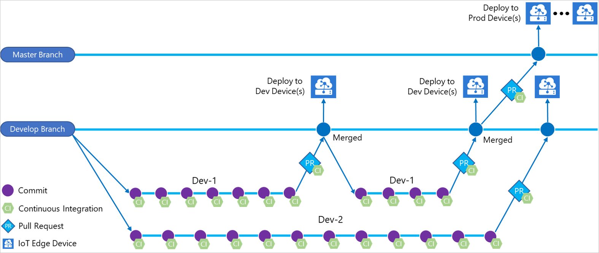
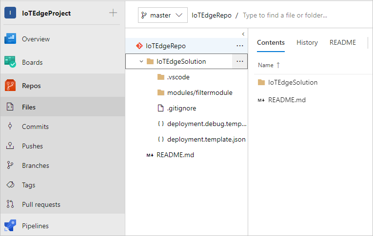
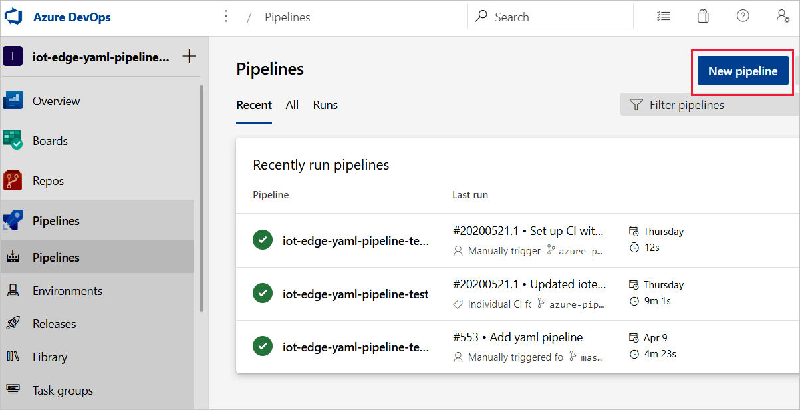
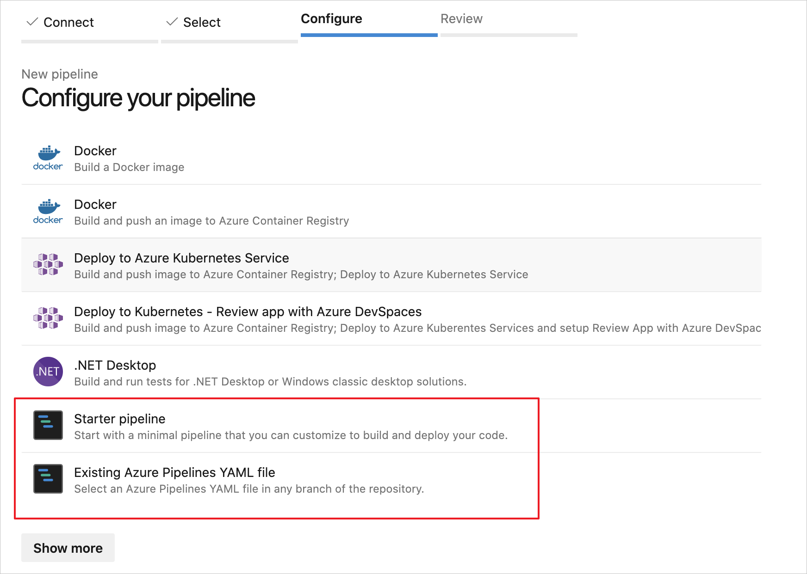
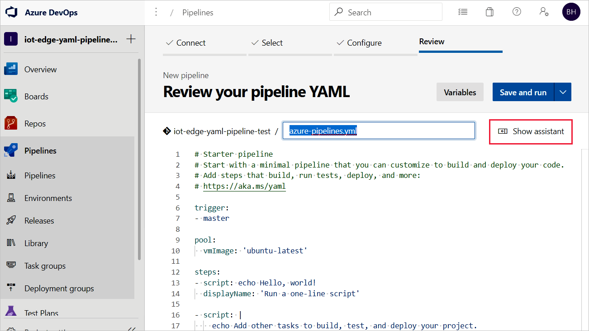
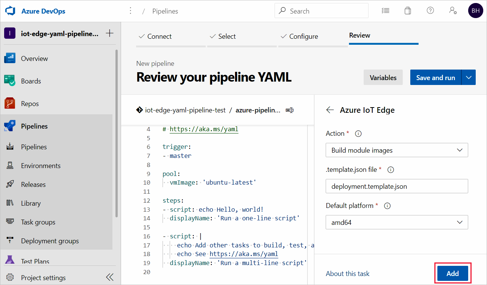
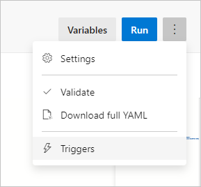

# Continuous integration and continuous deployment to Azure IoT Edge devices

[!INCLUDE [iot-edge-version-all-supported](../../includes/iot-edge-version-all-supported.md)]

You can easily adopt DevOps with your Azure IoT Edge applications with the built-in Azure IoT Edge tasks in Azure Pipelines. This article demonstrates how you can use Azure Pipelines to build, test, and deploy Azure IoT Edge modules using YAML. Alternatively, you can [use the classic editor](how-to-continuous-integration-continuous-deployment-classic.md).

In this article, you learn how to use the built-in [Azure IoT Edge tasks](/azure/devops/pipelines/tasks/build/azure-iot-edge) for Azure Pipelines to create build and release pipelines for your IoT Edge solution. Each Azure IoT Edge task added to your pipeline implements one of the following four actions:

 | Action | Description |
 | --- | --- |
 | Build module images | Takes your IoT Edge solution code and builds the container images.|
 | Push module images | Pushes module images to the container registry you specified. |
 | Generate deployment manifest | Takes a deployment.template.json file and the variables, then generates the final IoT Edge deployment manifest file. |
 | Deploy to IoT Edge devices | Creates IoT Edge deployments to one or more IoT Edge devices. |

Unless otherwise specified, the procedures in this article do not explore all the functionality available through task parameters. For more information, see the following resources:

* [Task version](/azure/devops/pipelines/process/tasks?tabs=yaml#task-versions)
* [Control Options](/azure/devops/pipelines/process/tasks?tabs=yaml#task-control-options)
* [Environment Variables](/azure/devops/pipelines/process/variables?tabs=yaml#environment-variables)
* [Output variables](/azure/devops/pipelines/process/variables?tabs=yaml#use-output-variables-from-tasks)

## Prerequisites

* An Azure Repos repository. If you don't have one, you can [Create a new Git repo in your project](/azure/devops/repos/git/create-new-repo). For this article, we created a repository called **IoTEdgeRepo**.
* An IoT Edge solution committed and pushed to your repository. If you want to create a new sample solution for testing this article, follow the steps in [Develop and debug modules in Visual Studio Code](how-to-vs-code-develop-module.md) or [Develop and debug C# modules in Visual Studio](./how-to-visual-studio-develop-module.md). For this article, we created a solution in our repository called **IoTEdgeSolution**, which has the code for a module named **filtermodule**.

  For this article, all you need is the solution folder created by the IoT Edge templates in either Visual Studio Code or Visual Studio. You don't need to build, push, deploy, or debug this code before proceeding. You'll set up those processes in Azure Pipelines.

  Know the path to the **deployment.template.json** file in your solution, which is used in several steps. If you're unfamiliar with the role of the deployment template, see [Learn how to deploy modules and establish routes](module-composition.md).

  >[!TIP]
  >If you're creating a new solution, clone your repository locally first. Then, when you create the solution you can choose to create it directly in the repository folder. You can easily commit and push the new files from there.

* A container registry where you can push module images. You can use [Azure Container Registry](../container-registry/index.yml) or a third-party registry.
* An active Azure [IoT hub](../iot-hub/iot-hub-create-through-portal.md) with at least two IoT Edge devices for testing the separate test and production deployment stages. You can follow the quickstart articles to create an IoT Edge device on [Linux](quickstart-linux.md) or [Windows](quickstart.md)

For more information about using Azure Repos, see [Share your code with Visual Studio and Azure Repos](/azure/devops/repos/git/share-your-code-in-git-vs)

## Create a build pipeline for continuous integration

In this section, you create a new build pipeline. You configure the pipeline to run automatically when you check in any changes to the sample IoT Edge solution and to publish build logs.

1. Sign in to your Azure DevOps organization (`https://dev.azure.com/{your organization}`) and open the project that contains your IoT Edge solution repository.

   

2. From the left pane menu in your project, select **Pipelines**. Select **Create Pipeline** at the center of the page. Or, if you already have build pipelines, select the **New pipeline** button in the top right.

    

3. On the **Where is your code?** page, select **Azure Repos Git `YAML`**. If you wish to use the classic editor to create your project's build pipelines, see the [classic editor guide](how-to-continuous-integration-continuous-deployment-classic.md).

4. Select the repository you are creating a pipeline for.

    

5. On the **Configure your pipeline** page, select **Starter pipeline**. If you have a preexisting Azure Pipelines YAML file you wish to use to create this pipeline, you can select **Existing Azure Pipelines YAML file** and provide the branch and path in the repository to the file.

    

6. On the **Review your pipeline YAML** page, you can select the default name `azure-pipelines.yml` to rename your pipeline's configuration file.

   Select **Show assistant** to open the **Tasks** palette.

    

7. To add a task, place your cursor at the end of the YAML or wherever you want the instructions for your task to be added. Search for and select **Azure IoT Edge**. Fill out the task's parameters as follows. Then, select **Add**.

   | Parameter | Description |
   | --- | --- |
   | Action | Select **Build module images**. |
   | .template.json file | Provide the path to the **deployment.template.json** file in the repository that contains your IoT Edge solution. |
   | Default platform | Select the appropriate operating system for your modules based on your targeted IoT Edge device. |

   For more information about this task and its parameters, see [Azure IoT Edge task](/azure/devops/pipelines/tasks/build/azure-iot-edge).

   

   >[!TIP]
   > After each task is added, the editor will automatically highlight the added lines. To prevent accidental overwriting, deselect the lines and provide a new space for your next task before adding additional tasks.

8. Repeat this process to add three more tasks with the following parameters:

   * Task: **Azure IoT Edge**

     | Parameter | Description |
     | --- | --- |
     | Action | Select **Push module images**. |
     | Container registry type | Use the default type: **Azure Container Registry**. |
     | Azure subscription | Select your subscription. |
     | Azure Container Registry | Choose the registry that you want to use for the pipeline. |
     | .template.json file | Provide the path to the **deployment.template.json** file in the repository that contains your IoT Edge solution. |
     | Default platform | Select the appropriate operating system for your modules based on your targeted IoT Edge device. |

     For more information about this task and its parameters, see [Azure IoT Edge task](/azure/devops/pipelines/tasks/build/azure-iot-edge).

   * Task: **Copy Files**

     | Parameter | Description |
     | --- | --- |
     | Source Folder | The source folder to copy from. Empty is the root of the repo. Use variables if files are not in the repo. Example: `$(agent.builddirectory)`.
     | Contents | Add two lines: `deployment.template.json` and `**/module.json`. |
     | Target Folder | Specify the variable `$(Build.ArtifactStagingDirectory)`. See [Build variables](/azure/devops/pipelines/build/variables?tabs=yaml#build-variables) to learn about the description. |

     For more information about this task and its parameters, see [Copy files task](/azure/devops/pipelines/tasks/utility/copy-files).

   * Task: **Publish Build Artifacts**

     | Parameter | Description |
     | --- | --- |
     | Path to publish | Specify the variable `$(Build.ArtifactStagingDirectory)`. See [Build variables](/azure/devops/pipelines/build/variables?tabs=yaml#build-variables) to learn about the description. |
     | Artifact name | Specify the default name: `drop` |
     | Artifact publish location | Use the default location: `Azure Pipelines` |

     For more information about this task and its parameters, see [Publish build artifacts task](/azure/devops/pipelines/tasks/utility/publish-build-artifacts).

9. Select **Save** from the **Save and run** dropdown in the top right.

10. The trigger for continuous integration is enabled by default for your YAML pipeline. If you wish to edit these settings, select your pipeline and click **Edit** in the top right. Select **More actions** next to the **Run** button in the top right and go to **Triggers**. **Continuous integration** shows as enabled under your pipeline's name. If you wish to see the details for the trigger, check the **Override the YAML continuous integration trigger from here** box.

    

Continue to the next section to build the release pipeline.

[!INCLUDE [iot-edge-create-release-pipeline-for-continuous-deployment](../../includes/iot-edge-create-release-pipeline-for-continuous-deployment.md)]

[!INCLUDE [iot-edge-verify-iot-edge-continuous-integration-continuous-deployment](../../includes/iot-edge-verify-iot-edge-continuous-integration-continuous-deployment.md)]

## Next steps

* Understand the IoT Edge deployment in [Understand IoT Edge deployments for single devices or at scale](module-deployment-monitoring.md)
* Walk through the steps to create, update, or delete a deployment in [Deploy and monitor IoT Edge modules at scale](how-to-deploy-at-scale.md).