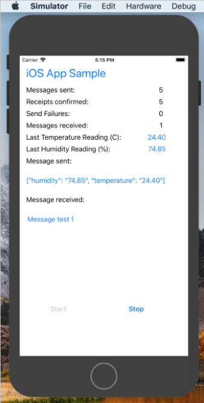

# Send cloud-to-device messages with IoT Hub (iOS)

[!INCLUDE [iot-hub-selector-c2d](../../includes/iot-hub-selector-c2d.md)]

Azure IoT Hub is a fully managed service that helps enable reliable and secure bi-directional communications between millions of devices and a solution back end. 

This article shows you how to:

* Receive cloud-to-device messages on a device

At the end of this article, you run the following Swift iOS project:

* **sample-device**: the same app created in [Send telemetry from a device to an IoT hub](../iot-develop/quickstart-send-telemetry-iot-hub.md), which connects to your IoT hub and receives cloud-to-device messages.

> [!NOTE]
> IoT Hub has SDK support for many device platforms and languages (including C, Java, Python, and JavaScript) through the [Azure IoT device SDKs](iot-hub-devguide-sdks.md).

You can find more information on cloud-to-device messages in the [messaging section of the IoT Hub developer guide](iot-hub-devguide-messaging.md).

## Prerequisites

* An active IoT hub in Azure.

* The code sample from [Azure samples](https://github.com/Azure-Samples/azure-iot-samples-ios/archive/master.zip).

* The latest version of [XCode](https://developer.apple.com/xcode/), running the latest version of the iOS SDK. This quickstart was tested with XCode 9.3 and iOS 11.3.

* The latest version of [CocoaPods](https://guides.cocoapods.org/using/getting-started.html).

* Make sure that port 8883 is open in your firewall. The device sample in this article uses MQTT protocol, which communicates over port 8883. This port may be blocked in some corporate and educational network environments. For more information and ways to work around this issue, see [Connecting to IoT Hub (MQTT)](iot-hub-mqtt-support.md#connecting-to-iot-hub).

## Simulate an IoT device

In this section, you simulate an iOS device running a Swift application to receive cloud-to-device messages from the IoT hub. 

### Install CocoaPods

CocoaPods manages dependencies for iOS projects that use third-party libraries.

In a terminal window, navigate to the Azure-IoT-Samples-iOS folder that you downloaded in the prerequisites. Then, navigate to the sample project:

```sh
cd quickstart/sample-device
```

Make sure that XCode is closed, then run the following command to install the CocoaPods that are declared in the **podfile** file:

```sh
pod install
```

Along with installing the pods required for your project, the installation command also created an XCode workspace file that is already configured to use the pods for dependencies.

### Run the sample device application

1. Retrieve the connection string for your device. You can copy this string from the [Azure portal](https://portal.azure.com) in the device details blade, or retrieve it with the following CLI command:

    ```azurecli-interactive
    az iot hub device-identity connection-string show --hub-name {YourIoTHubName} --device-id {YourDeviceID} --output table
    ```

2. Open the sample workspace in XCode.

   ```sh
   open "MQTT Client Sample.xcworkspace"
   ```

3. Expand the **MQTT Client Sample** project and then folder of the same name.  

4. Open **ViewController.swift** for editing in XCode.

5. Search for the **connectionString** variable and update the value with the device connection string that you copied in the first step.

6. Save your changes.

7. Run the project in the device emulator with the **Build and run** button or the key combo **command + r**.

   

## Send a cloud-to-device message

You are now ready to receive cloud-to-device messages. Use the Azure portal to send a test cloud-to-device message to your simulated IoT device.

1. In the **iOS App Sample** app running on the simulated IoT device, click **Start**. The application starts sending device-to-cloud messages, but also starts listening for cloud-to-device messages.

   

2. In the [Azure portal](https://portal.azure.com), navigate to your IoT hub.

3. On the **Devices** page, select the device ID for your simulated IoT device.

4. Select **Message to Device** to open the cloud-to-device message interface.

5. Write a plaintext message in the **Message body** text box, then select **Send message**.

6. Watch the app running on your simulated IoT device. It checks for messages from IoT Hub and prints the text from the most recent one on the screen. Your output should look like the following example:

   

## Next steps

In this article, you learned how to send and receive cloud-to-device messages.

To learn more about developing solutions with IoT Hub, see the [IoT Hub developer guide](iot-hub-devguide.md).