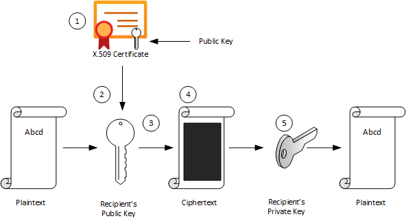
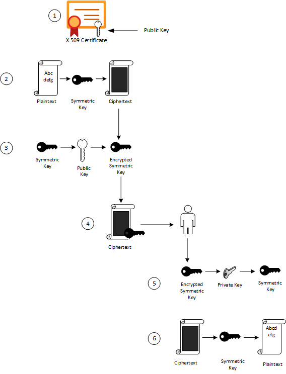
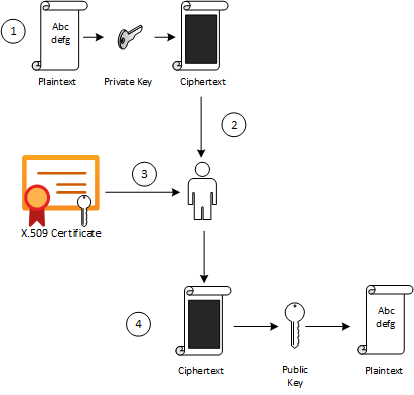
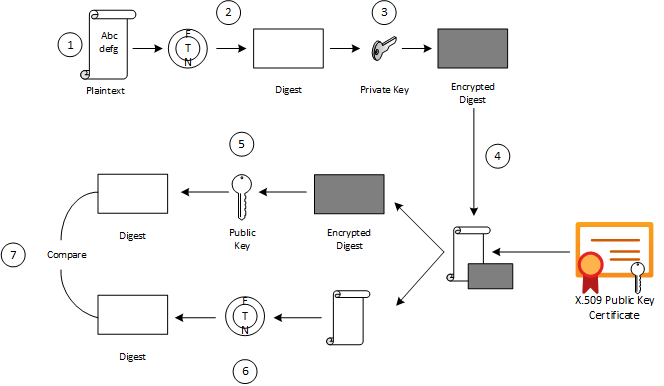

# Tutorial: Understanding Public Key Cryptography and X.509 Public Key Infrastructure

You can use X.509 certificates to authenticate devices to an Azure IoT Hub. A certificate is a digital document that contains the device's public key and can be used to verify that the device is what it claims to be. X.509 certificates and certificate revocation lists (CRLs) are documented by [RFC 5280](https://tools.ietf.org/html/rfc5280). Certificates are just one part of an X.509 public key infrastructure (PKI). To understand X.509 PKI, you need to understand cryptographic algorithms, cryptographic keys, certificates, and certification authorities (CAs):

* **Algorithms** define how original plaintext data is transformed into ciphertext and back to plaintext.
* **Keys** are random or pseudorandom data strings used as input to an algorithm.
* **Certificates** are digital documents that contain an entity's public key and enable you to determine whether the subject of the certificate is who or what it claims to be.
* **Certification Authorities** attest to the authenticity of certificate subjects.

You can purchase a certificate from a certification authority (CA). You can also, for testing and development or if you are working in a self-contained environment, create a self-signed root CA. If, for example, you own one or more devices and are testing IoT hub authentication, you can self-sign your root CA and use that to issue device certificates. You can also issue self-signed device certificates. This is discussed in subsequent articles.

Before discussing X.509 certificates in more detail and using them to authenticate devices to an IoT Hub, we discuss the cryptography on which certificates are based.

## Cryptography

Cryptography is used to protect information and communications. This is typically done by using cryptographic techniques to scramble plaintext (ordinary text) into ciphertext (encoded text) and back again. This scrambling process is called encryption. The reverse process is called decryption. Cryptography is concerned with the following objectives:

* **Confidentiality**: The information can be understood by only the intended audience.
* **Integrity**: The information cannot be altered in storage or in transit.
* **Non-repudiation**: The creator of information cannot later deny that creation.
* **Authentication**: The sender and receiver can confirm each other's identity.

## Encryption

The encryption process requires an algorithm and a key. The algorithm defines how data is transformed from plaintext into ciphertext and back to plaintext. A key is a random string of data used as input to the algorithm. All of the security of the process is contained in the key. Therefore, the key must be stored securely. The details of the most popular algorithms, however, are publicly available.

There are two types of encryption. Symmetric encryption uses the same key for both encryption and decryption. Asymmetric encryption uses different but mathematically related keys to perform encryption and decryption.

### Symmetric encryption

Symmetric encryption uses the same key to encrypt plaintext into ciphertext and decrypt ciphertext back into plaintext. The necessary length of the key, expressed in number of bits, is determined by the algorithm. After the key is used to encrypt plaintext, the encrypted message is sent to the recipient who then decrypts the ciphertext. The symmetric key must be securely transmitted to the recipient. Sending the key is the greatest security risk when using a symmetric algorithm.

### Asymmetric encryption

If only symmetric encryption is used, the problem is that all parties to the communication must possess the private key. However, it is possible that unauthorized third parties can capture the key during transmission to authorized users. To address this issue, use asymmetric or public key cryptography instead.

In asymmetric cryptography, every user has two mathematically related keys called a key pair. One key is public and the other key is private. The key pair ensures that only the recipient has access to the private key needed to decrypt the data. The following illustration summarizes the asymmetric encryption process.

1. The recipient creates a public-private key pair and sends the public key to a CA. The CA packages the public key in an X.509 certificate.

1. The sending party obtains the recipient's public key from the CA.

1. The sender encrypts plaintext data using an encryption algorithm. The recipient's public key is used to perform encryption.

1. The sender transmits the ciphertext to the recipient. It isn't necessary to send the key because the recipient already has the private key needed to decrypt the ciphertext.

1. The recipient decrypts the ciphertext by using the specified asymmetric algorithm and the private key.

### Combining symmetric and asymmetric encryption

Symmetric and asymmetric encryption can be combined to take advantage of their relative strengths. Symmetric encryption is much faster than asymmetric but, because of the necessity of sending private keys to other parties, is not as secure. To combine the two types together, symmetric encryption can be used to convert plaintext to ciphertext. Asymmetric encryption is used to exchange the symmetric key. This is demonstrated by the following diagram.

1. The sender retrieves the recipient's public key.

1. The sender generates a symmetric key and uses it to encrypt the original data.

1. The sender uses the recipient's public key to encrypt the symmetric key.

1. The sender transmits the encrypted symmetric key and the ciphertext to the intended recipient.

1. The recipient uses the private key that matches the recipient's public key to decrypt the sender's symmetric key.

1. The recipient uses the symmetric key to decrypt the ciphertext.

### Asymmetric signing

Asymmetric algorithms can be used to protect data from modification and prove the identity of the data creator. The following illustration shows how asymmetric signing helps prove the sender's identity.

1. The sender passes plaintext data through an asymmetric encryption algorithm, using the private key for encryption. Notice that this scenario reverses use of the private and public keys outlined in the preceding section that detailed asymmetric encryption.

1. The resulting ciphertext is sent to the recipient.

1. The recipient obtains the originator's public key from a directory.

1. The recipient decrypts the ciphertext by using the originator's public key. The resulting plaintext proves the originator's identity because only the originator has access to the private key that initially encrypted the original text.

## Signing

Digital signing can be used to determine whether the data has been modified in transit or at rest. The data is passed through a hash algorithm, a one-way function that produces a mathematical result from the given message. The result is called a *hash value*, *message digest*, *digest*, *signature*, or *thumbprint*. A hash value cannot be reversed to obtain the original message. Because A small change in the message results in a significant change in the *thumbprint*, the hash value can be used to determine whether a message has been altered. The following illustration shows how asymmetric encryption and hash algorithms can be used to verify that a message has not been modified.

1. The sender creates a plaintext message.

1. The sender hashes the plaintext message to create a message digest.

1. The sender encrypts the digest using a private key.

1. The sender transmits the plaintext message and the encrypted digest to the intended recipient.

1. The recipient decrypts the digest by using the sender's public key.

1. The recipient runs the same hash algorithm that the sender used over the message.

1. The recipient compares the resulting signature to the decrypted signature. If the digests are the same, the message was not modified during transmission.

## Next steps

To learn more about the fields that make up a certificate, see [Understanding X.509 Public Key Certificates](tutorial-x509-certificates.md).

If you already know a lot about X.509 certificates, and you want to generate test versions that you can use to authenticate to your IoT Hub, see the following topics:

* [Using Microsoft-Supplied Scripts to Create Test Certificates](tutorial-x509-scripts.md)
* [Using OpenSSL to Create Test Certificates](tutorial-x509-openssl.md)
* [Using OpenSSL to Create Self-Signed Test Certificates](tutorial-x509-self-sign.md)

If you have a certification authority (CA) certificate or subordinate CA certificate and you want to upload it to your IoT hub and prove that you own it, see [Proving Possession of a CA Certificate](tutorial-x509-prove-possession.md).
